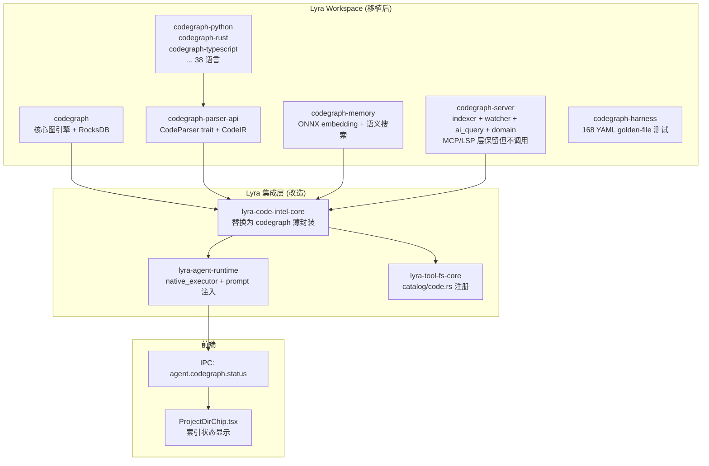
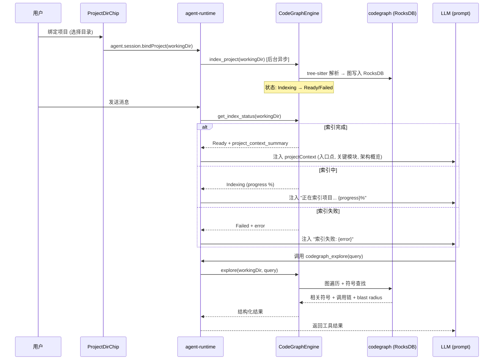

# CodeGraph 引擎深度移植

## 架构总览




## 数据流




## Phase 1: 源码导入 + Workspace 集成

### 1.1 复制 42 crate 到 Lyra workspace

- 源：`参考/AI编程工具/codegraph-ai/crates/*`
- 目标：`crates/codegraph*`（保留原始 crate 名，不改前缀，最小 diff）
- 包含 vendored C 源码（7 个语言 ~63MB：cobol/dart/dockerfile/perl/r/tcl/zig）
- 包含 codegraph-harness（168 个 YAML golden-file 测试用例 + fixtures）

### 1.2 Workspace Cargo.toml 集成

- 在 Lyra 根 `Cargo.toml` 的 `members` 中添加全部 42 个 crate 路径
- 在 `[workspace.dependencies]` 中添加 codegraph-ai 的共享依赖：
  - `rocksdb = "0.22"` (features = multi-threaded-cf)
  - `libz-sys = "=1.1.25"` (pinned，修复 macOS vendored zlib)
  - `fs2 = "0.4"`
  - `fastembed = "4"` (default-features=false, features 用 ort-download-binaries)
  - `tower-lsp = "0.20"` (保留但后续可能移除)
  - `tree-sitter = "0.25"`
  - 各语言 `tree-sitter-*` 绑定版本照搬
- edition 冲突：codegraph-ai 用 edition 2021，Lyra 用 2024。保留各 crate 自己的 edition 声明（Cargo.toml 局部 edition 覆盖 workspace edition）

### 1.3 依赖冲突解决

- `serde` / `serde_json` / `tokio` / `regex` 等共享依赖：统一版本，取两者中较新的
- `tree-sitter` 版本碎片化（0.1/0.23/0.24/0.25/5.9 并存）：保持各语言 crate 原始版本声明，不强制统一
- `notify` 版本：codegraph-ai 用 6.x，检查 Lyra 是否已有 notify 依赖
- 目标：`cargo build` 全 workspace 编译通过

## Phase 2: 替换 lyra-code-intel-core

### 2.1 清理旧实现

删除 `crates/lyra-code-intel-core/src/` 中的旧文件：

- `graph_engine.rs`（子串匹配 + grep 的假图引擎）
- `scanner.rs`、`symbol_index.rs`、`text_index.rs`、`storage.rs`、`types.rs`
- 移除 `arborium-tree-sitter`、`grep-matcher`/`grep-regex`/`grep-searcher` 依赖

### 2.2 重写为 codegraph 薄封装

`crates/lyra-code-intel-core/src/lib.rs` 重写为：

```rust
// 重导出 codegraph 核心，供 agent-runtime 使用
pub use codegraph::graph::{CodeGraph, Node, Edge, NodeKind, EdgeKind};
pub use codegraph_parser_api::{CodeParser, CodeIR};

pub mod engine;      // CodeGraphEngine: 索引管理 + 查询入口
pub mod status;      // IndexStatus: Idle/Indexing/Ready/Failed + progress
pub mod context;     // ProjectContext: 从图生成项目概览 (入口点、关键模块、架构)
pub mod explore;     // explore(): 统一查询 (借鉴 codegraph-colby 的单一工具设计)
```

### 2.3 CodeGraphEngine 设计

```rust
// crates/lyra-code-intel-core/src/engine.rs (伪代码)

pub struct CodeGraphEngine {
    // 项目路径 → 索引状态
    indices: RwLock<HashMap<PathBuf, ProjectIndex>>,
    // RocksDB 存储根目录 (~/.lyra/codegraph/)
    storage_root: PathBuf,
}

struct ProjectIndex {
    status: IndexStatus,              // Idle/Indexing/Ready/Failed
    graph: Option<Arc<CodeGraph>>,     // 内存图 + RocksDB 后端
    indexed_at: u64,
    file_count: u64,
    error: Option<String>,
}

impl CodeGraphEngine {
    // 后台异步索引，立即返回，状态轮询
    pub fn index_project(&self, root: PathBuf);
    // 阻塞获取状态
    pub fn status(&self, root: &Path) -> IndexStatus;
    // 统一查询入口 (codegraph-colby 风格: 一个 explore 返回一切)
    pub fn explore(&self, root: &Path, query: &str) -> Result<ExploreResult>;
    // 单独工具
    pub fn callers(&self, root: &Path, symbol: &str) -> Result<Vec<Node>>;
    pub fn callees(&self, root: &Path, symbol: &str) -> Result<Vec<Node>>;
    pub fn impact(&self, root: &Path, symbol: &str) -> Result<ImpactResult>;
    // 生成项目上下文摘要 (用于 prompt 注入)
    pub fn project_context(&self, root: &Path) -> Result<ProjectContext>;
}
```

### 2.4 文件监听 + 增量同步

从 `codegraph-server/src/watcher.rs`（1661 行）提取文件监听逻辑：

- `notify` crate 监听项目目录
- FNV-1a content hash 判断文件变更
- 增量 re-index 仅重解析变更文件
- debounce 2s（借鉴 codegraph-colby 的 debounce 策略）
- 写入 RocksDB 持久化，重启秒级加载

## Phase 3: Lyra 工具集成

### 3.1 注册 Agent 工具

在 `crates/lyra-tool-fs-core/src/catalog/code.rs` 中填充 manifest（当前为空壳）：

```rust
pub(super) fn manifests() -> Vec<ToolManifest> {
    vec![
        s("/tools/code/explore", "code", "explore", "Code graph explore",
          "Search the code graph: returns relevant symbols, call paths, and blast radius in one call.", Some("codegraph_explore")),
        s("/tools/code/callers", "code", "callers", "Find callers",
          "Find all functions that call the given symbol.", Some("codegraph_callers")),
        s("/tools/code/callees", "code", "callees", "Find callees",
          "Find all functions called by the given symbol.", Some("codegraph_callees")),
        s("/tools/code/impact", "code", "impact", "Impact analysis",
          "Analyze the blast radius of changing a symbol.", Some("codegraph_impact")),
        s("/tools/code/context", "code", "context", "Project context",
          "Get an overview of the project: entry points, key modules, architecture.", Some("codegraph_context")),
    ]
}
```

### 3.2 native_executor dispatch

在 `crates/lyra-agent-runtime/src/native_backend/tools/native_executor.rs` 的 match 中新增：

```rust
"codegraph_explore" => tool_codegraph_explore(session_id, input),
"codegraph_callers" => tool_codegraph_callers(session_id, input),
"codegraph_callees" => tool_codegraph_callees(session_id, input),
"codegraph_impact" => tool_codegraph_impact(session_id, input),
"codegraph_context" => tool_codegraph_context(session_id, input),
```

每个工具函数通过 `session_workspace_root(session_id)` 获取项目路径，调用 `CodeGraphEngine` 对应方法。

### 3.3 agent-runtime 依赖

在 `crates/lyra-agent-runtime/Cargo.toml` 添加：

```toml
lyra-code-intel-core.workspace = true
```

在 `native_backend/` 中初始化全局 `CodeGraphEngine` 单例（类似 session state 的全局 state）。

## Phase 4: 自动索引 + 动态提示词注入

### 4.1 自动索引触发

在 `crates/lyra-agent-runtime/src/native_backend/sessions.rs` 的 `bind_project` 逻辑中：

- 项目绑定后，调用 `CodeGraphEngine::index_project(workingDir)` 后台异步启动
- 索引在独立线程/tokio task 中运行，不阻塞 session 创建
- 索引状态通过 `RwLock<HashMap<PathBuf, IndexStatus>>` 全局可查

### 4.2 runtime_context 注入

在 `crates/lyra-agent-runtime/src/native_backend/context.rs` 的 `build_runtime_context()` 中新增字段：

```rust
// 新增到 runtime_context JSON
"projectContext": {
    "status": "indexing" | "ready" | "failed" | "idle",
    "progress": 0.42,         // 仅 indexing 时
    "summary": {              // 仅 ready 时
        "fileCount": 1234,
        "symbolCount": 5678,
        "entryPoints": ["main()", "routes.ts", ...],
        "keyModules": ["auth/", "api/", "components/"],
        "architecture": "Layered: routes → services → models",
        "circularDeps": 2,
        "languages": ["TypeScript", "Python"]
    },
    "error": "..."            // 仅 failed 时
}
```

这个 JSON 通过 `dynamic_context.md.j2` 的 `{{ runtime_context_json }}` 自动注入 prompt。

### 4.3 prompt 模板更新

`full_contract.md.j2` 新增段（在 runtime_context 说明之后）：

```
## Project Code Graph

Project is indexed ({{ projectContext.summary.fileCount }} files, {{ projectContext.summary.symbolCount }} symbols). 
Entry points: {{ projectContext.summary.entryPoints }}
Architecture: {{ projectContext.summary.architecture }}
Use codegraph tools to explore: codegraph_explore (one call returns relevant code + call paths + blast radius), codegraph_callers, codegraph_callees, codegraph_impact, codegraph_context.

Project code graph is being indexed ({{ (projectContext.progress * 100)|round }}% complete). Code graph tools will return richer results once indexing completes. Meanwhile, use grep/read as normal.

Project code graph indexing failed: {{ projectContext.error }}. Code graph tools unavailable — use grep/read instead.

```

`compact_contract.md.j2` 对应紧凑版本。

### 4.4 版本提升

- `prompt_contract.rs`: `PROMPT_TEMPLATE_VERSION` +1
- `prompt_contract_audit.toml`: 新增审计条目
- `prompt_policy.rs`: 更新 assert 测试

## Phase 5: UI 索引状态显示

### 5.1 IPC 端点

新增 IPC handler `agent.codegraph.status(sessionId)`：

- 从 session snapshot 取 `workingDir`
- 查询 `CodeGraphEngine::status(workingDir)`
- 返回 `{ state, progress, fileCount, error }`

### 5.2 ProjectDirChip 改造

在 `apps/desktop/src/modules/workbench/ai-panel/lyra-agents/features/chat/ProjectDirChip.tsx` 的下拉菜单中：

当前菜单项：

```
- Open Project Tree
- Open in File Manager
- Reveal in File Manager
- Open in {editor}
```

新增索引状态行（非菜单项，状态显示）：

```
- ─────────────────
- 正在索引... 42%     (spinner icon, progress)
- 索引完成 1234 文件  (checkmark icon)
- 索引失败           (error icon, tooltip 显示原因)
- 未索引             (idle, 仅显示工具提示)
```

一行简洁显示，让用户心理有底。状态变化时可以加一个轻微的动画/颜色变化。

### 5.3 状态轮询

- 前端在 ProjectDirChip 挂载时启动 2 秒间隔轮询 `agent.codegraph.status`
- 索引完成/失败后停止轮询
- 或改为 event-based：agent-runtime 通过现有的 session event 机制推送索引状态变化

## Phase 6: codegraph-colby 特性移植

### 6.1 框架感知 (Framework Resolvers)

从 codegraph-colby 的 `src/resolution/frameworks/` 移植 17 个框架解析器：

- React, Express, NestJS (Node)
- Laravel, Django, Flask, FastAPI (Python)
- Rails (Ruby)
- Spring, Play (Java)
- Gin, GoFrame (Go)
- ASP.NET (C#)
- Vapor (Swift)
- Drupal (PHP)
- React Native, Expo (跨平台)

这些作为 codegraph-ai 的 **resolution pass 插件**，在 tree-sitter 提取后补充框架路由节点和合成边。需要在 `lyra-code-intel-core/src/engine.rs` 的索引流程中插入 resolution pass。

### 6.2 跨语言桥接

从 codegraph-colby 移植合成边逻辑：

- Swift ↔ ObjC `@objc` 桥（`swift-objc-bridge.ts`）
- React Native JS ↔ native（legacy bridge / TurboModules / Fabric）
- 合成边标记 `provenance: "heuristic"` + `metadata.synthesizedBy`

这些在 codegraph-ai 的图模型中作为 `Edge` 的 metadata 字段实现。

### 6.3 单一 explore 工具设计

codegraph-colby 的核心设计哲学：一个 `codegraph_explore` 工具返回一切（相关符号源码 + 调用路径 + blast radius），而非 42 个细粒度工具。

在 Phase 3 的工具注册中已经采用这个设计：`codegraph_explore` 作为主工具，其余作为补充。prompt 引导 Agent 优先使用 explore。

### 6.4 Staleness banner

codegraph-colby 的 staleness 机制：文件变更后、sync 完成前的窗口期，工具响应附 `⚠️` 提示。

在 `lyra-code-intel-core/src/engine.rs` 的查询方法中：检查文件是否在 pending 列表中，如果是则在响应中附加 staleness 标记。

## 验证

- `cargo build` 全 workspace 编译通过（42 新 crate + 26 现有 crate）
- `cargo test -p codegraph` 通过（现有单元测试）
- `cargo test -p codegraph-harness` 通过（168 YAML golden-file 测试）
- `cargo test -p lyra-code-intel-core` 通过（新封装层测试）
- `cargo test -p lyra-tool-fs-core` 通过（catalog 验证）
- `cargo test -p lyra-agent-runtime` 通过（prompt policy assert 更新后）
- 手动：绑定一个项目 → 观察索引启动 → ProjectDirChip 显示"正在索引" → 完成后显示"索引完成" → 发消息观察 prompt 中注入了项目上下文 → 调用 codegraph_explore 返回结构化结果

## 风险与缓解

- **构建时间**：42 crate + RocksDB C++ + ONNX 编译首次可能 10+ 分钟。缓解：cargo sccache，增量编译
- **tree-sitter 版本碎片**：38 语言 crate 使用不同 tree-sitter 版本。缓解：保持各 crate 原始版本，不强制统一，cargo 的 semver 兼容性处理
- **codegraph-server 的 MCP/LSP 层**：40k 行中约 1/3 是协议层。缓解：保留不删（dead code 不影响性能），后续 Phase 7 清理
- **vendored C 源码 63MB**：进入 git 仓库。缓解：git-lfs 或接受（codegraph-ai 原项目就这么做）
- **ONNX 模型下载**：fastembed 首次运行下载 ~100MB 模型。缓解：graph-only 模式作为 fallback，或预下载

