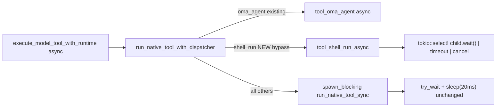

# Shell tool: polling → event-driven (tokio::select on child.wait())

## Why

`tool_shell_run` uses `try_wait()` + `thread::sleep(20ms)` poll loop (`crates/lyra-agent-runtime/src/native_backend/tools/shell.rs:~218`). Codex/opencode/zed all use `tokio::select! { child.wait() | timeout }` — zero poll, OS wakes on process exit. Async chain already exists down to `run_native_tool_with_dispatcher` (`native_executor.rs:639`); shell only goes sync because it's inside `run_native_tool_sync` wrapped in `spawn_blocking` (`native_executor.rs:666`).

## Design

Follow the existing `oma_agent` bypass pattern (`native_executor.rs:657`): pull shell out of the sync match, into an async path in `run_native_tool_with_dispatcher`, so it runs on the tokio runtime and can `.await` `child.wait()`. Keep the sync `tool_shell_run` signature as a `#[cfg(test)]` `block_on` wrapper so the 15 test call sites don't change.




## Changes

### 1. `crates/lyra-agent-runtime/Cargo.toml:45`

Add `process` to tokio features:

```
tokio = { workspace = true, features = ["rt-multi-thread", "sync", "time", "macros", "process"] }
```

`tokio::process::Command`/`Child` require `process`. Workspace root already has `full`.

### 2. `crates/lyra-agent-runtime/src/native_backend/tools/native_executor.rs`

In `run_native_tool_with_dispatcher` (~line 657, right after the `oma_agent` bypass), add a shell bypass:

```rust
if tool_name == "shell_run" {
    return super::shell::tool_shell_run_async(
        &session_id, &turn_id, &tool_call_id, &input,
    ).await;
}
```

Remove the `"shell_run" =>` arm from `run_native_tool_sync` match (line 706).

### 3. `crates/lyra-agent-runtime/src/native_backend/tools/shell.rs` — core rewrite

- **New** `pub(crate) async fn tool_shell_run_async(session_id, turn_id, tool_call_id, input) -> NativeToolResult`. Body = current `tool_shell_run` logic but:
  - `shell_command_builder` returns `tokio::process::Command` (set `stdin/stdout/stderr = piped`, `kill_on_drop(false)` so background survives — matches opencode `detached`).
  - `child = command.spawn()?` → `tokio::process::Child`.
  - Replace the `try_wait` + `sleep(20ms)` loop with:
    ```rust
    let timeout = timeout_ms.map(Duration::from_millis);
    let mut sleep = timeout.map(|t| tokio::time::sleep(t));
    let exit = tokio::select! {
        s = child.wait() => Some(s?),
        _ = async { match &mut sleep { Some(t) => t.await, None => std::future::pending::<()>().await } } => { timed_out = true; None }
        _ = cancellation.cancelled() => { /* treat as timeout, leave alive */ None }
    };
    ```
  - Output: drain stdout/stderr via `tokio::io::AsyncReadExt` with a bounded timeout (replace `mpsc` + `read_limited_stream` thread with `tokio::time::timeout` on `read_to_end` of the bounded `max_output` bytes). For background-pipe-held case, the timeout returns partial — no kill.
  - **No** `terminate_shell_process_group` calls anywhere (success or timeout). Background children survive (last turn's change kept).
  - `parent_death_watcher` spawn stays.
- **Keep** `pub(crate) fn tool_shell_run(...) -> NativeToolResult` as the existing sync polling impl, but gate behind `#[cfg(test)]` and make it a `block_on` wrapper:
  ```rust
  #[cfg(test)]
  pub(crate) fn tool_shell_run(session_id, turn_id, tool_call_id, input) -> NativeToolResult {
      crate::native_backend::turn_engine::block_on(
          tool_shell_run_async(session_id, turn_id, tool_call_id, input)
      )
  }
  ```
  Wait — that breaks tests that assert poll-specific behavior (`outputCollectionTimedOut` from pipe-held background). With async + `tokio::time::timeout` on `read_to_end`, the pipe-held case still times out the same way (read blocks → timeout fires → partial). The 15 test assertions should hold. One test (`shell_run_cleans_up_background_descendant_pipe_leak`) asserts `processGroupTerminated == false`, `outputCollectionTimedOut == true`, `success == false` — all still true. Verify after.
- Delete `spawn_limited_stream_reader`, `collect_stream_output`, `read_limited_stream`, `OUTPUT_DRAIN_TIMEOUT`, `OUTPUT_KILL_DRAIN_TIMEOUT` (the mpc/thread plumbing) — replaced by async drain. Delete `terminate_shell_process_group` (no callers left after removing kill paths). Keep `shell_command_builder` but change to return `tokio::process::Command`.
- Windows elevated-helper branch (`try_execute_via_elevated_helper`) currently takes `timeout_ms: u64`. Keep it sync, call it via `spawn_blocking` from inside the async fn if `#[cfg(target_os="windows")]`. Lower risk than rewriting it async. Pass `timeout_ms.unwrap_or(30_000).as_millis() as u64` as before.

### 4. Test update

- `crates/lyra-agent-runtime/src/native_backend/tests/foundation/native_and_git/code_shell.rs` — 15 call sites unchanged (they call the `#[cfg(test)]` sync wrapper). After rewrite, re-run the suite; fix any assertion drift from the async drain (e.g., if a pipe-held background now yields partial stdout instead of empty). The pipe-leak test's current assertions (`processGroupTerminated=false`, `outputCollectionTimedOut=true`, `success=false`) should hold.

## Validation

- `cargo build -p lyra-agent-runtime` clean, no new warnings
- `cargo test -p lyra-agent-runtime --lib code_shell` (13 tests)
- `cargo test -p lyra-agent-runtime --lib native_and_git` (31 tests)
- `cargo test -p lyra-agent-runtime --lib shell_run_cleans_up_background_descendant_pipe_leak`
- `cargo clippy --workspace --all-targets --no-deps` on the crate
- Manual: `pnpm dev:desktop`, run a long command without timeoutMs — should block on `child.wait()`, not poll.

## Files touched

1. `crates/lyra-agent-runtime/Cargo.toml` — +`process` feature
2. `crates/lyra-agent-runtime/src/native_backend/tools/native_executor.rs` — shell bypass + remove sync arm
3. `crates/lyra-agent-runtime/src/native_backend/tools/shell.rs` — core async rewrite
4. `crates/lyra-agent-runtime/src/native_backend/tests/foundation/native_and_git/code_shell.rs` — assertion tweaks only if needed

## Risk / rollback

- `tokio::process::Child` differs from `std::process::Child`: by default `kill_on_drop` is false (good — background survives), but the async fn must not hold the child across `.await` points that outlive the tool call unexpectedly.
- Windows elevated-helper path stays sync via `spawn_blocking` — avoids touching the named-pipe code.
- If async rewrite regresses, the sync `tool_shell_run` (last commit) is in git history; revert is clean.

