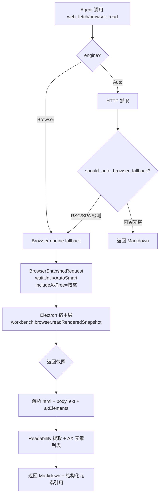

# 浏览器工具强化：RSC/SPA 检测 + 等待策略 + AX Tree 快照

## 概述

参考 agent-browser（React DevTools hook + CDP AX tree）、stagehand（Hybrid DOM+AX snapshot、waitForSelector）、browser-use（DOM serializer）等项目的关键技术，已在当前工作区同时完成 Rust reader/runtime/Tool-FS 与 Electron 浏览器宿主实现。新增字段均有兼容默认值；等待和 AX 能力不可用时返回结构化 warning，不改变既有硬错误语义。

## 涉及文件

| 文件 | 改动 |
| --- | --- |
| [crates/lyra-agent-reader/src/types.rs](crates/lyra-agent-reader/src/types.rs) | 新等待枚举和默认值；BrowserAxElement；snapshot/options/ReaderResult 兼容字段 |
| [crates/lyra-agent-reader/src/document/browser_source.rs](crates/lyra-agent-reader/src/document/browser_source.rs) | 用内部 Source 的 HTML 字节数判断文本密度并传递 AX 数据 |
| [crates/lyra-agent-reader/src/document/render_dispatch.rs](crates/lyra-agent-reader/src/document/render_dispatch.rs) | 区分完整 Next SSR、RSC streaming 和 SPA shell |
| [crates/lyra-agent-runtime/src/native_backend/tools/web.rs](crates/lyra-agent-runtime/src/native_backend/tools/web.rs) | 新参数映射、host payload/response 解析 |
| [crates/lyra-agent-runtime/src/native_backend/tools/web_summary.rs](crates/lyra-agent-runtime/src/native_backend/tools/web_summary.rs) | AX count、interactive count 和 20 个样本 |
| [crates/lyra-agent-runtime/src/native_backend/tools/browser_interact.rs](crates/lyra-agent-runtime/src/native_backend/tools/browser_interact.rs) | `useFrameworkRouter` 参数透传 |
| [crates/lyra-tool-fs-core/src/catalog.rs](crates/lyra-tool-fs-core/src/catalog.rs) | 对外 schema、枚举与默认值 |
| [apps/desktop/src/main/workbench-browser/view-manager-runtime/rendered-snapshot-runtime.ts](apps/desktop/src/main/workbench-browser/view-manager-runtime/rendered-snapshot-runtime.ts) | NetworkIdle/AutoSmart 和按需 AX Tree |
| [apps/desktop/src/main/workbench-browser/view-manager-runtime/normalizers.ts](apps/desktop/src/main/workbench-browser/view-manager-runtime/normalizers.ts) | 同源链接 framework router 导航 helper |
| [apps/desktop/src/main/workbench-browser/view-manager-runtime/page-registry-controller.ts](apps/desktop/src/main/workbench-browser/view-manager-runtime/page-registry-controller.ts) | normal tab router 优先、硬导航回退 |
| [apps/desktop/src/main/workbench-browser/view-manager-runtime/agent-page-controller.ts](apps/desktop/src/main/workbench-browser/view-manager-runtime/agent-page-controller.ts) | live/isolated Agent 导航接线 |
| [apps/desktop/src/main/agent/lumen-tool-host.ts](apps/desktop/src/main/agent/lumen-tool-host.ts) | Lumen host 参数接线 |

## 数据流

## Todo 列表

### P0: 改进 SPA/RSC 检测和 fallback 策略（completed）

- `__next` 不再直接等同于空壳；完整 SSR 正文保留 HTTP reader 结果。
- RSC streaming、空 root、旧 `<80` 字符保护和大 HTML 超低正文密度触发 browser fallback。
- `should_auto_browser_fallback` 直接接收内部 `Source`，密度分母使用真实 HTML 字节数，未扩充公共 DTO。
- 测试包含超过 80 字符的 RSC fixture，确保不是旧保护误触发。

### P1: 等待策略（completed）

- Rust 和 Tool-FS 支持 `networkIdle | autoSmart`，默认 `autoSmart`。
- Electron 复用共享 debugger session 监听 CDP Network 事件；WebSocket、EventSource、Media 不计入 in-flight。
- `autoSmart` 依次检查 document ready、network idle、DOM/文本稳定。
- debugger 不可用或超时会降级并返回结构化 warning，snapshot 读取继续完成。

### P2: AX Tree 结构化快照（completed）

- `includeAxTree=true` 时延迟调用现有 `axMapAgentPage(strategy=document)`；未请求时不执行 AX 读取。
- `BrowserAxNode` 映射为稳定 `axRef`、role、name、可用 URL、整数 CSS bounds、interactive/content 标记。
- AX 失败或临时 renderer 返回空数组和 warning。
- `axElements` 经 snapshot、`Source`、带 serde 默认值的 `ReaderResult` 全链路保留。
- compact summary 保留总数、可交互数和最多 20 个样本；Tool-FS 默认 `includeAxTree=false`。

### P3: SPA 导航增强（completed）

- `WorkbenchBrowserNavigateRequest`、live/isolated Agent 导航和 Lumen host 均接受 `useFrameworkRouter`。
- 仅同源 HTTP(S) 地址尝试点击页面中 URL 完全匹配的现有链接。
- 没有匹配链接、URL 未变化、跨域或脚本失败时回退既有 `loadURL`；未使用 `history.pushState`。
- Browser interact schema 顶层暴露该字段，默认 `false`。

## 实施约束

- BrowserSnapshotProvider trait 保持同步接口
- 新增字段使用 `Vec` 默认空、`Option` 默认 None，不破坏现有调用
- 新增枚举变体放在最后，不改变现有变体的序号
- 不调整 Agent 提示词，不限制 model 智能
- 所有新增逻辑配 ONE 个可运行的单元测试

## 验证

已通过：

- `cargo check -p lyra-agent-reader -p lyra-agent-runtime`
- `cargo test -p lyra-agent-reader --lib`：133 passed
- `cargo test -p lyra-tool-fs-core`：全部通过
- Runtime 新增/受影响定向用例：framework router 和 browser web-fetch host 数据链均通过
- Electron Vitest：rendered snapshot 5 passed；framework router/AX 2 passed；Lumen router 1 passed
- 本次改动 Rust 文件的定向 `rustfmt --check`
- `git diff --check`

已执行并核对的仓库既有基线：

- `cargo test -p lyra-agent-runtime --lib`：559 passed、18 failed；18 项均位于 provider/session/memory/terminal/trim 等既有非浏览器测试，本次新增浏览器用例通过。原文记录的“21 个预存失败”已按当前实测更新。
- `npm --prefix apps/desktop run typecheck`：仍被仓库已有类型错误阻塞；本次等待、AX、router 实现文件未新增错误。
- `pnpm check` / `pnpm lint:structure`：结构检查仍被既有超长文件与 language-pack 主进程跨层 import 阻塞；本次曾触发的 `web.rs` 行数问题已通过拆出 `web_summary.rs` 消除。
- `cargo fmt --all --check`：既有 `crates/lyra-computer-use-core/src/windows.rs:1101` 语法错误阻止全量格式化，并同时报告其他既有未格式化文件。
- `cargo check --workspace`：已执行但未跑完；补编译未命中的平台/终端依赖时磁盘达到 99%（约余 5.6 GiB），为避免耗尽磁盘主动终止。未清理用户的 `target` 缓存；上述 affected crates 的联合 `cargo check` 已通过。
