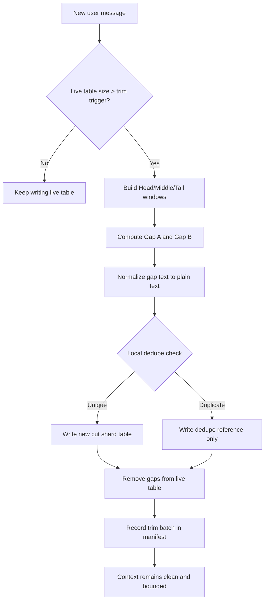
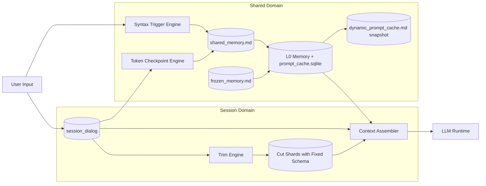

# Lyra AI Memory Architecture V2

## Status
- Status: Locked for implementation
- Scope: Lyra desktop AI memory and session persistence
- Principle: session isolation, no session deletion, context cleanliness by trimming, long-term retention by archival and shared memory

## Design Goals
1. One session, one isolated active database with fixed table schema.
2. AI can read all local data under `~/.lyra` when needed.
3. No session deletion.
4. Context control by token or character windows, not by message count.
5. Trimmed parts are archived, not deleted.
6. Archived trimmed text stores plain text only (remove punctuation and emoji).
7. Archive cleanup is size-threshold driven and keeps each archive shard head and tail.
8. Shared memory is explicit and proactive, not only passive lookup.
9. Shared memory has two channels: file storage and dynamic prompt injection.
10. Shared extraction is trigger-driven by syntax engine and token checkpoints, with dedupe marks.
11. Shared memory performs compression and decay based on size thresholds, compression first.
12. Permanent profile facts are stored in frozen memory.
13. Shared and frozen memory both support updates and corrections.
14. Auto-updatable fields should be derived automatically when possible.
15. Cut archives in one session must run automatic local deduplication with very-high-similarity direct dedupe.
16. Session-local databases and cut shards must prefer fixed schema names over dynamic table names.
17. `dynamic_prompt_cache.md` is an observable snapshot, not runtime cache truth.

## Storage Root
All AI memory data is under:

```text
~/.lyra/modules/ai/
```

Recommended V2 layout:

```text
~/.lyra/modules/ai/
  sessions/
    <session_id>/
      session.sqlite
      cuts/
        cut_000001.sqlite
        cut_000002.sqlite
      manifests/
        cuts.manifest.json
  shared/
    shared_memory.md
    frozen_memory.md
    dynamic_prompt_cache.md
    shared_index.sqlite
  runtime/
    trigger_marks.sqlite
    memory_jobs.sqlite
    prompt_cache.sqlite
  metrics/
    memory_compaction.log
```

## Core Model

### 1. Session Live Memory
- Each session has one dedicated active SQLite database file: `sessions/<session_id>/session.sqlite`.
- Each session database uses fixed schema names.
- Main live message table:
  - `session_dialog`
- Because the database file is already session-scoped, the main live table does not need a `session_id` column.
- If V2 later introduces in-session branches or subthreads, add `stream_id` or equivalent branch keys rather than dynamic table names.

Suggested live table columns:
- `msg_id` (stable id)
- `turn_index`
- `role` (`user|assistant|tool|system`)
- `content_raw`
- `token_count`
- `char_count`
- `created_at`
- `metadata_json`
- `stream_id` (optional, reserved for future in-session branching)

### 2. Trim Archive Shards
- Every trim operation creates a new archive shard in `cuts/`.
- One trim operation equals one new shard database with fixed schema:
  - file: `cut_00000N.sqlite`
  - tables: `cut_payload`, `cut_refs`, `cut_meta`
- Archived data is queryable by AI and linked to source ranges.

Suggested `cut_payload` columns:
- `archive_id`
- `source_session_id`
- `source_msg_start_id`
- `source_msg_end_id`
- `role`
- `content_plain` (punctuation and emoji removed)
- `token_count_plain`
- `char_count_plain`
- `trim_batch_id`
- `created_at`

Suggested `cut_refs` columns:
- `dedupe_ref_id`
- `source_archive_id`
- `target_archive_id`
- `dedupe_reason`
- `similarity_score`
- `created_at`

### 3. Shared and Frozen Memory
- `shared_memory.md`: high-value shared knowledge, can evolve.
- `frozen_memory.md`: stable identity-like facts, very low churn.
- `dynamic_prompt_cache.md`: observable snapshot of generated injected snippets, used for debugging and audit, not as runtime cache truth.

## Context Assembly Algorithm

When constructing model input for one session:

1. Keep `HEAD_WINDOW` from session start.
2. Keep `TAIL_WINDOW` from latest part.
3. Keep `MIDDLE_WINDOW` from the middle anchor region.
4. Trim two gaps:
- Gap A: between head and middle.
- Gap B: between middle and tail.

Context formula:

```text
Context = Head(H tokens/chars) + Middle(M tokens/chars) + Tail(T tokens/chars)
```

Rules:
- Window units use token first, char fallback.
- Never use message-count as primary control.
- Trimmed gaps are archived immediately to new archive shards.

## Trim Pipeline



## Plain Text Normalization for Archive

Archive writing runs local normalization only:
1. Remove punctuation classes.
2. Remove emoji and pictographic symbols.
3. Collapse repeated whitespace.
4. Keep language characters, numbers, and structural separators.

This is local deterministic processing and does not require remote services.

## Cut Archive Deduplication (Local-Only)

Scope:
- Deduplication runs inside one session's `cuts/` folder only.
- No cross-session dedupe in V2.

Hard requirements:
1. Pure local code implementation, no remote service, no model call.
2. Exact duplicate must be removed immediately.
3. Very-high-similarity duplicate must be removed directly.
4. Keep lineage via references so no information path is lost.

Dedup stages:
1. Exact dedupe:
- On normalized plain text, compute `sha256`.
- If hash exists in session cut index, do not write duplicated payload.
- Write a reference record to existing archive payload.

2. Near-duplicate dedupe:
- Build local fingerprint (recommended `simhash` over 3-gram tokens).
- Compute similarity against candidate set from index.
- If similarity `>= CUT_DEDUPE_SIM_THRESHOLD`, treat as duplicate.
- Default threshold for direct dedupe: `0.985`.

3. Candidate narrowing:
- Use cheap prefilters first: length bucket, token-count delta, prefix/suffix checksum.
- Only run full similarity on narrowed candidates.

Reference record fields:
- `dedupe_ref_id`
- `source_archive_id`
- `target_archive_id`
- `dedupe_reason` (`exact_hash|near_duplicate`)
- `similarity_score`
- `created_at`

Implementation note:
- `cuts.manifest.json` should include dedupe stats and target references.
- Optional index DB per session: `cuts/dedupe_index.sqlite`.

## Archive Cleanup Policy (Cuts Only)

Session live memory is never deleted by this policy.
Only `cuts/` is compacted when size threshold is exceeded.

Trigger:
- If `cuts/` total size for one session exceeds `CUTS_SIZE_TRIGGER_BYTES`.

Cleanup action:
1. Iterate each cut shard.
2. Keep head segment and tail segment from that shard.
3. Remove middle segment in that shard.
4. Recalculate total size.
5. Continue until below `CUTS_SIZE_TARGET_BYTES`.
6. Re-run local dedupe after compaction to collapse newly similar retained segments.

Hard constraints:
- Do not delete entire session.
- Do not fully erase a cut shard unless it has no retained content after compaction.
- Compaction is reversible only through source-of-truth lineage metadata.

## Trim/Delete Integrity Controls

Trim, dedupe, compaction, and decay must run as a deterministic state machine.

Required invariants:
1. Any removed live segment must be archived or dedupe-referenced first.
2. Archive lineage must remain resolvable (`source -> target` chain).
3. No duplicate full payload should persist as independent records in one session cuts domain.
4. Every compaction run preserves recoverable head and tail context for each cut shard.

Boundary cases requiring dedicated tests:
1. Very short sessions where head/middle/tail windows overlap.
2. Near-threshold token jitter around trim trigger.
3. Multiple trims in short intervals.
4. Mixed-language and emoji-heavy content after normalization.
5. Compaction immediately followed by dedupe.

## Shared Memory Mechanism

### Channel A: Shared Files
- AI writes explicitly useful cross-session facts into `shared_memory.md`.
- Permanent near-static facts are written to `frozen_memory.md`.

### Channel B: Dynamic Prompt Injection
- Runtime generates compact snippets from shared and frozen memory.
- Inject snippets into system or context prompt when needed.
- Runtime cache layers are:
- `L0` in-memory hot cache
- `L1` `runtime/prompt_cache.sqlite`
- `L2` `shared/dynamic_prompt_cache.md` snapshot only
- `dynamic_prompt_cache.md` is not a source of truth and is not the active hot cache.

## Trigger Engine

Shared memory extraction is not per-message mandatory.

Two trigger paths:
1. Syntax trigger:
- Multi-language grammar engine checks user input patterns.
- Trigger requires syntax-level match, not only keyword match.
- Triggered message goes through extra analysis pass before writing shared memory.

2. Token checkpoint trigger:
- When context reaches configured token threshold.
- Run retrospective scan on unchecked user messages.
- Use check marks to avoid repeated analysis.

Dedupe and marking:
- `runtime/trigger_marks.sqlite` stores analyzed message ids and outcomes.
- Already-checked ranges are skipped unless explicit recheck is requested.

## Performance and Latency Control

To avoid reply delay from dynamic injection and trigger analysis, V2 uses staged execution.

Execution strategy:
1. Reply-critical path:
- Build reply context from already available session/shared snapshots.
- Never block assistant reply on heavy retrospective scans.

2. Background path:
- Syntax deep analysis and token-checkpoint scans run as background jobs.
- Results are applied to subsequent turns.

Token-checkpoint throttling:
- `TOKEN_TRIGGER_COOLDOWN_MS`: minimum interval between full scans.
- `TOKEN_TRIGGER_BATCH_LIMIT`: max unchecked messages processed per run.
- `TOKEN_TRIGGER_MAX_CPU_MS`: budget cap per run.

Tiered cache (local-first):
1. L0 in-memory hot cache: frequent shared snippets and trigger decisions.
2. L1 local durable cache: `runtime/prompt_cache.sqlite` and other SQLite cache tables under `~/.lyra/modules/ai`.
3. L2 cold storage: files, cut shards, and observable snapshots.
4. Optional Redis (future): acceleration only, never truth storage.

Rules:
- Cache miss never breaks correctness.
- Source of truth remains SQLite and filesystem.
- `dynamic_prompt_cache.md` exists for inspection, audit, and debugging only.

## Shared Value Classification Strategy

Shared-value detection cannot be keyword-only.

Classifier signals:
1. Syntax features:
- profile statements
- correction/update statements
- durable preference statements
- long-term project constraints

2. Lexical features:
- multilingual keyword lexicons as weak signals.

3. Context features:
- repetition frequency
- contradiction with existing shared/frozen facts
- recency and stability hints

Decision:
- weighted scoring (`syntax + lexical + context`).
- only scores above `SHARED_CLASSIFY_SCORE_THRESHOLD` enter shared write.
- uncertain scores are stored as review candidates, not direct shared/frozen writes.

## Shared Memory Compression and Decay

When shared memory file size exceeds threshold:
1. Run model-guided compaction.
2. Prefer merge and rewrite over deletion.
3. Keep evidence links and update timestamps.
4. Apply soft decay to low-value repeated items first.

## Update and Correction Rules

All shared and frozen records support updates.

Update modes:
1. Replace: when old value is clearly outdated.
2. Merge: when new value extends old value.
3. Deprecate: keep old value with inactive marker.

Examples:
- Name or phone corrections must override stale records.
- Wrong historical values remain auditable via revision notes.

## Auto-Updatable Fields

Prefer derived updates for fields that naturally evolve.

Examples:
- Age derived from birth date and current date.
- Relative time labels recalculated on read.

Rule:
- Do not require manual maintenance for derivable fields.

## Update Safety and Audit Log

All shared and frozen updates must emit auditable records.

Suggested update log fields:
- `update_id`
- `target_space` (`shared|frozen|dynamic`)
- `target_key`
- `old_value_digest`
- `new_value_digest`
- `update_reason`
- `evidence_source`
- `confidence`
- `created_at`

Safety rules:
1. Frozen records are protected by default.
2. Frozen override requires explicit correction evidence.
3. Auto-update applies only to whitelist fields (for example age from birthdate).
4. Sensitive identity fields (name, gender, phone) are never auto-updated without explicit user evidence.
5. Every overwrite keeps revision history for rollback.

## Read Access Strategy

AI can read all local session and archive data under `~/.lyra`.

Read policy:
- Default reads stay session-local.
- Cross-session reads are on-demand when task relevance requires it.
- Shared and frozen memory can be loaded proactively by trigger policy.

## No-Delete Session Policy

- Session records are never hard deleted by normal memory maintenance.
- Session lifecycle supports archive, hide, and cold state, but not destructive removal.

## Multi-Device Sync Readiness

V2 keeps local-first architecture, while preparing for future sync:
- Every message, archive batch, and shared item uses stable ids.
- Keep `created_at`, `updated_at`, `revision`, and `source_device` fields in metadata.
- Keep append-friendly audit notes for conflict inspection.

## Architecture Diagram



## Implementation Guardrails

1. Session writes must go through AI storage service only.
2. No direct browser storage for AI truth data.
3. No cross-module direct writes into `~/.lyra/modules/ai`.
4. Trim archive must keep source lineage metadata.
5. Shared trigger engine must support multilingual syntax parsing.
6. Trigger engine must persist check marks to prevent repeated scans.
7. Session deletion API must remain disabled by default.
8. Cut dedupe must be local-only and deterministic.
9. Dedupe references must be queryable by AI (traceable source-target chain).
10. Token-checkpoint scans must respect cooldown and CPU budget.
11. Shared/frozen updates must emit audit log entries.
12. Session-local databases must use fixed schema names, not dynamic per-session table names.
13. Cut shard databases must use fixed table names (`cut_payload`, `cut_refs`, `cut_meta`).
14. `dynamic_prompt_cache.md` must never be treated as runtime cache truth.

## Tunable Parameters (Required Config)

All thresholds must be configurable and observable:
- `HEAD_WINDOW_TOKENS`
- `MIDDLE_WINDOW_TOKENS`
- `TAIL_WINDOW_TOKENS`
- `CUTS_SIZE_TRIGGER_BYTES`
- `CUTS_SIZE_TARGET_BYTES`
- `CUT_DEDUPE_SIM_THRESHOLD`
- `TOKEN_TRIGGER_COOLDOWN_MS`
- `TOKEN_TRIGGER_BATCH_LIMIT`
- `TOKEN_TRIGGER_MAX_CPU_MS`
- `SHARED_CLASSIFY_SCORE_THRESHOLD`

Default values must be conservative and tuned from profiling data.

## Verification Baseline

Before default enablement, V2 requires:
1. Integrity tests:
- no-loss guarantees across trim/dedupe/compaction cycles.

2. Performance tests:
- p95 reply latency impact under trigger load remains within budget.

3. Classification tests:
- multilingual precision/recall for shared-value detection.

4. Update safety tests:
- no unintended overwrite for frozen or sensitive fields.

## Rollout Plan

Phase 1:
- Build session-isolated live database with fixed schema (`session_dialog`).
- Enable head-middle-tail context assembly.
- Implement cut shard fixed schema (`cut_payload`, `cut_refs`, `cut_meta`).
- Implement exact and near-duplicate dedupe for per-session `cuts/`.

Phase 2:
- Enable syntax and token checkpoint triggers.
- Enable shared and frozen file update pipeline.
- Add `runtime/prompt_cache.sqlite` and snapshot generation for `dynamic_prompt_cache.md`.

Phase 3:
- Enable archive size compaction and model-guided shared compression.
- Add sync-ready metadata fields.
