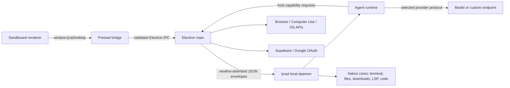

# Architecture overview

Audience: Internal
Status: Active
Last verified: 2026-07-28

Lyra Desktop is an Electron shell around native and TypeScript runtime
services. The product is local-first: workspaces and most state are rooted on
the user's device, but selected features intentionally call model providers,
websites, Supabase, search services, update infrastructure, extension sources,
and other configured endpoints.

## Runtime composition

### Renderer

`apps/desktop/src/renderer` boots the workbench and design-system layers.
Business modules live under `apps/desktop/src/modules/workbench`. Renderer code
must not import Electron or native runtime implementations directly.

### Preload

`apps/desktop/src/preload/index.ts` exposes `window.lyraDesktop` with
`contextBridge`. The main workbench window enables context isolation, disables
Node integration, and enables Electron sandboxing. This protects the renderer
from direct Node access, but does not make every extension or web surface a
security sandbox; see [extensions](extensions.md).

### Electron main

`apps/desktop/src/main` owns BrowserWindow/WebContentsView lifecycle, IPC
registration, safeStorage, native binding loading, local process startup,
browser profiles, OS permissions, and host capabilities required by the Agent.
Main-process services should remain focused adapters. Long-lived native-owned
state must not acquire a second TypeScript implementation.

### Local daemon and native cores

`apps/desktop/src/main/runtime-client.ts` starts or connects to `lyrad`.
`crates/lyrad` routes versioned envelopes to Agent, terminal, download, LSP,
search, code, and performance services. The daemon can call back into registered
Desktop host capabilities for browser, workbench, computer, terminal, and other
Electron-owned operations.

### Agent runtime

`crates/lyra-agent-runtime` owns provider execution, context construction,
permissions, tools, memory projection, Solo/Oma orchestration, checkpoints, and
rollback. `crates/lyra-agent-core` is a compatibility facade, not the kernel
source of truth. See [Agent runtime](agent-runtime.md) and
[ADR-0002](../decisions/ADR-0002-agent-runtime-boundary.md).

## Ownership rules

- Renderer owns presentation and transient UI state.
- Electron main owns OS/Electron integration and bridge validation.
- `lyrad` owns the local process boundary and request routing.
- Native crates own performance-sensitive execution and persistent formats
  assigned to them.
- The selected provider owns remote inference once a request leaves Lyra.
- External extensions remain owned by their authors and are not part of the
  private Lyra ABI unless explicitly documented in the public developer docs.

## Related documents

- [Desktop processes](desktop-processes.md)
- [Runtime socket](../contracts/runtime-socket.md)
- [Storage](storage.md)
- [Security and data flow](security-data-flow.md)
- [Generated module index](../generated/modules.md)

