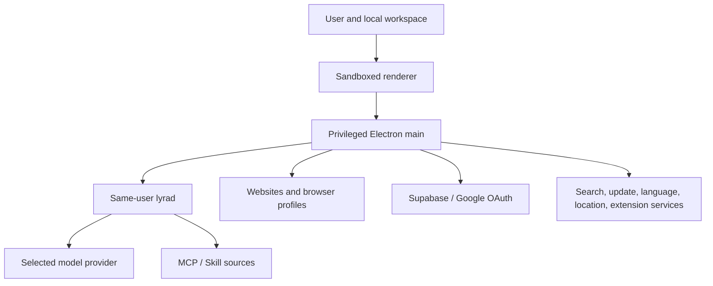

# Security and data flow

Audience: Internal
Status: Active
Last verified: 2026-07-28

This page is the architecture-level threat and flow map. The operational audit
checklist is [privacy-data-flow-audit.md](../operations/privacy-data-flow-audit.md).

## Trust zones

- Renderer input is untrusted until validated by main.
- Website content, model output, MCP results, Skill instructions, archives, and
  language assets are external input.
- Electron main, activated UIUX code, and `lyrad` are privileged same-user
  components.
- A local socket prevents ordinary network exposure; it does not defend against
  another process already running as the same user.

## Model-provider boundary

Depending on the turn and provider capability, Lyra can send:

- user prompts and conversation history;
- active memory and project/workspace context;
- selected files, attachments, images, page content, screenshots, and tool
  results;
- OS/device/hostname/app version, screen, timezone, Git/project details, and a
  consented location label;
- computed persona fields derived from local identity signals.

The runtime currently collects local signals and computes persona on each turn.
Signals include operating-system identity, Git name/email/remotes/history,
SSH public-key comments/known hosts, npm/pip and VS Code/Cursor identity hints,
home-directory age, and earliest commit signals. The computed identity—not
necessarily every raw signal—is incorporated into model context. The separate
persona consent service does not currently gate this path.

## Credentials

- Supabase sessions and cached local account identity use Electron safeStorage.
- Browser login-manager password capture is off by default. After the user
  explicitly enables it, submitted credentials are stored as safeStorage
  ciphertext metadata until capture is disabled again.
- The modular Credentials surface receives only password metadata during list
  operations. Reveal and fill require distinct explicit user-intent values.
  Copy is executed inside Core: Core decrypts the selected value and writes it
  to the clipboard without returning the password to the application bundle.
  Revealed values remain ephemeral renderer state, are cleared when selection
  changes or Core reports a credential update, and are excluded from tab
  snapshots.
- Provider secrets may come from profiles or environment variables.
- MCP headers/env are persisted in local JSON and only redacted in the UI.
- UIUX code with Desktop API access must be treated as able to request
  privileged operations available through that API. Installed packs remain
  untrusted until the user accepts a full-trust warning.

Secrets must never appear in logs, generated inventories, crash bundles, or
support attachments. Redaction is not encryption.

## Browser and network flows

- Browser profiles retain site data and history on the device.
- Isolated Agent flows may borrow origin cookies from the live profile.
- Omnibox suggestions use only local history while typing. Google Suggest and
  Wikipedia network suggestion integrations are disabled in this release.
- Skills catalogs contact `skills.sh`, `claude-plugins.dev`, and `clawhub.ai`;
  installation may contact Git/archive sources.
- Language packs and updates contact GitHub-hosted release endpoints.
- Precise coordinates remain local for the location indicator. Public
  Nominatim reverse geocoding is disabled in this release.
  Its public service policy says personal/confidential data must not be
  submitted, so this implementation remains a legal/security release-review
  item rather than an ordinary low-risk request.

## Local storage and deletion

Most application state lives under `~/.lyra`, but workspaces and downloads can
exist elsewhere. Deleting a module root does not delete cloud account records,
model-provider data, copied files, Git history, or remote MCP state. Product and
legal copy must describe deletion by data class, not as one universal erase
operation.

## Telemetry statement

No first-party behavior analytics or advertising telemetry integration is
currently registered. This does not mean the application is offline: provider,
auth, browsing, search, update, location, and extension flows still make
network requests.
