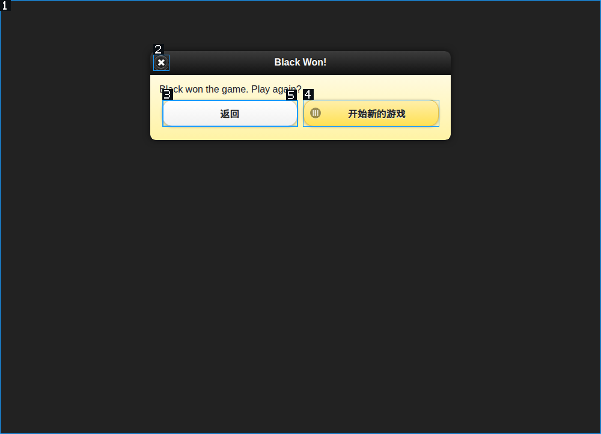

# 获胜后卡在调查：通用浏览器链路修复

Audience: Internal
Status: Active
Last verified: 2026-09-28

日期：2026-09-28。分支：`feat/visual-browser-control`。未提交、未推送。

调查依据：[原始会话时间线](gomoku-win-stall-audit-2026-09-28.md)。历史调查保留原貌，下面记录后续修复状态。

## 验收动作与边界

用户会重复的动作是：让 agent 开始一局、连续落子、识别结果并结束回复。实现修复必须改善这条路径，而不能仅以内部计数或单元测试通过宣称整局已经足够快。

本次已完成生产链路回归，以及原网站通过真实输入触发胜利遮罩、进入结果页的机械回放。**尚未用 MiMo 自主重新完成整局，因此整局速度与自动收尾仍待验收。** 原会话约 90% 的总时间落在供应商请求中，包含推理、首包和传输；本次减少多余模型回合和重复上下文，没有声称已经测出或修复供应商吞吐问题。

生产实现没有域名、棋子、胜负规则、网站 class 名或游戏内部对象的特判。原网站的设置标签和固定落子序列只存在于可选回归测试中，不提供给运行时或模型。

## 修复清单

| 状态 | 原因 | 已实现的通用修复 | 验证 |
| --- | --- | --- | --- |
| 已修，回归通过 | Lyra 自己的动画污染截图与文本 | 截图期间隔离自有光标/提示层；截图完成恢复。页面文本也排除这些内容 | 开关自有光标前后截图像素相同，提示文字不进入 pageText |
| 已修，回归通过 | 无关像素变化让稳定坐标失效 | 验证文档、视口、真实命中节点及局部像素；不再要求整图相等 | 无关动画允许输入；同外观换节点、透明拦截层、目标位移、局部重绘仍拦截；iframe 同样验证 |
| 已修，回归通过 | 只能读出底层被盖住，不能定位上层 | 返回实际接收输入的可见覆盖对象、边界和内容，标为 occluding-hit-surface，不虚构按钮语义 | 委托事件遮罩能映射和真实点击；原网站胜利遮罩也通过 |
| 已修，回归通过 | 结构回执早于异步响应，拆出多次模型调用 | 结构区域也做有上限的状态等待；显式 after 条件把一次输入、等待与新场景放在同一调用 | 650 ms 后的异步结果在一次动作回执中返回，只有一次可信输入 |
| 已修，回归通过 | auto 意外切图；wait 重新建全图 | auto 保持结构模式；已知区域的 wait 返回结构及原有条件证据 | 无截图、无重建地图；matched、completion、当前文本仍到达模型 |
| 已修，回归通过 | 旧停滞计数在新进展后残留 | 按页面记录实际控件/文本，结构证据替代旧计数；URL 和数量不算状态 | wait 与变化场景交替不误报；同数量但状态变化、不同行页互不累计 |
| 已修，回归通过 | 每轮完整场景堆积 | 模型工作副本只保留每页/表示/区域最新两份完整场景，其余摘要化；浏览器图片沿用上限 | 动作回执、证据索引、最新状态与供应商 reasoning 保留；原始档案未改 |
| 已改善，整局待验 | 获胜后不停查不同源码/CSS，逃过重复检测 | 输入后连续 6/12/24 个无新输入回合提醒复核用户目标；已完成则收尾，缺证据则针对具体问题调查 | 不同源码查询也触发目标复核；新输入重置计数；纯只读研究不触发 |
| 已修说明，误用仍需整局观察 | extract 像承诺结构抽取，实际只返回文本 | schemaApplied=false、extractionMode=renderedText，接口说明与输出一致；提示区分 DOM 弹层和原生 dialog | 工具输出测试通过；不放松 AX 根节点和 effect 安全边界 |
| 已修，契约检查通过 | 浏览器提示与工具能力变化需要让旧会话更新契约 | PROMPT_TEMPLATE_VERSION 升至 62，TOOL_DISCOVERY_CONTRACT_VERSION 升至 3 | 提示词契约检查通过，完整/精简提示投影快照随版本更新 |

- [x] ~~自有光标影响坐标操作~~
- [x] ~~整图一致性导致无关动画拦点击~~
- [x] ~~自定义覆盖层没有真实目标~~
- [x] ~~结构动作缺少异步状态交接~~
- [x] ~~wait 反复重取地图、auto 丢失表示模式~~
- [x] ~~旧计数制造假停滞~~
- [x] ~~旧完整场景持续占据工作上下文~~
- [x] ~~提取接口描述与实际能力不一致~~
- [ ] MiMo 完整对局的速度、胜利后及时回复：代码措施已落实，端到端结果未测。

## 等待与完成必须分开

`after` 支持 textContains、textGone、targetHidden、targetEnabled、stateChanged，最多等待 30 秒。输入前检查参数、读取基线，输入只发送一次。条件超时、观察失败都保留已送达回执。

短暂稳定只表示 quiet；只有显式条件满足才返回 conditionMet，它仍不等于整个用户任务完成。点击前就存在且一直未变的结果文字不会被算成新的回复。采样可能错过极短的条件变化，此时保守返回 unknown。源码可以辅助解释现有结果，但不能仅凭源码或过时状态栏判定现场完成。

收尾提醒是复核机制，不会自动宣告成功、强制关闭游戏弹层或禁止源码分析。原生对话框与 AX 根节点的正确拒绝继续保留。压缩下载内容仍通过正常 HTTP 解码处理，未加入任意改写用户 shell 命令的逻辑。

## 验证记录

| 检查 | 状态 | 结果 |
| --- | --- | --- |
| 生产 Electron 浏览器回归 | 通过 | 79 项；动态画面、iframe、真实输入、遮罩、连续动作、取消、延迟结果及失败回执 |
| 读取/等待/光标 Vitest | 通过 | 42 项 |
| 渲染结构 Node 测试 | 通过 | 4 项 |
| Rust 停滞检测 | 通过 | browser_loop_detector 筛选，12 项 |
| Rust 视觉/上下文/进展测试 | 通过 | visual 筛选，22 项，与上一筛选有重叠，不能直接相加 |
| 工具目录契约 | 通过 | catalog 筛选，2 项，包含 after 的公开 schema |
| 提示词契约与投影 | 通过 | 契约检查通过；完整/精简快照 2 项；已确认最终完整提示包含 after、遮罩、历史摘要及完成复核指引 |
| 主进程、预加载、lyrad 构建 | 通过 | 已构建；守护进程原子替换到本地 desktop/native/linux-x64，SHA-256 一致 |
| 原网站胜利到结果页 | 通过（机械回放） | 9 次落子及结果读取约 9.599 秒；模型推理不在计时内 |
| 完整 TypeScript 检查 | 未通过，既有问题 | 94 条诊断；本次新增视觉与等待模块无诊断 |
| 结构检查 | 未通过，既有问题 | 3 项 Rust 文件长度、2 项既有 storage-root 规则违规 |
| 全工作区 Clippy | 未通过，其他模块问题 | lyra-bootstrap-installer 有 4 条 deny 级诊断（format 与 redundant clone），本次未修改该模块 |
| 内部文档检查 | 未通过，既有问题 | 其他历史文档元数据/链接和生成清单过期；本次两份新增/更新文档的元数据已补齐 |
| Agent 跨语言契约检查 | 未通过，既有问题 | TS 声明 subagentFinished，Rust 事件清单缺失该项；本次未更改这些事件声明 |
| 自主模型完整任务 | 未验证 | 不能据机械回放宣称 agent 已能快速赢一局并及时结束 |

原网站回放选择双人模式，用观察到的行列位置依次驱动双方，稳定触发胜利画面。测试没有读取棋盘内部数组、调用业务 API 或让求解器代替模型。它检查的是输入与结束界面链路，不是模型棋力。



复验命令（Node 24）：

```sh
node --import tsx tools/browser/run-visual.mts
LYRA_VISUAL_LIVE_GRID=1 LYRA_VISUAL_LIVE_OUTCOME=1 node --import tsx tools/browser/run-visual.mts
pnpm --filter @lyra/desktop test src/main/agent/tests/lumen-read.test.ts src/main/agent/tests/lumen-wait.test.ts src/main/workbench-browser/tests/agent-cursor-overlay.test.ts
node --import tsx --test apps/desktop/src/main/workbench-browser/view-manager-runtime/visual-render-state.test.ts
cargo test -j 2 -p lyra-agent-runtime --lib browser_loop_detector
cargo test -j 2 -p lyra-agent-runtime --lib visual
cargo test -j 2 -p lyra-tool-fs-core --lib catalog
```

原网站回放：`/tmp/lyra-visual-audit-84AhzA`；79 项最终回归：`/tmp/lyra-visual-audit-pITWAN`。两者均使用隔离 Electron profile，没有继续或修改用户的旧测试会话。

本地运行文件已更新，没有终止用户进程。重启 Lyra 后才能让现有实例加载新的主进程和守护进程；随后用同一“完整一局并结束回复”目标复验。当前修改保留在工作区。

## 工作边界参考

[Playwright actionability](https://playwright.dev/docs/actionability) 验证目标稳定及能接收事件，不要求整页像素相同。Lyra 保留嵌入式 Electron 的 [capturePage](https://www.electronjs.org/docs/latest/api/web-contents#contentscapturepagerect-opts) 与原生输入路径，不另外启动浏览器适配层。

本地 `參考/opencode/packages/opencode/src/session/processor.ts` 的 doom-loop 检查连续相同工具名和输入，不把 URL 没变化当作整项任务停滞。这里采用实际状态进展与任务目标复核，避免一个旧计数反复驱动重取地图。
