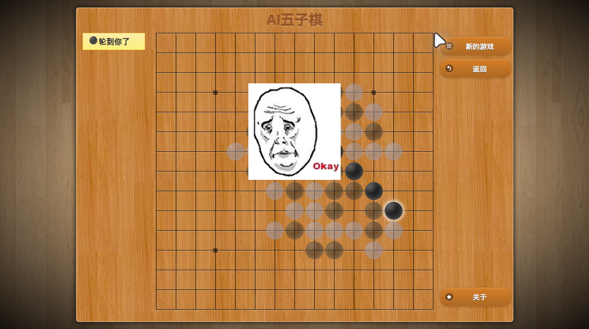

# 五子棋已获胜但未结束：会话调查（2026-09-28）

本次只调查并记录，没有修改产品代码，没有重启或继续该游戏。

## 结论与统计口径

这次完成了 26 次有效落子并获胜，但没有完成任务收尾。实际点击已经很快；操作后的状态交接、运行时误报、视觉点击保护和目标完成判断仍然存在问题。这不能算“快准狠”的整局验收通过，也不能据此证明其他网页或游戏都能正常完成。

- 会话：`session-3ecd0b1a-6937-46d8-8992-721a07a39161`，标题“AI五子棋 - 便民查询网在线五子棋 完一次五子棋”。
- 模型：`mimo_token_plan_cn / mimo-v2.6-flash`。
- 来源：该会话 `session.sqlite` 的 `session_dialog` 与 `session_bundle`，只读读取；包括持久化工具结果、实际给模型的图片、供应商统计和结束状态。
- 时间统一为 **2026-09-28 America/New_York（EDT，UTC−4）**。下方工具编号按 snapshot 的 101 个活动排序，包含开场自动地图。
- 05:50:09.676 开始；06:26:36.639 最后一手完成；06:57:24.766 用户取消。
- 总计 **67 分 15.090 秒**；获胜前 **36 分 26.963 秒**；获胜后继续 **30 分 48.127 秒**。
- 26 次成功落子，执行合计 **9.639 秒**，中位数 **0.356 秒**；相邻两手开始时间间隔平均 **85.727 秒**、中位数 **63.648 秒**、最长 **299.417 秒**。这里的间隔包含模型决策、对手响应及中间读取，不等于点击耗时。
- 全部 101 个工具活动耗时相加 **144.092 秒**。已结束的 101 次供应商请求（100 次产生工具调用、1 次连接失败）合计 **3,623.996 秒**，约占总时间 **89.8%**。这包括服务端推理、传输、首包等待，不能全部称为“思考”或“网络等待”。未归入两项的约 267 秒含取消前未结算请求、上下文处理及其他间隔，现有统计不能继续精确拆分。
- 唯一记录到的连接失败持续 **30.027 秒**，发生在工具 #10 与 #11 之间，随后恢复。它不足以解释整局一小时；本报告不据此判断 VPN 是否正常。
- 已结算输出 159,408 token，其中 reasoning 151,709，约 **95.2%**；单次输入从 **26,483** 增至 **215,285 token**。100 次请求的输入量相加为 12,038,004，其中缓存读取 10,798,656；累计输入不是唯一内容量，也不等同实际费用。
- 实际送给模型的浏览器图片共 **5 张，全部在获胜后**；此前使用共享的 DOM 结构、状态字典和行列位置完成落子。没有证据表明落子期间使用了外部游戏接口或后台棋谱；后半段有源码调查，但发生在获胜之后。

## 胜利证据与“为什么没有停”

#63 返回的当前棋盘中，黑子已在 `(6,9)、(7,10)、(8,11)、(9,12)`，行列均从 1 开始。#64 成功点击 `(10,13)`，返回 `completed=1, dispatched=true`，随后棋盘被结果遮罩覆盖。#69 的截图已经展示获胜后的五子连线及中间的“Okay”表情图片。

不能仅凭表情的悲喜判断输赢。会话 #94 已读取的网站 `showWinDialog` 明确显示：当前玩家为 `HumanPlayer` 时写入“你赢了!”并显示 `#sad-outer`。#96 又读到 `Game.win()` 停止游戏并禁止继续落子。截图、最后一手的结构证据、网站源码三个来源相互吻合。

网站自身也有一个干扰：结束逻辑给 `gameInfo.value` 赋值，而更新状态栏的方法是 `gameInfo.setText()`。因此截图与工具文本仍显示“轮到你了”。这是网站的过时提示，Lyra 不应将这一条文字作为继续对局的充分证据。

#94 在 **06:41:08** 已提供明确的胜利分支证据，随后仍继续约 **16 分钟**，查无障碍图片、Game.js、CSS 和动画，直到用户停止。任务已经从“完成一局”偏移成“排查为什么遮罩点不了”。源码分析本身有价值；问题是得到足够结果证据后，没有回到用户目标并结束。

历史截图（#80；白色大光标是 Lyra 的操作提示）：

## 已定位的问题

### P1：Lyra 自己的动态光标污染截图，触发整图失效保护

**状态：代码缺陷已定位，历史图片支持；本次未修复。**

- #70、#71、#81、#82 四次坐标点击均返回 `image_content_changed`，且 `completed=0, dispatched=false`，根本没有向页面发送点击。
- `visual-scene-actions.ts` 对坐标操作重新截图，并要求整张 PNG 的 SHA-256 与之前完全一致。任意位置的像素变化都会拦截输入，连与目标无关的动画也包括在内。
- `page-content-runtime.ts` / `snapshot-provider.ts` 直接调用 `webContents.capturePage()`；没有排除注入页面的 `__lyra_agent_page_cursor__`。
- `agent-cursor-overlay.ts` 给该光标添加摇摆动画、90px 光晕、移动和淡出；它是 DOM 绘制内容，`pointer-events:none`、`aria-hidden` 都不会让它从截图消失。
- 保存下来的 #69→#70、#70→#71、#80→#81 图片差异分别仅占 **0.368%、0.506%、0.309%**，全部落在可见的 Lyra 光标/光晕区域。#80→#81 差异框为 `x=962..1049, y=53..140`；尝试点击的位置约为 `(671,296)`，与变化区域分离。
- 因此不能把“画面变化”归因于游戏。已存图片明确暴露了我们自己的动画干扰；拒绝时使用的瞬时校验帧没有单独落盘，无法逐次证明四次拒绝只受该动画影响。

通用修复方向：截图与页面证据先隔离 Lyra 自有绘制层；坐标动作按文档、视口、目标局部身份/遮挡变化验证，避免整图逐像素相等。不能简单删掉全部过期检查，也不能仅扩大重试次数。

代码入口：

- `apps/desktop/src/main/workbench-browser/view-manager-runtime/visual-scene-actions.ts`，`raw` 分支的 `scene.pixelHash` 比较。
- `apps/desktop/src/main/workbench-browser/view-manager-runtime/visual-scene-capture.ts`，生成 `pixelHash`。
- `apps/desktop/src/main/workbench-browser/view-manager-runtime/page-content-runtime.ts`，`capturePage`。
- `apps/desktop/src/main/workbench-browser/agent-cursor-overlay.ts`，`buildAgentCursorOverlayScript`。

### P2：地图能报告底层元素被遮挡，却不能指出和操作遮挡层

**状态：会话中已确认能力缺口；本次未修复。**

#64 成功落子后，结构接口返回“原区域消失，使用语义地图”。地图列出被覆盖的旧棋盘和按钮，却没有覆盖它们的表情遮罩；#66 的 `blockedRegions` 为空。#69/#80 的场景 `controls=[]`、渲染状态数为 0，提示文字却仍让模型“使用框内编号”。

这个可见的遮罩不是原生 dialog 或按钮：网站给 `.fullscreen-wrapper` 注册 jQuery `tap`，点击后才进入真正的结果页。语义扫描和 AX 搜索没有提供对应目标；视觉节点扫描依赖已有地图 targetRef，额外只发现 canvas/svg/application，未补出此遮挡层。CDP 监听器辅助探测也只显式检查 click/mousedown/mouseup/pointerdown/pointerup，不能保证覆盖自定义事件及委托交互。

这不是“没有把 225 个点全标出来”的问题。棋盘已成功归为一个区域并支持行列落子；失败发生在从棋盘切换到新遮罩的那一刻。

通用修复方向：被遮挡时返回当前实际命中的顶层可见对象及其边界/内容/证据；区分“可见、可命中、已知可交互”，不要把未知 div 自动宣称为按钮。允许模型对观察到的顶层区域明确下达点击，并在执行后验证。没有编号时应准确说明可用路径。

代码入口：`visual-scene-dom.ts` 的 `collectVisualNodes`；`agent-observation-cdp-enhancements.ts` 的 `detectJsClickListenerBackendIds`；`visual-scene-controller.ts` 的结构区域消失回退。

### P3：结构化回执返回得过早，必要的后续状态读取被拆成多轮模型调用

**状态：代码与实际回执吻合；本次未修复。**

前中盘常见流程是“落子 → 模型决定等待 → wait → 模型决定读结构 → see → 模型决定下一手”。后半盘则几乎每次“落子 → map → 下一手”。

但不能把所有重新读取都归为多余：#8/#11/#14 等落子回执明确显示“思考中”，状态中只有己方刚下的棋子，还没有对手回复。#5 甚至已显示“轮到你了”，但棋盘只有一枚黑子，说明读取正好撞在页面的异步状态交接中。后续刷新有实际需要。

根因之一是 `visual-scene-controller.ts` 的结构分支立即 `describe()` 并返回，没有走下方截图分支的有限等待逻辑。于是共享结构解决了定位，却没有解决一次动作后何时把可靠的新状态交回模型。

本次 7 次 `textContains` wait 实际条件只花 **34–57ms** 满足，整个工具却花约 **3.4–3.5 秒**，同时带回地图。局部 `see(representation=structure)` 约 **0.18–0.21 秒**。需要读取的是已知区域的新状态；当前经常走重建地图，并为“等一下”和“再读一下”分别调用模型。

通用修复方向：把明确的后置条件、有限等待、区域状态增量作为动作回执的统一能力，结构和图像都适用。条件可以由 agent 指定，不能系统猜测游戏规则，也不能把动画静止或文本短暂稳定等同于任务完成。保留“输入已投递”与“后置条件是否满足”两个独立结果。

### P4：旧停滞计数没有被真实结构进展清除，反复误导 agent 重新取图

**状态：代码缺陷已确认；注入次数为回放推演，非原始注入日志。**

`browser_loop_detector.rs` 的旧指纹仅取 URL、节点数量、status.state。wait 结果没有结构 scene，也没有 elements/status，于是几次 wait 都被归为同一个 URL、零元素、空状态。

新的结构场景有棋子变化指纹，但在该分支处理后直接 `continue`，不清理旧的 `consecutive_stagnant_pages`。函数末尾又无条件检查旧计数并输出“重新 map，再操作 targetRef”。因此即使后续每一手都在产生新状态，警告仍可持续出现，甚至无浏览器结果的一轮也会重复旧警告。

按当前代码对保存结果回放，#21 达到阈值，此后 #21–#64 共 44 轮仍满足旧警告条件。运行时的 attempt-local 警告没有逐条写入本会话协议档案，因此 **44 是代码回放结果，不作为已记录的实际注入次数**。可见回复至少三次回应了这种误报：05:58、06:01、06:06 均说明棋盘在变化、只是状态栏文字没变。

通用修复方向：同一页面使用统一的有意义状态进展；新证据须清除旧停滞，不把不同观察范围或证据缺失当作相同。纠偏建议要优先复用当前有效的结构与区域，不统一退回重建地图。

### P5：模型调用和上下文持续增长，已经获得的结果没有约束后续调查

**状态：耗时与任务偏移已确认；不能仅凭统计把全部延迟归责于模型或网络。**

100 次已结束的模型工具回合里，17 次请求超过 60 秒，7 次超过 120 秒。绝大部分输出 token 用于 reasoning。26 手棋平均间隔 86 秒；获胜后的 37 个工具没有再推动对局或完成回复。

共享结构已有 `changed` 与计数，但每次还返回完整状态字典、行压缩棋盘以及 CSS 层描述，后面的地图还附带语义列表。随着多轮推理及工具历史累积，输入从 26k 增至 215k。这个增长是观测到的事实；当前数据不能精确归因每一种内容占多少 token，也不能证明仅压缩输入就能达到 30 秒一手。

通用修复方向：稳定状态字典和对象编号复用、增量优先、明确异步后置条件、阶段性完成证据；避免模型为了工具衔接不断开新一轮。保留源码调查，但每次调查围绕一个可验证问题；已有结果与现场证据一致时回到用户任务。供应商所需的推理回传不能直接粗暴删除。

### P6：恢复流程出现工具误用与缺少新增证据的排查

**状态：会话已确认；需区分正确拒绝与工具缺陷。**

- #75 用 `effect=observe` 尝试关闭一个 `dialogId=none` 的原生对话框，正确触发 `browser_action_effect_conflict`。此时是 DOM 遮罩；参数与工具选择错误。
- #88 尝试点击 AX 根 webarea，正确触发 `axTargetNotActionable`；不能为绕过坐标保护而放松根节点点击校验。
- #77 希望 `extract` 给出遮罩标签/src/class，结果只是带 instruction/schemaHint 的页面文本。工具完成状态不代表满足了该提取要求，能力说明与实际输出需要核对。
- #91/#92 获取到压缩的 JS 数据，后面用 `curl --compressed` 重取才读到源码，增加两个无效回合。
- #96 以后已经有停止游戏与胜利分支证据，仍不断换查询词、读取 CSS。不同文件带来不同输出，不等于用户目标取得新进展。

## 修复优先级与可见验收条件（尚未实施）

1. 隔离自有光标与截图/进展证据；保留合理的局部防误点机制。在有动态光标、加载动画、其他无关动画的页面，点击稳定目标应正常发送；目标被真实替换或遮挡时仍应拦截。
2. 补全顶层遮挡对象的通用观察和命中路径。在没有 button/dialog 语义、使用委托事件或自定义点击事件的弹层中，可以看见并定位覆盖层。
3. 修复新旧进展判断冲突；结构与图像共用动作后状态交接。页面真实变化时不发假停滞警告；一次动作能返回条件满足后的状态或明确的未完成结果，不要求额外重建全图。
4. 优化增量上下文和任务收尾。达到用户定义的结果后，不为无关的界面清理继续调查；证据不足时准确说明缺口，不能凭动画或一个词自动宣布完成。

验收继续采用用户看到的动作：开始一局、连续落子、识别结果并结束回复；并用另一个网站/异步表单/非原生遮罩复验通用性。内部单元测试或一次点击成功不能替代完整任务测试。

## 逐项时间线

“前间隔”是上一个工具结束到此工具开始，含模型请求及调度等，不直接等同模型纯推理。“工具耗时”只统计该工具。状态评价针对本次任务实际用途，不只看接口 success；长间隔单独标注，避免误称点击工具很慢。`#1` 为自动初始地图。

| # | 开始时间 EDT | 前间隔 | 工具耗时 | 动作与观察 | 状态 |
|---|---|---:|---:|---|---|
| 1 | 05:50:09 | 0.003s | 0.294s | 初始地图：12 个设置控件 | 正常 |
| 2 | 05:50:18 | 9.000s | 0.092s | 发现 act、wait 工具 | 正常 |
| 3 | 05:50:27 | 8.498s | 1.746s | 点击“开始”，获得 15×15 结构 | 正常 |
| 4 | 05:50:46 | 17.299s | 0.097s | 发现 vact、see 工具 | 正常 |
| 5 | 05:50:52 | 6.131s | 0.381s | 第 1 手 (8,8)，点击成功 | 正常落子 |
| 6 | 05:51:10 | 17.553s | 2.238s | shell sleep 2；等待另占一次模型回合 | 有问题（效率） |
| 7 | 05:51:22 | 9.285s | 0.187s | 局部结构读取；无截图 | 正常（补取对手新状态） |
| 8 | 05:51:52 | 29.676s | 0.370s | 第 2 手 (7,9)，点击成功；回执仍在对手思考阶段 | 正常落子；后续状态未就绪 |
| 9 | 05:52:04 | 12.050s | 3.477s | 等待“轮到你了”，随后附带完整地图 | 有问题（等待与读取拆分） |
| 10 | 05:52:14 | 6.527s | 0.209s | 局部结构读取；无截图 | 正常（补取对手新状态） |
| 11 | 05:53:06 | 51.944s | 0.302s | 第 3 手 (9,8)，点击成功；回执仍在对手思考阶段 | 正常落子；后续状态未就绪；前间隔≥30秒 |
| 12 | 05:53:13 | 6.753s | 3.459s | 等待“轮到你了”，随后附带完整地图 | 有问题（等待与读取拆分） |
| 13 | 05:53:25 | 8.717s | 0.182s | 局部结构读取；无截图 | 正常（补取对手新状态） |
| 14 | 05:54:10 | 44.235s | 0.380s | 第 4 手 (7,8)，点击成功；回执仍在对手思考阶段 | 正常落子；后续状态未就绪；前间隔≥30秒 |
| 15 | 05:54:18 | 8.143s | 3.444s | 等待“轮到你了”，随后附带完整地图 | 有问题（等待与读取拆分） |
| 16 | 05:54:40 | 17.654s | 0.205s | 局部结构读取；无截图 | 正常（补取对手新状态） |
| 17 | 05:56:28 | 107.817s | 0.331s | 第 5 手 (7,10)，点击成功；回执仍在对手思考阶段 | 正常落子；后续状态未就绪；前间隔≥30秒 |
| 18 | 05:56:36 | 8.350s | 3.453s | 等待“轮到你了”，随后附带完整地图 | 有问题（等待与读取拆分） |
| 19 | 05:56:51 | 11.345s | 0.175s | 局部结构读取；无截图 | 正常（补取对手新状态） |
| 20 | 05:57:34 | 42.508s | 0.312s | 第 6 手 (7,7)，点击成功；回执仍在对手思考阶段 | 正常落子；后续状态未就绪；前间隔≥30秒 |
| 21 | 05:57:45 | 10.661s | 3.464s | 等待“轮到你了”，随后附带完整地图 | 有问题（等待与读取拆分） |
| 22 | 05:57:56 | 8.005s | 0.180s | 局部结构读取；无截图 | 正常（补取对手新状态） |
| 23 | 05:58:22 | 25.700s | 0.312s | 第 7 手 (8,10)，点击成功；回执仍在对手思考阶段 | 正常落子；后续状态未就绪 |
| 24 | 05:58:32 | 9.832s | 0.189s | 局部结构读取；无截图 | 正常（补取对手新状态） |
| 25 | 05:59:25 | 52.959s | 0.328s | 第 8 手 (9,10)，点击成功；回执仍在对手思考阶段 | 正常落子；后续状态未就绪；前间隔≥30秒 |
| 26 | 05:59:36 | 9.903s | 0.121s | 发现 map 工具 | 正常 |
| 27 | 05:59:43 | 6.965s | 3.623s | 重取全图并返回棋盘结构 | 有问题（必要刷新走重型路径） |
| 28 | 06:00:26 | 39.624s | 0.352s | 第 9 手 (10,10)，点击成功；回执仍在对手思考阶段 | 正常落子；后续状态未就绪；前间隔≥30秒 |
| 29 | 06:00:46 | 19.955s | 3.482s | 等待“轮到你了”，随后附带完整地图 | 有问题（等待与读取拆分） |
| 30 | 06:00:58 | 8.462s | 3.544s | 重取全图并返回棋盘结构 | 有问题（必要刷新走重型路径） |
| 31 | 06:03:26 | 143.990s | 0.361s | 第 10 手 (9,11)，点击成功；回执仍在对手思考阶段 | 正常落子；后续状态未就绪；前间隔≥30秒 |
| 32 | 06:03:35 | 8.719s | 3.553s | 重取全图并返回棋盘结构 | 有问题（必要刷新走重型路径） |
| 33 | 06:04:49 | 71.054s | 0.350s | 第 11 手 (10,12)，点击成功 | 正常落子；前间隔≥30秒 |
| 34 | 06:05:01 | 11.085s | 3.534s | 等待“轮到你了”，随后附带完整地图 | 有问题（等待与读取拆分） |
| 35 | 06:05:35 | 30.349s | 3.587s | 重取全图并返回棋盘结构 | 有问题（必要刷新走重型路径）；前间隔≥30秒 |
| 36 | 06:06:04 | 26.236s | 0.354s | 第 12 手 (6,9)，点击成功；回执仍在对手思考阶段 | 正常落子；后续状态未就绪 |
| 37 | 06:06:16 | 11.513s | 3.628s | 重取全图并返回棋盘结构 | 有问题（必要刷新走重型路径） |
| 38 | 06:08:45 | 144.687s | 0.344s | 第 13 手 (12,10)，点击成功；回执仍在对手思考阶段 | 正常落子；后续状态未就绪；前间隔≥30秒 |
| 39 | 06:09:00 | 14.966s | 3.629s | 重取全图并返回棋盘结构 | 有问题（必要刷新走重型路径） |
| 40 | 06:09:23 | 19.327s | 0.347s | 第 14 手 (8,6)，点击成功；回执仍在对手思考阶段 | 正常落子；后续状态未就绪 |
| 41 | 06:09:33 | 9.525s | 3.548s | 重取全图并返回棋盘结构 | 有问题（必要刷新走重型路径） |
| 42 | 06:10:31 | 54.707s | 0.353s | 第 15 手 (5,9)，点击成功；回执仍在对手思考阶段 | 正常落子；后续状态未就绪；前间隔≥30秒 |
| 43 | 06:10:41 | 9.260s | 3.603s | 重取全图并返回棋盘结构 | 有问题（必要刷新走重型路径） |
| 44 | 06:11:15 | 30.861s | 0.376s | 第 16 手 (6,6)，点击成功；回执仍在对手思考阶段 | 正常落子；后续状态未就绪；前间隔≥30秒 |
| 45 | 06:11:24 | 8.749s | 3.610s | 重取全图并返回棋盘结构 | 有问题（必要刷新走重型路径） |
| 46 | 06:12:08 | 39.679s | 0.364s | 第 17 手 (11,12)，点击成功；回执仍在对手思考阶段 | 正常落子；后续状态未就绪；前间隔≥30秒 |
| 47 | 06:12:21 | 13.001s | 3.599s | 重取全图并返回棋盘结构 | 有问题（必要刷新走重型路径） |
| 48 | 06:12:38 | 13.331s | 0.352s | 第 18 手 (12,9)，点击成功；回执仍在对手思考阶段 | 正常落子；后续状态未就绪 |
| 49 | 06:12:48 | 9.345s | 3.609s | 重取全图并返回棋盘结构 | 有问题（必要刷新走重型路径） |
| 50 | 06:13:09 | 18.185s | 0.437s | 第 19 手 (11,8)，点击成功；回执仍在对手思考阶段 | 正常落子；后续状态未就绪 |
| 51 | 06:13:21 | 11.118s | 3.571s | 重读棋盘地图 | 有问题（读取偏重） |
| 52 | 06:13:31 | 6.987s | 3.517s | 紧接上次再次重读地图 | 有问题（重复观察） |
| 53 | 06:14:34 | 59.102s | 0.357s | 第 20 手 (5,11)，点击成功；回执仍在对手思考阶段 | 正常落子；后续状态未就绪；前间隔≥30秒 |
| 54 | 06:14:41 | 6.598s | 3.181s | 重取全图并返回棋盘结构 | 有问题（必要刷新走重型路径） |
| 55 | 06:15:06 | 22.174s | 0.340s | 第 21 手 (4,10)，点击成功；回执仍在对手思考阶段 | 正常落子；后续状态未就绪 |
| 56 | 06:15:19 | 11.840s | 3.661s | 重取全图并返回棋盘结构 | 有问题（必要刷新走重型路径） |
| 57 | 06:15:42 | 19.360s | 0.371s | 第 22 手 (5,10)，点击成功 | 正常落子 |
| 58 | 06:15:49 | 7.086s | 3.611s | 重取全图并返回棋盘结构 | 有问题（必要刷新走重型路径） |
| 59 | 06:19:23 | 210.662s | 0.404s | 第 23 手 (6,12)，点击成功 | 正常落子；前间隔≥30秒 |
| 60 | 06:19:32 | 8.092s | 3.549s | 重取全图并返回棋盘结构 | 有问题（必要刷新走重型路径） |
| 61 | 06:24:23 | 287.372s | 0.399s | 第 24 手 (9,12)，点击成功 | 正常落子；前间隔≥30秒 |
| 62 | 06:24:33 | 10.369s | 3.604s | 重取全图并返回棋盘结构 | 有问题（必要刷新走重型路径） |
| 63 | 06:26:09 | 91.875s | 0.422s | 第 25 手 (8,11)，点击成功 | 正常落子；前间隔≥30秒 |
| 64 | 06:26:35 | 26.111s | 0.640s | 第 26 手 (10,13)，形成黑子五连；输入成功，结构转为缺失 | 正常落子；有问题（结果交接） |
| 65 | 06:26:46 | 9.970s | 0.599s | 地图仍列旧棋盘，所有底层控件被遮挡 | 有问题（漏掉覆盖层） |
| 66 | 06:26:57 | 9.973s | 0.530s | 查询赢/关闭/确认等，只匹配 2 个旧控件；blockedRegions 为空 | 有问题（漏掉覆盖层） |
| 67 | 06:27:08 | 10.661s | 0.129s | 读取可见文字，仍是“轮到你了” | 正常读取；有问题（结果证据不足） |
| 68 | 06:27:20 | 12.098s | 0.218s | 再次搜索已用过的 see | 有问题（重复发现） |
| 69 | 06:27:30 | 9.232s | 1.613s | 首次截图：胜利表情已出现，无任何编号目标 | 有问题（看得见但没有目标） |
| 70 | 06:27:54 | 22.807s | 1.585s | 坐标点表情；image_content_changed，未发送输入 | 异常（点击被拦截） |
| 71 | 06:28:17 | 20.978s | 1.555s | 用新 captureId 再点；同样未发送 | 异常（同类拦截） |
| 72 | 06:28:54 | 36.076s | 0.529s | 查询 page 区域，仍只得到被覆盖的旧容器 | 有问题（恢复无进展）；前间隔≥30秒 |
| 73 | 06:29:18 | 22.929s | 0.167s | 再次读全文，只得到旧状态文字 | 有问题（重复证据） |
| 74 | 06:29:37 | 19.061s | 0.182s | 发现 press/dialog/act，尝试另一路恢复 | 正常（恢复准备） |
| 75 | 06:29:52 | 15.352s | 0.023s | 原生 dialog 关闭参数与 effect 冲突 | 有问题（调用错误；防护正常） |
| 76 | 06:30:09 | 16.201s | 0.598s | 发 Escape，输入成功但覆盖层未变化 | 正常输入；恢复无效 |
| 77 | 06:31:02 | 52.616s | 0.182s | 要求提取遮罩 HTML，返回页面文字和 schemaHint | 有问题（输出不满足请求）；前间隔≥30秒 |
| 78 | 06:32:06 | 64.428s | 2.727s | 等待 textStable，文字稳定但不是结果确认 | 有问题（条件无助于收尾）；前间隔≥30秒 |
| 79 | 06:32:31 | 22.213s | 0.940s | 地图搜索 image/overlay/okay，无匹配 | 有问题（覆盖层仍缺失） |
| 80 | 06:32:59 | 27.076s | 1.971s | 再次截图，画面仍为胜利遮罩且无编号 | 有问题（恢复未完成） |
| 81 | 06:33:18 | 16.212s | 1.747s | 第三次坐标点击；image_content_changed | 异常（同类拦截） |
| 82 | 06:34:00 | 40.875s | 0.658s | observe:none 再点；第四次拦截，仍未发送 | 异常（同类拦截）；前间隔≥30秒 |
| 83 | 06:34:21 | 19.924s | 0.966s | 泛搜 div，226 个匹配，多为旧容器/棋格 | 有问题（扩大无关结果） |
| 84 | 06:34:46 | 23.784s | 0.734s | 发现 AX 地图/动作工具 | 正常（恢复准备） |
| 85 | 06:35:12 | 25.858s | 0.417s | AX 搜 dialog，未找到 | 有问题（与 DOM 遮罩不匹配） |
| 86 | 06:35:30 | 17.635s | 0.359s | 读取 AX 全图，得到网页根与普通链接 | 正常读取；未解决遮罩 |
| 87 | 06:36:05 | 34.496s | 0.675s | 地图查 okay，未找到 | 有问题（重复恢复无进展）；前间隔≥30秒 |
| 88 | 06:37:26 | 80.523s | 0.254s | 尝试点 AX 根，axTargetNotActionable | 有问题（目标选择错误；防护正常）；前间隔≥30秒 |
| 89 | 06:38:32 | 65.356s | 0.187s | 发现 computer 工具，但没有实际执行它们 | 有问题（继续绕路）；前间隔≥30秒 |
| 90 | 06:39:47 | 74.522s | 3.521s | 读网站 HTML 与脚本地址，开始源码调查 | 正常（有具体假设）；前间隔≥30秒 |
| 91 | 06:40:08 | 18.008s | 3.216s | 下载 JS 未解压，grep 未取得预期源码 | 有问题（获取格式） |
| 92 | 06:40:29 | 17.216s | 0.268s | 检查文件字节和 happy 关键字，仍受压缩内容影响 | 有问题（额外回合） |
| 93 | 06:40:46 | 16.737s | 5.332s | 用 --compressed 重取，读到胜负相关代码 | 正常（纠正获取） |
| 94 | 06:41:08 | 17.574s | 0.273s | 读到 HumanPlayer 赢→sad-outer，与截图相符 | 正常（关键结果证据） |
| 95 | 06:41:39 | 30.203s | 0.281s | 读到点遮罩会打开 game-won 结果页 | 正常（解释交互）；前间隔≥30秒 |
| 96 | 06:42:51 | 71.734s | 2.970s | 确认 Game.win 停止游戏；对照图片尺寸与旧状态栏实现 | 正常（补充佐证；应收尾）；前间隔≥30秒 |
| 97 | 06:46:29 | 214.952s | 0.262s | 继续 AX 查询图片，无匹配 | 有问题（胜利后继续绕路）；前间隔≥30秒 |
| 98 | 06:49:32 | 182.592s | 0.265s | 继续读 Game.js 胜利流，没有新落子或结果变化 | 有问题（未收尾）；前间隔≥30秒 |
| 99 | 06:51:07 | 94.665s | 3.507s | 下载 CSS，排查页面动画 | 有问题（任务转为调试）；前间隔≥30秒 |
| 100 | 06:52:49 | 99.354s | 0.270s | 继续查遮罩样式和 hovering 定义 | 有问题（未收尾）；前间隔≥30秒 |
| 101 | 06:54:57 | 127.295s | 0.288s | 继续查棋子/CSS 动画，随后用户取消 | 有问题（未收尾）；前间隔≥30秒 |

另有两项未作为工具活动编号：

| 时间 | 事件 | 状态 |
|---|---|---|
| #10 与 #11 之间 | 供应商连接错误 30.027 秒，安全重试后继续 | 异常（已恢复，不是整局主因） |
| 06:57:24.766 | 用户取消；距最后工具完成约 146.943 秒，没有完成回复 | 有问题（任务未自行收尾） |

## 调查边界

没有修改工具行为，没有替用户点击结果遮罩，没有复跑这场游戏。上述结论来自历史实际输入/输出、截图像素比较和当前代码；报告区分了已存证据、代码回放与待实测修复方向。后续应逐项修复并复验完整动作，不能用本报告代替修复或验收。
