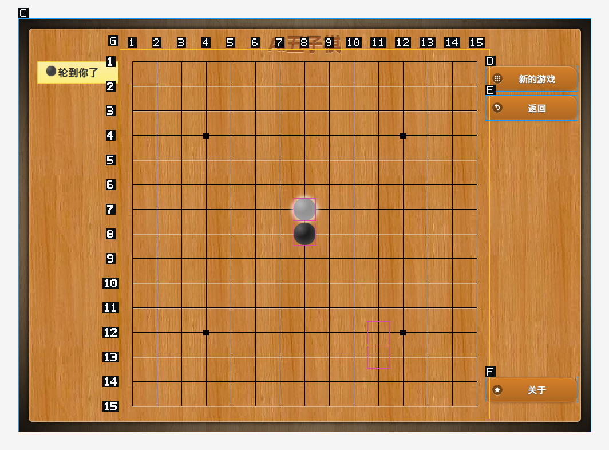
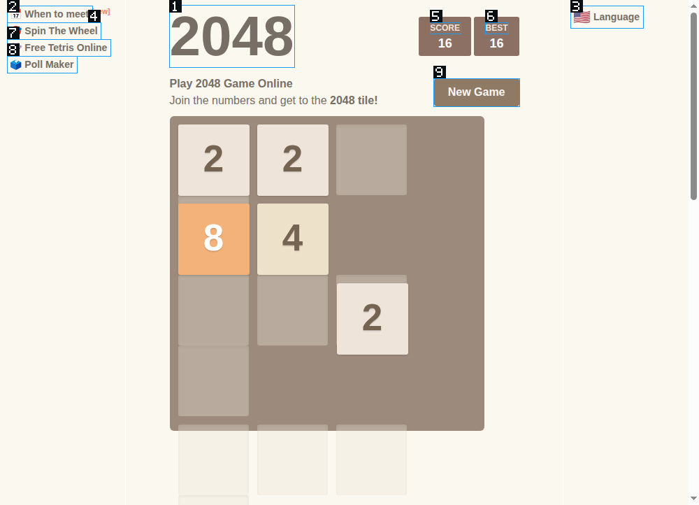

# 通用浏览器场景与连续操作优化：2026-09-28

范围：`feat/visual-browser-control`。本轮修改观察、寻址、工具提供和动作回执，不包含网站域名、棋盘尺寸、棋子类名、胜负规则或游戏内部 API 分支。未提交或推送。

## 原失败任务与验收动作

原会话 `session-37441220-d659-4ef5-8960-09971af354bf` 从开始到取消约 191.4 秒，只完成一次有效落子。11 次已完成模型请求合计约 150.5 秒。不是点击执行器花了三分钟，而是状态缺失、查询和工具发现导致了多轮模型往返。

| 原过程 | 状态 | 本轮对应处理 |
| --- | --- | --- |
| 打开游戏设置、开始 | 正常 | 保留正常的语义操作路径 |
| 地图给出大量匿名位置，查询命中 226 个目标 | 有问题 | 地图直接附带完整几何结构、状态字典和差异 |
| 再按坐标文字查询，两次未命中 | 有问题 | 用真实区域、单元位置和相对锚点寻址；不依赖生成的匿名标签 |
| 真实点击后出现双方落子 | 正常 | 保留真实 Chromium 输入与执行回执 |
| 读取文字、查询单个目标仍拿不到内部状态 | 有问题 | 读取原生状态及可见渲染层，保留不确定性和来源 |
| 先搜索截图工具，再搜索视觉操作工具 | 有问题 | 浏览器工具一起提供；不再拆两轮发现 |
| 操作漏传 captureId，在发送输入前失败 | 异常 | 编号操作绑定本任务已收到的观察；原始图片坐标仍要求显式 ID |
| 用户取消任务 | 测试失败 | 不能把一次成功点击当成自主游戏通过 |

固定验收动作：打开交互页面，获取可操作说明，连续执行显式输入并读取结果；再换为另一网站和键盘操作场景。测试同时检查错误操作未发生，以及输出能否直接支持下一步。

## 已处理项

- [x] 普通地图和视觉观察共用节点、区域编号与结构提取。匿名重复控件可以折叠为完整结构，原 targetRef 查询保留。
- [x] 状态字典包含原生 ARIA、可见子层、伪元素、背景/渐变、样式类等事实。类名不自动解释为棋子或业务状态。
- [x] 同一任务连续观察返回位置差异。大场景明确报告省略细节，支持 `see(representation: "structure", region, cell)` 取回。
- [x] 中心、上一次实际输入、已知单元位置加方向/步数由系统换算；拖动终点同样支持。偶数网格中心歧义、越界、非法后续步骤在输入前拒绝。
- [x] 编号操作可省略 captureId，限定于本任务、标签页、模式和文档；显式过期 ID 不被静默换掉。其他任务不能借用观察。
- [x] 正常文字模型可使用结构观察与编号动作，不被错误赶回普通地图。
- [x] `see` / `vact` 随浏览器操作能力一起提供；模型可直接调用。
- [x] 换站测试暴露的隐藏 iframe 截图失败：不再让隐藏广告框阻断整页观察；报告未映射框架。单个动作仍检查真实框架和节点。
- [x] 动作后的图片在有限预算内等待可见 DOM 动画，减少半移动状态。不会等待无限动画或把动画结束当作游戏完成。
- [x] 图片/结构读取失败保留已完成输入回执；区域消失时返回普通地图，避免诱导重放。
- [x] 使用仍有效的旧观察执行动作，也会更新本任务下一次使用的输入锚点。

没有移除源码分析。状态 ID 和渲染描述提供可重复使用的实时证据，模型可以结合相关源码解释；执行器不调用游戏对象或棋盘数组，不替模型选择策略。

## 对照与工作边界

本地 ZCode 的截图文档不要求每步同时取 DOM 和截图；其 turn-end 截图用于展示，不建立 Lyra 这种任务作用域的动作引用。参考 [OmniParser](https://microsoft.github.io/OmniParser/) 的图像 UI 解析与 [Electron capturePage](https://www.electronjs.org/docs/latest/api/web-contents#contentscapturepagerect-opts)：图像解析或截图本身不维护实时 DOM 身份与输入回执。本实现由宿主管坐标换算、观察归属与结构读取，模型负责语义和决策。

## 验证记录

| 动作 | 状态 | 实际结果 |
| --- | --- | --- |
| 9×11 匿名控件面板：取地图、中心点击、相对连续点击 | 正常 | 约 3.13 秒完成地图和三次输入；零截图，事件为可信输入 |
| 原五子棋站点：地图 → 省略 captureId → 中心输入 | 正常 | 约 3.59 秒；这段执行零截图，状态返回两种落子渲染及装饰点差异。另拍结果图核对 |
| `play2048.co` | 外部页面异常，本次未通过 | 页面显示游戏启动错误；不能记为成功。原作者 GitHub Pages 在实际浏览器重定向到该页 |
| `2048game.com`，修复前 | 产品问题 | 输入送达，但后续截图因隐藏 iframe 报 `Visual frame owner is unavailable` |
| 同站点，同一组六次方向键，修复后 | 正常 | 最终版本约 4.74 秒，每次回传图片；最终画面分数 16，出现 8 的方块，三处隐藏 iframe 被明确跳过 |
| 真实 Electron 完整回归 | 正常 | 最终 69 项通过，含 19 项本轮共享结构、任务隔离、隐藏 iframe、动画和连续动作用例 |
| 大型异构结构、详情取回、相同外观与文档变化 | 正常 | 4 项状态表达单元测试通过 |
| 视觉运行时、无图片结构传输、回执和权限边界 | 正常 | 16 项 Rust 测试通过 |
| 工具发现与成套提供 | 正常 | 20 项测试通过。两条旧测试改为搜索实际延迟加载的 scroll，不再假设 map/navigate 需要发现 |
| 工具目录 schema | 正常 | 7 项测试通过 |

时间为本机生产工具链测量，包含输入和对应观察，不含模型思考、网络推理和打开页面；不是稳定性能保证。六次按键是显式测试动作，不是模型自主游戏或胜利验收。

原站核对图：

换站核对图：

## 构建与现有检查限制

Electron main 构建、`cargo build -p lyrad` 完成。daemon 原子替换到本地 desktop/native，并核对与构建产物一致。需重新启动 Lyra 才会加载新宿主和 daemon；未替用户结束当前应用。

TypeScript 仍有原有 94 条诊断，本轮文件无新增诊断。结构检查仍有原有 5 处违规，Workspace Clippy 仍受 `lyra-bootstrap-installer` 的 4 处旧错误阻断。这不是全仓发布检查全部通过。

## 还不能宣称完成的部分

- MiMo 自主完整游戏尚待用户按原任务或换站重测，尤其是决策耗时、状态理解与是否多余取图。
- Canvas 内部任意物体不因此自动获得业务名称；不可确认的图形仍需像素判断。规则线检测不支持任意旋转、透视或遮挡布局。
- 渲染字典为有预算的观测事实；相同采样外观不等于相同业务含义。悬停、动画、装饰也可能改变渲染状态。
- 用户想要的“所有游戏都快准狠”不能由这组机械输入、合成回归或六次按键证明。

本轮复核记录（本机临时目录）：

- 完整浏览器回归：`/tmp/lyra-visual-audit-h4lsDb/result.log`
- 原站结构输入：`/tmp/lyra-visual-audit-SOjGMf/live-structure.json`
- 换站最终输入与图片：`/tmp/lyra-visual-audit-gEKdZ3/`
- 类型检查：`/tmp/lyra-scene-final-ts.log`
- 构建：`/tmp/lyra-scene-main-build.log`、`/tmp/lyra-scene-daemon-build.log`
- 本地 daemon SHA256：`9128738dd247c2f62ee9b7248522b078a624170da54e1f998b0b87a0315eedb3`
