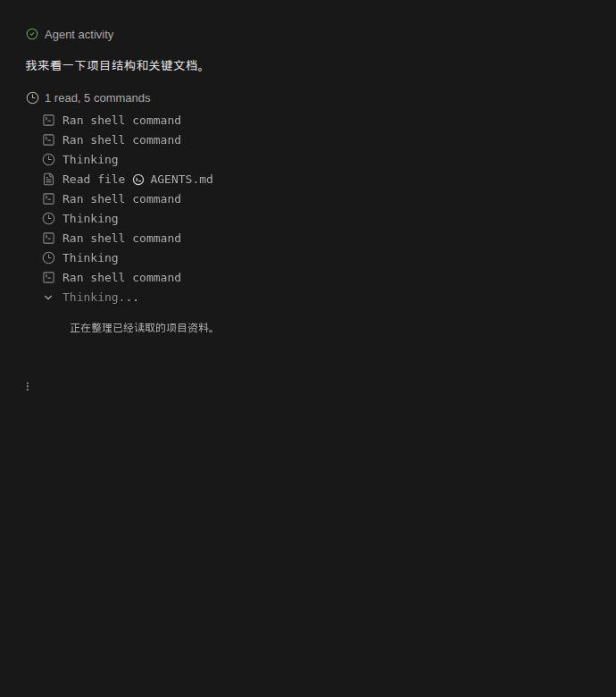

# 工作中的时间行与活动折叠

本次修复会话共用的消息投影和渲染逻辑，没有按会话 ID、模型或工具名称设置特殊分支。

## 可见验收动作

让 agent 执行多轮工具调用，在工具完成、下一次模型请求开始、思考增量到达、正文输出和整轮结束时观察同一条回复。工作期间不出现消息时间；展开活动折叠能看到先前工具和当前思考；整轮结束后过程进入总折叠，最终正文和一条时间行保留。重新打开旧会话应保持相同分组。

## 根因与修复

| 状态 | 问题 | 修复 |
| --- | --- | --- |
| 已修复 | 消息归并明确排除空助手占位。下一轮模型开始思考、尚无正文时，同一任务被切为两条气泡。 | 连续助手响应统一归并，保留最新响应的 `streamingMessageId`，不会失去流式订阅。用户消息和 API 错误仍保留边界。 |
| 已修复 | 时间行使用“本条没有活动指示器”作为显示条件。指示器移到后一条，前一条就露出时间；活动文字为空也会触发。 | 时间、过程总折叠和文件变更摘要统一受当前任务是否仍在运行控制，活动文字只决定指示器样式。 |
| 已修复 | 思考订阅依赖合并气泡的旧 ID，并用“整个气泡是否已有思考”判断是否添加新思考。 | 思考记录携带来源消息 ID；订阅实际正在输出的响应，按来源去重，插在该响应正文之前。旧轮思考不会压掉新轮思考。 |
| 已修复 | 投影层创建 loading 占位后没有返回它，且活动宿主搜索可以跨过最新用户消息。 | 当前请求尚无助手响应时生成有效占位；宿主搜索在用户消息处停止，旧回复不承载新一轮活动。 |

历史检查显示，排除空占位的归并规则和时间行的缺省分支早已存在；后续流式思考实现仍使用气泡 ID。这是公共规则之间未对齐的缺陷，不能根据用户此前未观察到就断言它是某一个新提交首次引入。

## 证据与参考

本地最新“了解一下这个项目”记录中，4 次模型响应调用了 6 个工具（1 次读取、5 次命令），随后第 5 次模型响应输出总结。用记录中的消息结构回放“工具完成 → 空助手壳 → 思考流 → 正文流 → 完成”，复现了拆气泡和提前出现时间的问题。修复前新增的两个回归场景均失败。

参考 ZCode 的 `packages/shared/src/assistant-presentation.ts`：它不会在 streaming/settling 阶段把某段内容当作最终答复。另核对了 [AI SDK 的会话状态与完成回调](https://ai-sdk.dev/docs/reference/ai-sdk-ui/use-chat)，工具调用完成与整个响应完成属于不同事件。Lyra 保留现有运行时和 StreamStore，仅修正展示层的消息边界和生命周期判断。

## 验证

- 153 项相关测试通过，包含消息投影、流式存储、运行时事件、活动折叠、时间行、文件摘要、聊天视图和旧会话重新挂载。
- Electron 实际渲染并点击活动和思考折叠，确认工具与新思考在同一折叠中，工作期间无时间行，正文继续实时更新，完成后只有一个过程总折叠和一个时间节点。
- 覆盖活动为空、模型调用、重试、等待工具和未知活动文案，以及旧任务完成、新任务尚无助手响应的窗口。
- 全局 TypeScript 检查仍有 95 项既有错误，与修改前逐条对比未新增。此次不是全仓发布验收。

现场仍需按上面的同一动作检查热更新后的实际会话；这里的 Electron 验证是结构回放，没有重新运行模型或执行记录中的命令。
