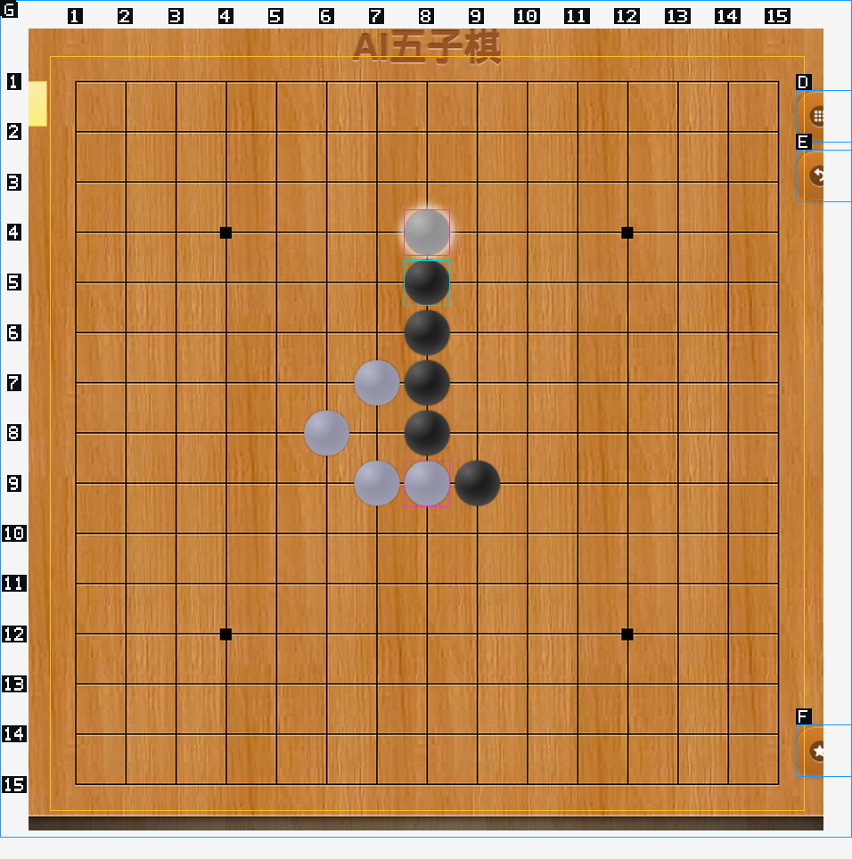
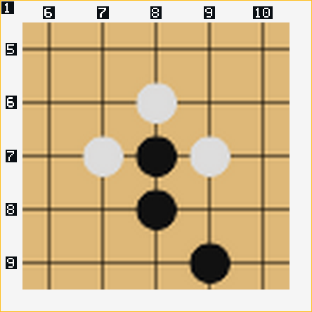

# 视觉连续操作修复与验证

日期：2026-09-28。对应调查：[第三步成功后进入误判循环](visual-gomoku-session-2026-09-28.md)。

本次保留源码分析、文件读取、下载和诊断能力。修复的是观察、动作回执、恢复、循环检测和模型图片上下文，不用禁止读源码来隐藏问题，也没有新增五子棋专用业务状态读取或自动下棋代码。

验收动作保持为：在原五子棋网页开始一局，连续落子，正确识别第三步后的棋局，并继续下一步。完整模型自主对局尚待重跑；以下测试不能替代它。

## 修复清单

| 项目 | 状态 | 处理及验证 |
| --- | --- | --- |
| ~~动作回图缺少与本次操作对应的证据~~ | 已修复、机制验证通过 | 返回本次输入位置、与上一观察相比发生变化的网格位置、页面正文摘录；青框标本次输入，粉框标像素变化，不做黑白棋子分类 |
| ~~局部观察只有裁剪，没有放大~~ | 已修复、原生点击验证通过 | `region` 自动放大，`region + cell` 显示五乘五位置邻域，`zoom` 支持 1–4 倍；全局行列地址不变，图像放大不改变网页布局 |
| ~~截图过期与页面错误混为一谈~~ | 已修复、回归通过 | 分开报告过期、错误页面、未知或已淘汰截图；过期附年龄；默认观察路径返回当前替代图，不重放已执行输入 |
| ~~绘制等待结束被表述成超时失败~~ | 已修复、真实网站复现验证 | 采样结束报告 `changed` 或 `budget_exhausted`，明确这不是输入失败；输入回执和图像证据保留 |
| ~~新视觉工具未进入循环检测~~ | 已修复、Rust 回归通过 | 识别直接工具名和 Tool-FS 嵌套参数；动作包含 mark/cell 等目标信息，页面按文档、标签页、像素及正文判断，不把新 captureId 当进展 |
| ~~反复旧图不断进入模型工作上下文~~ | 已修复、上下文回归通过 | 同页面保留最近两张不同浏览器图片，总共最多八张；旧图保留文字和原始制品线索；完整审计和用户上传图片保留，图片来源标识跨持久化、恢复链路保留 |
| 源码分析后绕回重复猜测 | 能力保留，恢复反馈已增强 | 提供可验证的动作/像素证据；提示按具体疑点定位源码并回到页面验证，提醒解压 HTTP 源码及验证临时像素分类器；不禁止分析源码 |
| MiMo 自主完整对局、决策耗时 | 待同任务验收 | 不能由浏览器测试或人工选点代替，也不保证增强观察后模型一定理解正确 |

像素比较是通用区域差异，不识别游戏规则。网格按各位置的小图块比较；非网格画布按局部图块比较，防止小笔画淹没在大画布中。最多分析八个区域，历史采样总预算约 16 MiB、最多 32 个观察作用域。区域尺寸变化时报告不可直接比较，不把缩放伪装成新增物体。

悬停预览、动画和对象消失也可能产生粉框，**粉框不代表新增棋子**。变化提示必须和图、正文及动作回执一起判断。采样存在阈值，未检测到变化也不能证明操作失败。

## 原网站连续操作

使用隔离 Electron 资料目录、生产观察/输入/工具桥接代码，打开原站 `https://wuziqi.bmcx.com/`。本次由 Codex 根据每次返回图选下一位置；没有读取游戏数组，没有通过 API 下棋，也没有让 MiMo 自主决策。

| 操作 | 状态 | 返回证据 |
| --- | --- | --- |
| 开始游戏 | 正常 | 一张完整 15×15 网格，225 个地址可用 |
| 第 1 次：8 行 8 列 | 正常 | 黑子落下、白子响应；本次位置变化为 true；“轮到你了”；绘制观察 788 ms |
| 第 2 次：9 行 9 列 | 正常 | 新的黑白子均可见；本次位置变化为 true；“轮到你了”；观察 671 ms |
| 第 3 次：7 行 8 列 | 正常；采样未稳定 | 新的黑白子均可见；本次位置变化为 true；“轮到你了”；观察 1,140 ms，返回 changed，未误报点击失败 |
| 第 4 次：6 行 8 列 | 正常 | 在第三步成功之后继续有效落子，白子响应；观察 967 ms |
| 第 5 次：5 行 8 列 | 正常 | 图上共五颗黑子、五颗白子；“轮到你了”；观察 942 ms |

以上时间是绘制观察，不是完整工具耗时，更不是模型决策时间。采样预算在单次 Chromium 调用间检查，墙钟时间可以略超过请求预算。

## 回归

- 生产 Electron 视觉工具：50 项通过，包括原有 43 项和新增 7 项连续观察回归。
- 新增回归重现三步后的六子画面，验证两处变化；验证重复输入无新变化、285 像素区域放大、局部图真实坐标输入、错误参数、非网格小笔画，以及过期原因。
- Rust 覆盖工具格式、视觉循环、动作去除瞬时 ID、图片去重及保留、完整协议记录、恢复后的图片来源。
- 真实网站连续五次落子通过。测试输出：`/tmp/lyra-visual-audit-mIhpXr`；最终原生回归：`/tmp/lyra-visual-audit-ObotE2`。

参考边界：本地 ZCode 的轮尾截图仅用于展示，不回灌模型；它的截图裁剪不提供本次动作与前一帧之间的变化证据。Lyra 的增强位于原生截图与模型工具反馈之间，源码分析作为诊断能力继续存在。Electron [capturePage](https://www.electronjs.org/docs/latest/api/web-contents#contentscapturepagerect-opts) 提供截图，Playwright [截图文档](https://playwright.dev/docs/screenshots) 展示截图缓冲区和区域截图用法；这些接口本身不负责判断任务是否完成。

## 本地构建与已知基线

桌面主进程构建通过，`lyrad` 构建并原子替换到桌面 native 目录，二进制哈希与本次构建一致。需重启 Lyra 才会使用新的主进程和守护进程。没有提交或推送 GitHub。

Rust 的视觉专项 14 项、模型循环相关 21 项、会话恢复专项 1 项和本次 catalog 筛选 2 项均通过（这些筛选有重叠，不相加为独立测试总数）。TypeScript 仍是原有 94 条诊断，规范化比较没有新增诊断；结构检查仍为原有 5 项；全工作区 Clippy 仍被 bootstrap-installer 的 4 条已有错误阻断。不能把这些状态写成全仓检查全绿。

下一次验收：重启后在原网页继续使用同一句“玩一次五子棋”，观察模型能否越过第三步、避免重复截图和源码分析循环，直到对局结束。模型速度和完整任务成功率以这次复测为准。
