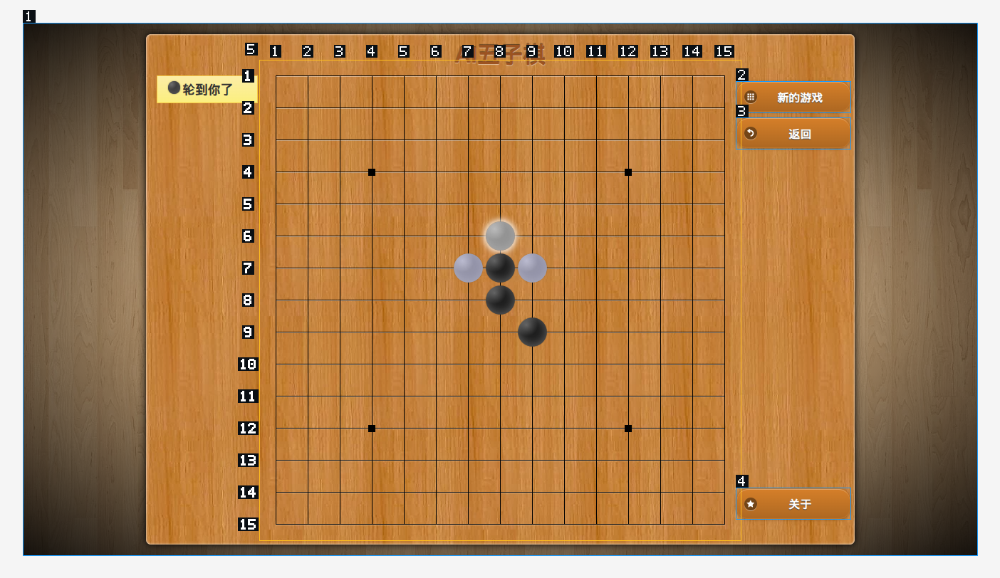
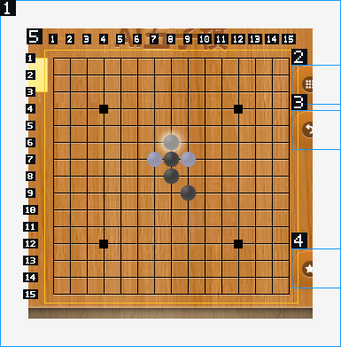

# 五子棋最新会话调查：第三步成功后进入误判循环

日期：2026-09-28。状态：此文记录修复前调查；后续修改与验收见[连续操作修复记录](visual-continuity-fix-2026-09-28.md)。

本轮检查的实际任务是：在用户附上的五子棋网页玩一局，连续识别当前棋局、落子、等对手回应，直到结束。验收对象是这条完整过程，不能用一次中心点击或工具测试通过替代。

## 结论

这次任务没有完成。运行 31 分 39.636 秒后被用户取消，只推进了三次有效落子。
第三次落子已经成功，模型却把画面判断成“点击没生效”，随后约 28 分 32 秒没有新的有效落子。
工具定位、点击和图片传递在这个关键节点都有成功证据；失败集中在视觉判读、纠错与连续观察机制。

上轮测试验证了 225 个落点能完整寻址和点击，却没有验证真实模型在多步棋局中持续读对画面。
这次结果说明，上轮机制测试通过不等于端到端验收通过。

## 会话与计时

- 会话：`session-f3c74832-c87c-4494-abb2-33417b106898`。
- 标题：`AI五子棋 - 便民查询网在线五子棋 玩一次五子棋`。
- 用户要求：引用当前网页后说“玩一次五子棋”。
- 模型：`mimo-v2.6-flash`，路由：`mimo_token_plan_cn`。
- 数据：只读访问 `~/.lyra/data/agent/agent-runtime/sessions/<sessionId>/session.sqlite`；核对持久化的工具回执、模型协议图片和实际 PNG。
- 时间：2026-09-28 01:31—02:03，America/New_York / EDT。

| 指标 | 数值 | 状态与解释 |
| --- | ---: | --- |
| runtime 运行时间 | 1,899.636 秒 | 有问题，约 31 分 40 秒，用户取消 |
| 已完成模型请求 | 32 次 | 每次均返回工具调用，没有最终完成 |
| 已完成模型请求耗时合计 | 1,771.580 秒，93.3% | 主要耗时；包含服务端生成及请求网络等待，不能全部称为纯计算 |
| 请求中位数 / 最长 | 30.994 秒 / 332.809 秒 | 最长一次约 5 分 33 秒 |
| 工具活动表 | 36 条 | 包含自动附页地图；另有一次缺 captureId 的模型调用在参数验证处失败，未进入活动表 |
| 工具耗时，合并并行区间 | 53.132 秒，2.8% | 鼠标/截图本身不是三十分钟的主要耗时 |
| 已记录输出 / reasoning tokens | 45,763 / 43,311 | reasoning 占 94.6%；只统计数量，不展开正文 |
| 单次输入上下文 | 21,583 → 107,562 tokens | 明显膨胀，包含源码、历史工具结果、推理回放和图片等；未把增量全部归给图片 |
| provider 失败 / 恢复记录 | 0 / 0 | 没有连接故障证据；不能凭此证明网络完全无影响 |
| 第三次成功后停滞 | 约 28 分 32 秒 | 没有推进下一次有效落子 |

其余约 74.9 秒没有细分，包含调度、上下文处理及取消前未完成请求等，未重复算入工具或模型耗时。

## 已确认的问题

### 1. 第三次落子被误判为失败，是本次停滞起点

01:34:32 的 `browser_vact` 明确要求区域 5、第 7 行第 8 列，返回 `ok=true`、`completed=1`。
更关键的证据是回图：黑子在 (7,8)、(8,8)、(9,9)，白子在 (6,8)、(7,7)、(7,9)，页面显示“轮到你了”。
这些位置按“行、列”记。

但模型随后说“我的 (7,8) 似乎没有落子”，重新截图。01:35:39 的图片与 01:34:35 的图片逐字节相同，SHA-256 都是
`c8a679ea4c2a105ab894e871d76055d1d1cba24a935a5742c6da8779b89f61a6`。
它之后下载 HTML、JS 和 CSS，重试同一位置，直到 01:56 才在文字中承认之前已下成功。

### 2. 图片已经进入模型协议；“模型没有收到图”不符合现有证据

逐条解码 `metadata.providerProtocol.auxiliaryMessagesAfterToolResults` 中的 `image_url`，
共 14 个图片块、8 个不同内容哈希，全部与对应本地截图字节一致。关键第三步的新图也在其中。
代码在工具回执后附图，Chat Completions 编码保留 `image_url` 内容。

MiMo 官方文档确认 `mimo-v2.6-flash` 支持图片，支持 `image_url` 中的 Base64 data URL，
与本次传输格式一致。[官方图片理解文档](https://mimo.mi.com/docs/en-US/quick-start/usage-guide/multimodal-understanding/image-understanding)

没有证据把问题归因于缺某个 MiMo 专用视觉参数。服务端如何处理这些帧未抓包验证，
也未做同图、干净上下文下的模型对照，不能把模型能力和历史上下文干扰的贡献比例说死。

### 3. 循环检测没有接上目前的直接工具名称

已确认代码缺陷：`browser_loop_detector.rs:37` 的解析器只识别带 `/tools/browser/` path 的调用，
以及旧的 `lyra_lumen` / `lyra_computer`。本会话模型直接调用 `browser_see`、`browser_vact`，
参数没有 path，因此不会进入这个浏览器循环检测器。

另外，即使补上名称，其指纹仍不够：动作没有包含视觉 mark/cell，页面指纹不读取视觉画面变化；
通用检测又比较完整参数/结果，新的 captureId 会使同画面得到不同指纹。
成功读文件也会清空“连续相同工具失败”计数。
不能只补两个名字就宣称解决了本次停滞，必须以同一页面的真实观察变化来判断是否获得新证据。

### 4. “局部放大”实际只有裁剪，提示与能力不一致

提示词写 `region on see magnifies`，但 `visual-scene-render.ts:79` 使用 `Math.min(1, ...)`，只允许缩小。
窗口缩小后，棋盘从 675×675 降到 285×285。01:53 与 01:55 两次“放大”都返回 385×391 的图片，
棋盘依然是 285×285；`downsampleForVision=false` 也没有放大。两张图片逐字节相同。

这是确定的能力缺口，会恶化后半段判读。不过首次误判发生时棋盘仍是 675×675，
所以不能把整次失败全部解释成窗口太小。

### 5. 截图五分钟到期被误报成未知页面，引发额外绕路

`visual-scene-store.ts:85` 将超过 300,000 ms 的截图统一视为不可读；
`visual-scene-actions.ts:203` 随后只返回 `unknown_capture_or_wrong_page`。

两次失败调用引用的已知截图分别老了至少 535.445 秒和 309.238 秒，均超过期限。
标签页 ID 保持相同，回执也带回当前截图。模型却先说“页面布局似乎变了”，又单独截图。
窗口后来确实变化，但这不是这个错误的准确说明。
过期保护可以保留，过期原因与已返回的新图必须清楚区分；延长 TTL 不能解决最初的视觉误判。

### 6. 绘制等待没有给出足够有用的变化证据

前三次成功落子都返回 `observationWait=timeout`，每次约 1.01 秒，仅采样两帧，`busy=false`。
最终图已经有对手回应，但系统只提供整区域哈希是否变化和时间耗尽，没有指出变化位置。
第一次之后模型又调用 textStable，再 see，多付两轮模型往返。

当前算法要求区域像素完全一致，不能区分实际内容变化与光效、动画等变化。
本次每次两帧恰好不同是已知事实；没有逐采样留图，不能断言这三次一定由无限动画导致。
把等待时间加长只会增加成本，不是本次的完整解法。

### 7. 操作任务偏离成了网页调试，恢复路径没有约束住

7 次 shell、8 次文件读取中，大部分用于下载、解读本站 HTML/JS/CSS。
第一次下载脚本没有解压，读到压缩数据后又用 `--compressed` 下载一次，进一步绕路。
没有发现通过业务 API 直接代下或读取运行中棋局数组，但这已不是靠视觉在页面上完成任务，
不能把它算作视觉操作能力。

最后临时写的像素分析也不可靠：用固定亮度阈值，把棋盘星位和鼠标等暗色内容当成黑子，
输出没有正确识别三颗灰白棋子。该脚本没有随后形成新落子，用户就取消了。
这不能变成产品里的五子棋专用补丁。

## 已生效与尚未通过的边界

| 项目 | 状态 | 本轮证据 |
| --- | --- | --- |
| 完整棋盘寻址 | 正常 | 225 点、15×15、整页 5 个标记；没有分页漏格 |
| 行列到实际点击 | 正常，覆盖前三次 | 三个目标位置均有正确棋子与对手回应 |
| 第三步图片传递 | 正常 | 模型协议图片字节与真实截图一致 |
| 窗口缩放后地址覆盖 | 正常，有限覆盖 | 仍返回 15×15；缩小后的重复点击被投递，但没有新合法落子，不能算新的落子成功 |
| 模型棋局判读 | 有问题 | 把已成功的第三步看成未生效 |
| 连续观察与纠错 | 有问题 | 同图、同目标、换工具绕路，没有恢复有效进展 |
| 整局体验与速度 | 失败 | 用户取消，未完成一局 |

## 下一步应改变什么

1. 将视觉结果与刚执行的动作关联：保留准确目标位置，提供同一区域前后画面的局部变化证据，以及页面可见状态文字。像素变化只能说明该处变了，不能自动宣称落子成功或对手完成。
2. 让局部观察真正提高可读性，并明确区分裁剪、插值放大和更高分辨率采样；不能承诺插值会创造原图没有的细节。
3. 接通现有工具入口的循环检测，用去除 captureId 等易变字段后的动作身份及实际画面变化识别停滞，避免把正常不同落子误认为重复。发现无进展时改变观察方式，不能机械要求重取地图。
4. 区分过期、错误页面、目标替换等失效原因；已经附上新图时直接使用，避免额外 see。
5. 对关键失败图片做干净上下文和连续多帧的模型对照，再决定历史帧保留策略。目前 14 个图片块只有 8 种画面，重复旧帧会增加负担，但还不能证明它就是首次误读的唯一原因。

修复的验收仍应是原任务：同一网站连续多步下棋，正确理解第三步后的六子局面，
下一步在新位置落子；不能再用一次中心落子、更多提示词或脚本读游戏状态替代。

## 完整工具时间线

以下时间均为 2026-09-28 EDT。耗时为工具自身记录，不包含前面的模型等待。
序号沿用工具活动表；`4a` 是额外从模型协议中找出的参数验证失败。

| # | 开始 | 耗时 | 工具 | 状态 | 行为与判断 |
| --- | --- | ---: | --- | --- | --- |
| 1 | 01:31:28 | 0.328s | browser_map | 正常 | 附页地图已包含开始按钮和选项，没有重走菜单。 |
| 2 | 01:31:38 | 0.111s | ToolSearch | 可优化 | 发现浏览器工具；非视觉动作已提供，视觉工具仍需发现。 |
| 3 | 01:31:44 | 1.976s | lyra_lumen.act | 正常 | 点击开始，游戏进入棋盘。 |
| 4 | 01:31:56 | 1.790s | lyra_lumen.see | 正常 | 首次视觉观察：225 点合成 15×15 网格、整页 5 个标记。 |
| 4a | 01:32:05 后 | 未单独记录 | browser_vact | 有问题；验证正确拒绝 | 模型漏传 captureId，参数验证失败；下一次补齐。 |
| 5 | 01:32:22 | 2.841s | lyra_lumen.vact | 正常；等待信号不足 | 中心 (8,8) 落子及白方回应均在图中；绘制等待却报 timeout。 |
| 6 | 01:32:41 | 4.551s | lyra_lumen.wait | 冗余 | 等待 textStable，返回“轮到你了”；前一幅图已经有白方回应。 |
| 7 | 01:32:58 | 1.665s | lyra_lumen.see | 冗余 | 再次取得整盘图，没有新的玩家操作。 |
| 8 | 01:33:45 | 2.792s | lyra_lumen.vact | 正常；等待信号不足 | (9,9) 落子成功，白方回应出现；绘制等待仍报 timeout。 |
| 9 | 01:34:32 | 2.831s | lyra_lumen.vact | 动作正常；随后误判 | (7,8) 已成功，截图出现六颗棋子；模型却认为未落子。 |
| 10 | 01:35:38 | 1.176s | lyra_lumen.see | 有问题 | 重复看图，返回图与 #9 完全相同；没有利用它纠正判断。 |
| 11 | 01:36:31 | 2.000s | shell.run | 偏离任务 | 下载网页 HTML，开始把下棋任务当作页面点击故障调试。 |
| 12 | 01:36:50 | 0.028s | file.read | 偏离任务 | 读取 HTML 查脚本地址，没有推进棋局。 |
| 13 | 01:37:14 | 8.521s | shell.run | 有问题 | 下载六份 JS，未正确处理压缩内容。 |
| 14 | 01:37:45 | 0.298s | shell.run | 有问题 | 直接拼接读取压缩文件，不能得到正常脚本文本。 |
| 15 | 01:38:05 | 7.724s | shell.run | 绕路恢复 | 加 --compressed 重新下载脚本；仍属于页面源码调试。 |
| 16 | 01:38:30 | 0.039s | file.read | 偏离任务 | 读取 interface.js。 |
| 17 | 01:38:30 | 0.040s | file.read | 偏离任务 | 读取 Game.js，与 #16 并行。 |
| 18 | 01:39:00 | 0.028s | file.read | 偏离任务 | 读取 Board.js。 |
| 19 | 01:39:00 | 0.033s | file.read | 偏离任务 | 读取 storage.js，与 #18 并行。 |
| 20 | 01:39:00 | 0.039s | file.read | 偏离任务 | 读取 Player.js，与 #18 并行；下一轮模型请求耗时约 5 分 33 秒。 |
| 21 | 01:44:34 | 1.361s | lyra_lumen.vact | 异常；错误说明不准 | 重试 (7,8)；引用已老化 535 秒，收到 unknown_capture_or_wrong_page，并已附新图。 |
| 22 | 01:46:16 | 1.152s | lyra_lumen.see | 冗余 | 错误结果已附当前图，仍再 see；此时棋盘缩到 285×285。 |
| 23 | 01:47:23 | 1.935s | lyra_lumen.vact | 有问题 | 再次点击已占据的 (7,8)，输入送达但棋局不变；回图与 #22 相同。 |
| 24 | 01:49:30 | 3.900s | shell.run | 偏离任务 | 下载 CSS 并查询棋子定位样式。 |
| 25 | 01:50:09 | 0.278s | shell.run | 偏离任务 | 继续 grep CSS。 |
| 26 | 01:50:28 | 0.029s | file.read | 偏离任务 | 完整读取 style.css。 |
| 27 | 01:51:30 | 0.034s | file.read | 偏离任务 | 读取 layout.js。 |
| 28 | 01:52:34 | 1.277s | lyra_lumen.vact | 异常；错误说明不准 | 悬停 (7,8)；引用已老化 309 秒，过期被笼统报告。 |
| 29 | 01:53:12 | 0.580s | lyra_lumen.see | 有问题 | 请求棋盘局部图，但棋盘仍只有 285×285，没有放大。 |
| 30 | 01:55:47 | 1.324s | lyra_lumen.see | 有问题 | 关闭 downsample 试图再放大，结果和 #29 完全相同。 |
| 31 | 01:59:45 | 1.249s | lyra_lumen.see | 有问题 | 口头承认第三次落子已成功后，又仅截图；下一次有效落子仍未发生。 |
| 32 | 02:00:53 | 0.555s | file.glob | 有问题 | glob 查截图返回空，与 #33 并行；再次绕离页面。 |
| 33 | 02:00:53 | 0.501s | file.glob | 有问题 | glob 查 .lyra 返回空。 |
| 34 | 02:01:17 | 0.172s | ToolSearch | 恢复动作 | 发现 artifact_read 工具以访问已经生成的图。 |
| 35 | 02:01:55 | 0.034s | artifact.read | 工具正常；任务仍停滞 | 读取已给过的截图，再次将同一幅图放入模型协议。 |
| 36 | 02:02:24 | 0.541s | shell.run | 有问题 | 运行临时亮度阈值分析；误报星位等黑点，未正确识别白子。随后用户取消。 |
