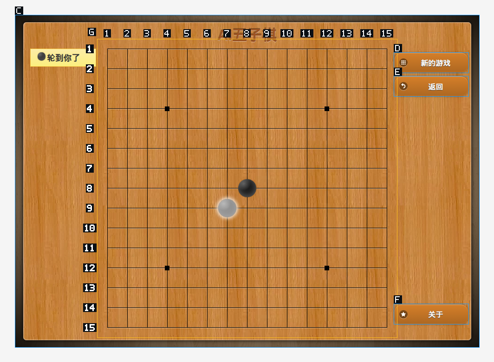

# 视觉棋盘区域试验

日期：2026-09-27。分支：`feat/visual-browser-control`。

## 要验证的实际动作

打开原五子棋网站，开始新游戏；让工具按「第 8 行、第 8 列」落子，
返回能看清棋盘、自己落子和对手回应的截图。棋盘不能因为标记分页而缺少落点，
也不能用 225 个框和编号盖住棋局。

## 本次实现

- 普通控件保留短编号；完整规则网格合成一个区域，在区域外标行列。
- DOM 网格内部仍绑定各个真实控件，执行时检查原节点和网格位置。
- Canvas/SVG 仅从截图像素检测规则交叉线，不读取网页游戏对象、棋局数组或业务接口。
- 行列定位可用于点击和连续拖动；移动或缩放不必重建定位，重排或换网格拒绝旧地址。
- 点击后自动附上新截图，默认最多等待 900 ms 观察绘制变化；画面安静不代表对手完成。
- 识别不可靠时保留区域坐标操作，不硬猜网格。产品代码没有五子棋域名或尺寸特判。

## 实测结果

| 检查 | 状态 | 结果及范围 |
| --- | --- | --- |
| 原网站棋盘覆盖 | 通过 | 15×15 的 225 个落点组成一个 DOM 网格，整页 5 个标记，无落点分页 |
| 原网站中心落子 | 通过 | 生产工具发送真实 Chromium 输入；截图中黑子在第 8 行、第 8 列 |
| 对手回应 | 通过 | 返回截图可见白子和「轮到你了」；通过看图确认，没有读取游戏状态 |
| 原视觉操作回归 | 通过 | 28 项，包括坐标转换、iframe、拖动、按住、取消与中途失败 |
| 新网格回归 | 通过 | 15 项，包括四角/中心、删格、缩放、同一行连续操作、格间拖动、像素网格、等待超时 |
| 非视觉浏览器回归 | 通过 | 97 个场景 |
| 工具目录协议 | 通过 | 50 个测试 |
| 运行时图像传递 | 通过 | 6 个测试，覆盖行列参数传递和结果压缩保留图片 |
| 模型自主下一整盘 | 未验证 | 本次验证定位、输入和回图，不代表模型棋力、整局成功率或推理速度 |
| 构建与本地就绪 | 通过 | Electron 主进程及 `lyrad` 构建成功，已更新桌面端本地原生程序；重启 Lyra 生效 |
| 全库静态检查 | 已有问题 | TypeScript 仍有 94 条原有诊断，无新增；结构检查仍有 5 项，Clippy 被安装器已有 4 个错误阻断 |

三次 Canvas 行列落子连同回图耗时约 3.28 秒，包含短暂绘制等待，
不含模型推理和网络时间，不能作为端到端任务速度。

## 返回给 agent 的实际画面



## 复现

使用 Node 24，在仓库根目录运行：

```sh
node --import tsx tools/browser/run-visual.mts
LYRA_VISUAL_LIVE_GRID=1 node --import tsx tools/browser/run-visual.mts
node --import tsx tools/browser/run-nonvisual.mts
cargo test -p lyra-agent-runtime --lib visual_ -- --test-threads=1
cargo test -p lyra-tool-fs-core
```

测试使用独立 Electron 窗口及配置，不操作用户已有的游戏标签页。
真实网站测试的进入新游戏步骤仅存在于测试脚本。
完整边界及已有全库检查问题见[架构说明](../architecture/visual-browser-control.md)。
