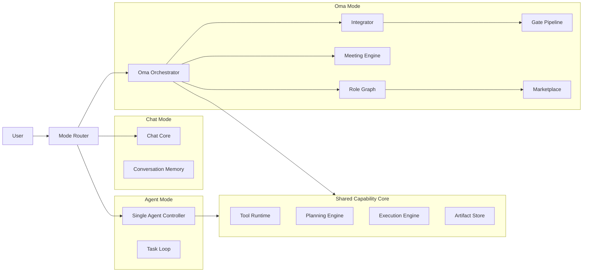

# Lyra Core v1 - Core Overview

## 0. 文档定位
- 文档类型：混合版（Vision + Executable Spec）。
- 第一读者：内部研发团队（产品、架构、工程、算法、测试、平台）。
- 目标：统一 Chat / Agent / Oma 的核心定义，并为实现提供可执行规范。
- 正式术语：第三模式统一命名为 `Oma`，全称 `Open Multi-Agent`。
- 宣传口号：`Oh My Agent`。

## 1. Core 文档包
本版本固定由 6 份主文档组成：

1. `00-Core-Overview.md`
2. `01-Mode-Specification.md`
3. `02-Oma-Orchestration-Protocol.md`（Oma 协议）
4. `03-Role-and-Capability-Model.md`
5. `04-Delivery-and-Governance.md`
6. `05-Oma-Marketplace.md`（Oma Marketplace）

## 2. 核心愿景（Why）
Lyra 的目标不是“把一个 Agent 做得更强”，而是让用户在同一工作台内获得三种稳定能力：

- Chat：低门槛实时对话能力。
- Agent：单体高执行力能力，同时是 Oma 的 Apex 执行层。
- Oma：多角色社会化协作能力（Open Multi-Agent）。

Oma 的关键创新点：

- 用户对“角色”发指令，不是直接对“执行器”发任务。
- 角色可自主判断是否独立执行、是否开会、是否委派、是否并发。
- 结果通过统一门禁和集成机制收敛，避免“并发=混乱”。

补充原则：
- Oma 不是对 Agent 的替代，而是 Agent 的组织化扩展。
- Agent 必须先做到“单体可独立完成复杂任务”，Oma 才有协作意义。

## 3. 设计原则（Principles）
- 单一术语：外部命名和内部模型都使用 `Oma`。
- 策略可配置：规则有默认值，默认值必须可覆盖。
- 默认可追责：每一次分发、会议、冲突、门禁都有结构化记录。
- 并发先约束后执行：先定义边界和契约，再并发生产。
- 强门禁优先：任何关键质量项失败都阻断主线。
- 先可运行后复杂化：首版商业机制可结算，但复杂经济系统后置。
- Agent First：Agent 能力不因 Oma 出现而降级，必须持续对标一线编码 Agent 体验与效果。

## 4. 三模式关系图

## 5. 术语表（Glossary）
- Role：角色，定义“负责什么、交付什么、如何验收”。
- Skill：技能栈，定义“用什么技术和规范执行”。
- Tool：工具能力（CLI、API、检索、代码执行、浏览器等）。
- Policy：策略约束（权限、质量门禁、安全规则、成本上限）。
- Ticket：任务单，最小可执行单元。
- Delegation：委派契约，从一个角色到另一个角色的可追责交付关系。
- Meeting：角色协商机制，用于跨角色对齐和决策。
- Integrator：集成角色，负责并发结果收敛与冲突闭环。
- Gate：质量门禁，决定结果是否允许进入主线。

## 6. 版本演进策略（v1 -> v2）
- v1：完成可执行规范，先跑通稳定闭环。
- v1.x：优化策略参数、评分模型、推荐质量。
- v2：在不破坏核心协议的前提下重构 Oma 编排层。

兼容原则：
- 接口字段新增只能“向后兼容”。
- 删除字段需经过废弃周期（Deprecation Window）。
- 协议版本由 `schema_version` 显式声明。

## 7. 首版范围与非目标
首版范围（In Scope）：
- 三模式边界定义。
- Oma 路由、会议、委派、并发、冲突、门禁、集成闭环。
- Role/Skill/Tool/Policy 四层模型。
- Marketplace 端到端业务流程（发布、匹配、协作、评分、申诉、仲裁、惩罚）。

非目标（Out of Scope）：
- 企业级重合规体系（SOC2/ISO 级别流程不在 v1 强制范围）。
- 完整经济学仿真定价系统（仅提供扩展接口）。

## 8. 默认假设（Assumptions）
- Chat 维持独立对话内核。
- Agent 与 Oma 共享能力内核，且 Agent 是 Oma 的最高执行层（Apex Layer）。
- Oma 编排层允许实验性策略，架构上预留重构位。
- 安全与合规采用开发级基线。
- 强门禁为默认策略，不允许静默绕过。

## 9. 阅读顺序建议
1. 先读 `01-Mode-Specification.md`。
2. 再读 `02-Oma-Orchestration-Protocol.md`（Oma 协议）。
3. 然后读 `03-Role-and-Capability-Model.md` 与 `04-Delivery-and-Governance.md`。
4. 最后读 `05-Oma-Marketplace.md`（Oma Marketplace）。

## 10. 统一测试计划（Cross-doc Test Plan）
- 模式一致性：同一请求在 Chat、Agent、Oma 三模式下行为符合边界定义。
- 路由一致性：无 `@`、单 `@`、多 `@`、错误 `@`、角色不可用均有确定性处理。
- 会议机制：发起、投票、超时、纪要、行动项映射可全链路复现。
- 并发收敛：多角色并行开发同一目标时，分支隔离、冲突收敛、最终集成可验证。
- 门禁阻断：任一质量门禁失败必阻断主线，并输出可追责报告。
- 市场闭环：发布 -> 匹配 -> 协作 -> 验收 -> 评分 -> 申诉的端到端链路可跑通。

## 11. 参考项目对齐（Reference Alignment）
为避免“只讲理念不讲机制”，v1 采用以下参考对齐策略：

- 编排图与节点化执行：借鉴 ChatDev 的 DAG/Node 设计，Oma 执行流必须支持图结构与子图复用。
- 自治与精控分层：借鉴 CrewAI 的 `Crews + Flows` 思路，Lyra 采用“角色自治 + 编排约束”双层架构。
- 持久执行与人类中断：借鉴 LangGraph / Microsoft Agent Framework 的 checkpoint、interrupt、time-travel 能力。
- 代码交付门禁：借鉴 Continue 的 checks-as-code，将门禁规则纳入仓库并可在 CI 中执行。
- 审批与回滚体验：借鉴 Cline 的 step approval 与 snapshot restore，补足高风险操作防护。
- 角色化公司范式：借鉴 MetaGPT 的 SOP 团队协作思想，但保持 Lyra 对“非公司角色”的扩展能力。

## 12. v1.1 优先增强项
在不改变 v1 主体边界下，优先增强以下能力：

1. Oma 编排 DSL（节点/边/动态并发/子图）。
2. 执行检查点（checkpoint）与可回放恢复。
3. 人类审批票据（Human Approval Ticket）与超时策略。
4. Gate-as-Code（`.lyra/checks/*.md`）与 CI 联动。
5. Marketplace 可信度信号扩展（门禁通过率、争议率、回滚率）。
