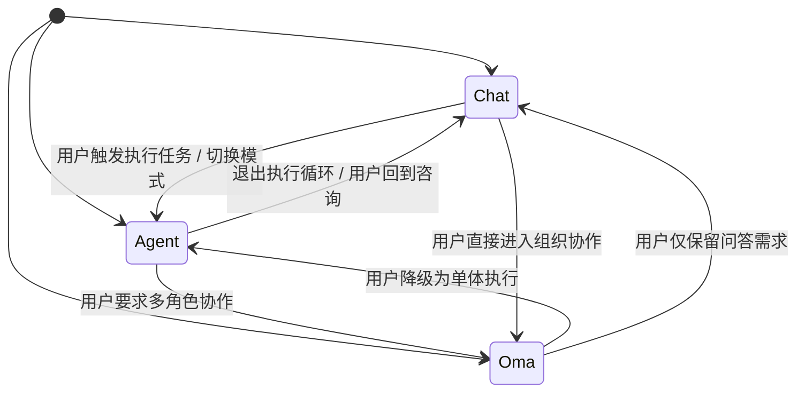

# Lyra Core v1 - Mode Specification

## 1. 目标
定义 Chat / Agent / Oma 三模式的边界、共享能力、切换策略和一致性约束，避免模式语义漂移。
其中 Oma 全称为 `Open Multi-Agent`，宣传口号为 `Oh My Agent`。

## 2. 模式边界总览
| 维度 | Chat | Agent | Oma |
|---|---|---|---|
| 内核类型 | 独立对话内核 | 共享能力内核 | 共享能力内核 + 独立编排层 |
| 主要目标 | 高质量对话与解释 | 单体任务执行 | 多角色协作与组织化交付 |
| 默认执行主体 | 单对话助手 | 单 Agent | 多 Role 网络 |
| 委派能力 | 无 | 可选（轻量） | 核心能力（默认存在） |
| 并发能力 | 无 | 有限并发 | 结构化并发（强约束） |
| 会议能力 | 无 | 无 | 可选会议，角色投票触发 |
| 门禁强度 | 低 | 中 | 强 |
| 交付收敛 | 对话回合 | 单体结果 | Integrator + Gate 收敛 |
| 与 Agent 关系 | 独立 | 基准执行层 | 以 Agent 作为 Apex 执行层并向下编排 |

## 3. 架构原则
- Chat 独立：Chat 不依赖 Oma 编排组件，不承担组织协作语义。
- Agent/Oma 共享：Tool Runtime、Planning Engine、Execution Engine、Artifact Store 统一复用。
- Agent 即 Apex：Oma 的顶层执行者与 Agent 模式是同一能力内核，不允许“Oma 强、Agent 弱”。
- Oma 可演进：Oma Orchestrator 单独模块化，允许后续重构而不破坏共享能力层。

## 4. 模式判定规则
模式判定优先级：

1. 显式模式（UI 模式开关）最高优先级。
2. 若无显式模式，沿用会话粘性模式（Session Sticky Mode）。
3. 若新会话且无粘性模式，按入口策略默认：
   - 通用聊天入口：Chat
   - 任务执行入口：Agent
   - 组织协作入口：Oma
4. 若存在模式冲突，返回可解释冲突原因并要求上层明确模式。

## 5. 模式切换状态机

## 6. 同一请求的一致性约束
对于同一 `UserIntentEnvelope`，三模式行为必须满足：

- Chat：只返回解释、建议、方案，不触发 Oma 级组织行为。
- Agent：可执行复杂任务，默认只有一个负责人和一个执行环，但能力强度必须达到 Apex 基线。
- Oma：必须可追踪角色路由、委派、会议、并发与集成结果，且其顶层执行者为 Agent Apex。

## 7. 失败与降级策略
- Chat 不可用时：仅可降级到 Agent（作为“单体问答执行器”），不得隐式进入 Oma。
- Agent 不可用时：可降级到 Chat（解释模式），或升级到 Oma（若用户明确要求多角色协作）。
- Oma 组件不可用时：允许降级到 Agent，但必须在响应中标注“组织协作未启用”。

## 8. 模式切换审计字段
每次模式切换必须记录：
- `switch_id`
- `session_id`
- `from_mode`
- `to_mode`
- `reason_code`
- `trigger_source`（user/system/policy）
- `created_at`

## 9. 验收标准
- 可重复：相同输入和相同策略下，模式判定结果一致。
- 可解释：每次切换均有结构化原因。
- 可回放：模式切换链路可被审计与重放。

## 10. 执行档位（Execution Profiles）
参考 OpenCode/Roo/Cline 的模式化经验，三模式在运行时需要绑定执行档位：

- `chat_readonly`：仅对话与分析，不可写入。
- `agent_standard`：单体执行，可写入，默认中等门禁。
- `oma_orchestrated`：多角色执行，强门禁、强审计、强收敛。

档位必须记录到会话元数据，字段建议：
- `execution_profile`
- `approval_profile`
- `sandbox_profile`

## 11. 审批策略矩阵（Approval Matrix）
参考 Cline 与 Codex 的审批实践，不同模式采用不同默认审批强度：

| 操作类型 | Chat | Agent | Oma |
|---|---|---|---|
| 文件写入 | deny | allow | allow |
| 终端命令 | deny | ask-on-risk | ask-on-risk |
| 网络访问 | deny | ask-on-risk | ask-on-risk |
| 生产环境变更 | deny | deny-by-default | deny-by-default |
| 高风险工具调用 | deny | explicit-approve | explicit-approve |

说明：
- `ask-on-risk`：低风险自动执行，高风险需审批。
- `explicit-approve`：每次都要求显式批准。

## 12. 兼容性约束
- Chat 永不隐式升级为可写模式。
- Agent 升级到 Oma 必须保留原任务上下文和审计链。
- Oma 降级到 Agent 时，未完成的并发子任务必须标记 `cancelled` 或 `handover`，不得丢失状态。

## 13. Agent Apex 能力基线
Agent 作为 Oma 顶层执行层，必须具备以下能力，不得因 Oma 架构而弱化：

- 可独立完成端到端编码任务（规划、实现、测试、修复、验证）。
- 可在单体模式下处理多文件、多模块、跨层改动。
- 可执行受控工具调用并在失败后自恢复。
- 可给出可解释的执行轨迹与结果证明（日志、产物、测试证据）。

目标要求：
- Agent 体验和效果需持续对标行业一线编码 Agent。
