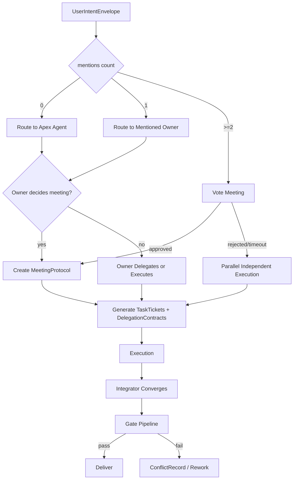
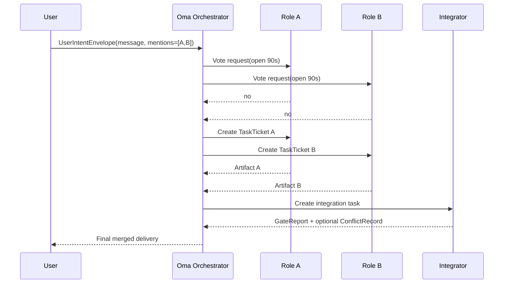

# Lyra Core v1 - Oma Orchestration Protocol

## 1. 协议目标
Oma 模式（Open Multi-Agent）要解决的问题不是“让更多 Agent 同时工作”，而是“让多角色协作结果可控、可追责、可收敛”。

本协议定义：
- 入口与路由规则
- 多 `@` 场景投票与会议机制
- 委派契约与任务单标准
- 并发收敛与冲突处理
- 对外统一接口类型

## 2. 统一接口与类型（Canonical Contracts）
以下类型是 v1 的统一对外契约。所有 Oma 流程记录必须可映射到这些对象。

```ts
type Mode = "agent" | "oma";
type TicketStatus = "draft" | "assigned" | "in_progress" | "blocked" | "done" | "rejected";
type VoteOption = "yes" | "no" | "abstain";
type GateStatus = "pass" | "fail" | "skipped";
type VerificationStatus = "pending" | "verified" | "rejected" | "suspended";
type NodeType = "agent" | "human" | "tool" | "subgraph" | "passthrough" | "literal" | "loop_counter" | "loop_timer";
type ApprovalStatus = "pending" | "approved" | "rejected" | "timeout";
type EventType = "intent.accepted" | "ticket.created" | "meeting.started" | "meeting.closed" | "task.updated" | "gate.finished" | "delivery.completed";
```

```ts
interface UserIntentEnvelope {
  schema_version: "v1";
  intent_id: string;
  session_id: string;
  mode: Mode;                    // Oma 流程要求 mode = "oma"
  requester_id: string;
  tenant_id?: string;
  message: string;
  mentions: MentionDirective[];
  attachments?: string[];
  constraints?: {
    deadline_ms?: number;
    budget_tokens?: number;
    quality_level?: "draft" | "standard" | "strict";
  };
  created_at: string;            // ISO-8601
}

interface MentionDirective {
  schema_version: "v1";
  raw: string[];                 // 原始 @ token，按输入顺序
  target_role_ids: string[];     // 解析后的角色 ID
  is_explicit: boolean;          // 是否由用户显式 @ 产生
  order_index: number[];         // 每个 target 在输入中的顺序
}

interface TaskTicket {
  schema_version: "v1";
  task_id: string;
  parent_task_id?: string;
  owner_role_id: string;
  collaborator_role_ids: string[];
  objective: string;
  deliverables: string[];
  acceptance_criteria: string[];
  input_artifacts: string[];
  required_gates: string[];      // 例如 ["lint", "test", "security", "review", "integration"]
  status: TicketStatus;
  created_at: string;
  updated_at: string;
}

interface DelegationContract {
  schema_version: "v1";
  delegation_id: string;
  from_role_id: string;
  to_role_id: string;
  task_id: string;
  scope: string;
  required_outputs: string[];
  acceptance_criteria: string[];
  due_at?: string;
  escalation_policy: {
    timeout_ms: number;
    fallback_role_id?: string;
  };
  created_at: string;
}

interface MeetingProtocol {
  schema_version: "v1";
  meeting_id: string;
  trigger_task_id: string;
  initiator_role_id: string;
  participant_role_ids: string[];
  vote: {
    open_at: string;
    close_at: string;
    quorum_ratio: number;        // 默认 0.5
    pass_ratio: number;          // 默认 0.5
    result: "approved" | "rejected" | "timeout";
  };
  agenda: string[];
  decisions: string[];
  action_task_ids: string[];
  minutes_artifact_id: string;
  created_at: string;
}

interface GateReport {
  schema_version: "v1";
  gate_id: string;
  task_id: string;
  branch_ref: string;
  checks: Array<{
    check_type: "lint" | "test" | "security" | "review" | "integration";
    status: GateStatus;
    evidence_ref: string;
    message: string;
  }>;
  overall_status: "pass" | "fail";
  blocker_reason?: string;
  generated_at: string;
}

interface ConflictRecord {
  schema_version: "v1";
  conflict_id: string;
  parent_task_id: string;
  related_task_ids: string[];
  branch_refs: string[];
  conflict_type: "merge" | "interface" | "style" | "logic";
  owner_integrator_role_id: string;
  resolution_plan: string[];
  final_resolution?: string;
  status: "open" | "resolved";
  created_at: string;
  resolved_at?: string;
}

interface MarketplaceProfile {
  schema_version: "v1";
  profile_id: string;
  publisher_id: string;
  role_template_id: string;
  display_name: string;
  capabilities: string[];
  policies: string[];
  pricing: {
    model: "fixed" | "subscription" | "hybrid";
    currency: string;
    amount: number;
  };
  trust_score: number;           // 0-100
  verification_status: VerificationStatus;
  rating_avg: number;            // 0-5
  completed_jobs: number;
  dispute_count: number;
  created_at: string;
  updated_at: string;
}

interface OmaExecutionGraph {
  schema_version: "v1";
  graph_id: string;
  session_id: string;
  nodes: Array<{
    node_id: string;
    node_type: NodeType;
    role_id?: string;
    config_ref?: string;
    dynamic?: {
      type: "map" | "tree";
      max_parallel: number;
      group_size?: number;
    };
  }>;
  edges: Array<{
    from: string;
    to: string;
    condition?: string;
  }>;
  start_nodes: string[];
  end_nodes: string[];
}

interface CheckpointRecord {
  schema_version: "v1";
  checkpoint_id: string;
  session_id: string;
  task_id?: string;
  graph_node_id?: string;
  state_ref: string;
  artifact_refs: string[];
  created_at: string;
}

interface HumanApprovalTicket {
  schema_version: "v1";
  approval_id: string;
  session_id: string;
  task_id: string;
  operation: "file_write" | "command_exec" | "network_call" | "external_publish";
  risk_level: "low" | "medium" | "high";
  summary: string;
  status: ApprovalStatus;
  timeout_ms: number;
  created_at: string;
  resolved_at?: string;
}

interface OmaEventEnvelope {
  schema_version: "v1";
  event_id: string;
  session_id: string;
  type: EventType;
  payload_ref: string;
  created_at: string;
}
```

## 2.1 编排图与动态并发扩展（参考 ChatDev/LangGraph）
Oma 在执行层允许使用图编排，不局限线性任务链。  
扩展要求：

- 支持 `OmaExecutionGraph` 表达节点、边、条件、起止节点。
- 支持 `dynamic.map`（扇出并行）和 `dynamic.tree`（并行 + 分层归约）。
- 支持循环保护节点（迭代次数/超时）避免无穷循环。
- 节点输出统一为结构化消息列表，便于后续节点和审计系统消费。

## 3. 入口与路由规则
### 3.1 无 `@` 输入
- 默认路由到 Apex 层角色（`oma.apex.default`）。
- Apex 角色可决定：
  - 自己执行
  - 委派执行
  - 发起会议

### 3.2 单 `@` 输入
- 路由到被 `@` 角色作为 `TaskTicket.owner_role_id`。
- 被 `@` 角色拥有二次分发权，不等于“必须独自执行”。

### 3.3 多 `@` 输入
- 系统先发起“是否开会”投票，参与者为被 `@` 角色集合。
- 投票规则默认值：
  - `quorum_ratio = 0.5`
  - `pass_ratio = 0.5`
  - `vote_window = 90s`
- 投票通过：创建 `MeetingProtocol`，会议产出任务单映射。
- 投票不通过或超时：并行独立执行，每个被 `@` 角色各自产生子任务，最终由 Integrator 收敛。

## 4. 会议机制（Meeting）
会议是可选机制，不是固定流程。可触发源：
- 多 `@` 场景投票通过。
- 无 `@` 或单 `@` 时，由负责人自主决定是否开会。

会议必须产出：
- `minutes_artifact_id`（会议纪要）
- `decisions`（决策结论）
- `action_task_ids`（映射到可执行任务单）

若会议未产生可执行任务单，流程视为无效会议，任务回退给发起角色重试。

## 5. 多 `@` 且不开会的并行策略
- 每个目标角色生成独立 `TaskTicket`，`parent_task_id` 相同。
- 任务之间默认互不阻塞。
- 系统自动分配 Integrator 角色创建 `integration/<parent_task_id>` 收敛分支。
- 任一子任务失败不会自动终止其他子任务，但会在集成阶段形成 `ConflictRecord` 或 `GateReport.fail`。

## 6. 异常路由的确定性规则
- `@` 到未知角色：尝试别名映射一次，失败则回退 Apex 并记录 `reason_code=UNKNOWN_ROLE`。
- `@` 到不可用角色：路由到其 `fallback_role_id`，无 fallback 则回退 Apex 并记录 `ROLE_UNAVAILABLE`。
- 多 `@` 中部分角色不可用：可用角色继续参与投票，不可用角色仅记录告警不阻断全局。

## 7. 端到端流程图


## 8. 关键时序图（多 `@`）


## 9. 实施要求（MUST）
- MUST：所有 Oma 流程输入必须落为 `UserIntentEnvelope`。
- MUST：所有执行单元必须有 `TaskTicket`。
- MUST：跨角色交付必须有 `DelegationContract`。
- MUST：并发收敛必须由 Integrator 输出 `GateReport`。
- MUST：冲突必须记录为 `ConflictRecord`。

## 10. 验收场景
- 无 `@`、单 `@`、多 `@` 三类输入均有确定输出路径。
- 多 `@` 投票、会议、超时、不开会并行执行可复现。
- 不可用角色和未知角色场景有稳定降级行为。

## 11. 持久执行与恢复（参考 LangGraph / Agent Framework）
- Oma 长任务必须定期生成 `CheckpointRecord`。
- 发生模型失败、工具失败、系统重启时，优先从最近 checkpoint 恢复。
- 恢复后必须追加 `OmaEventEnvelope(type=task.updated)` 记录恢复来源。

## 12. 人类审批机制（参考 Cline / Codex）
- 高风险操作必须创建 `HumanApprovalTicket`，未经批准不得执行。
- 支持审批超时：`timeout -> rejected` 或按策略回退。
- 审批决策必须进入审计链，避免“执行了但无法解释”。

## 13. 事件流与可观测性（参考 OpenHands）
Oma Orchestrator 必须以事件流方式对外暴露关键状态：

- `intent.accepted`
- `ticket.created`
- `meeting.started` / `meeting.closed`
- `task.updated`
- `gate.finished`
- `delivery.completed`

该事件流用于：
- 实时 UI（进度、状态、告警）
- 回放与复盘
- 成本与时延分析

## 14. 实施补充要求（MUST）
- MUST：并发流程必须声明 `max_parallel`，禁止无限并发。
- MUST：任何恢复动作必须可追溯到具体 `checkpoint_id`。
- MUST：高风险操作必须经过 `HumanApprovalTicket` 或显式策略豁免。
- MUST：所有状态变化必须产生 `OmaEventEnvelope`。

## 15. Apex Layer 定义
为避免将顶层角色误解为传统“CEO”，本协议明确：

- Apex 是执行能力定义，不是组织头衔定义。
- Agent 模式的执行体与 Oma 模式的 Apex 执行体是同一能力内核。
- Oma 只是让 Apex 在必要时编排更多角色，并不替代 Apex 的单体执行能力。

Apex 必须满足：
- 单体可完成高复杂度任务。
- 可独立规划、执行、验证与交付。
- 可在必要时下钻委派，并最终对结果收敛负责。
