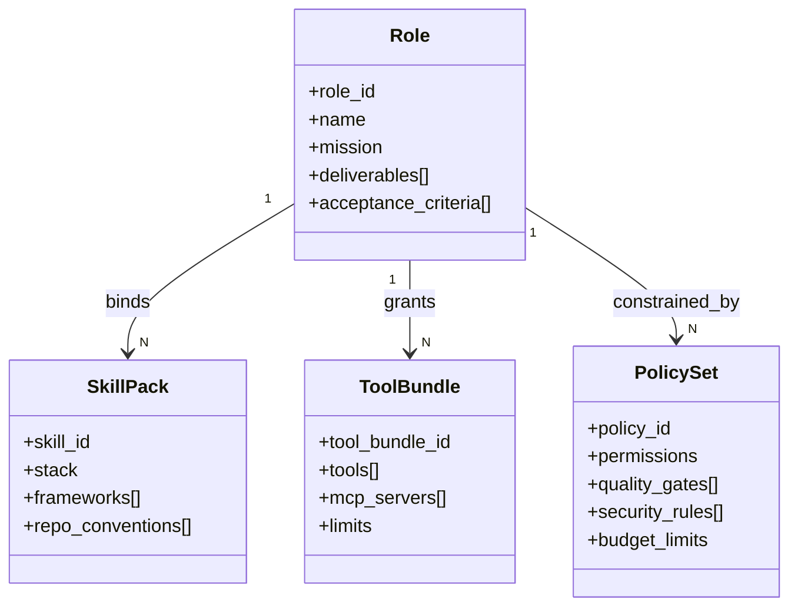

# Lyra Core v1 - Role & Capability Model

## 1. 目标
构建 Oma 的统一角色能力模型，支持“固定组织 + 用户自定义角色”的混合生态，避免岗位爆炸和职责漂移。

## 2. 四层模型
Lyra v1 采用 `Role / Skill / Tool / Policy` 四层结构：

- Role：职责边界与交付责任。
- Skill：技术栈与工程规范。
- Tool：可调用能力集合。
- Policy：权限、质量、安全、成本约束。



## 3. Role（岗位层）规范
Role 是稳定结构，不以具体语言拆分岗位。岗位定义必须包含：
- `mission`：角色目标。
- `deliverables`：必须产物。
- `acceptance_criteria`：验收标准。
- `delegation_scope`：可委派边界。
- `escalation_target`：升级路径。

默认角色集合（可扩展）：
- Apex Agent / PM / Architect / Frontend Engineer / Backend Engineer / QA / Security / Integrator
- 可选：Legal / Compliance / DevOps / Data Analyst / Researcher / Growth

## 4. Skill（技能层）规范
Skill 用于“同岗位跨技术栈复用”，避免岗位爆炸。示例：

- Backend Engineer + `java-spring`
- Backend Engineer + `python-fastapi`
- Client Engineer + `kotlin-android`

Skill 必须声明：
- 支持语言/框架
- 构建与测试命令
- 风格规范（lint/format）
- 最低质量门槛

## 5. Tool（工具层）规范
ToolBundle 按最小权限分配，默认分类：
- `analysis_tools`（检索、总结、文档）
- `build_tools`（构建、测试、打包）
- `delivery_tools`（发布、部署、回滚）
- `collaboration_tools`（会议、评论、任务同步）

每个 ToolBundle 必须包含：
- `allowed_scopes`
- `rate_limits`
- `risk_level`

## 6. Policy（策略层）规范
Policy 是执行边界，至少包含：
- 权限策略：能访问哪些仓库、分支、目录、密钥域。
- 质量策略：必须通过的 gate 列表。
- 安全策略：依赖扫描、密钥检测、危险命令限制。
- 成本策略：token / 时长 / 工具调用上限。

## 7. 自定义角色（User-defined Role）生命周期
状态机：
`draft -> review -> published -> enabled -> suspended (optional) -> archived`

流程要求：
- draft：用户定义角色说明、技能、工具和策略。
- review：系统检查字段完整性和权限越界。
- published：可进入 Oma Marketplace。
- enabled：可被项目团队引用和 `@`。
- suspended：触发违规或高风险时暂停。

## 8. 角色与任务契约映射
`TaskTicket.owner_role_id` 与 `DelegationContract.to_role_id` 必须是启用状态角色。  
角色不可用时必须按 `fallback_role_id` 或 Apex 回退策略处理。

## 9. 风险控制
- 禁止“无限责任角色”：任何角色都必须定义不负责范围（Out-of-Scope）。
- 禁止“无门禁角色”：任何可写入产物的角色都必须绑定 Gate 策略。
- 禁止“高权限无审计”：高风险工具调用必须写入审计日志。

## 10. 验收标准
- 同一岗位在不同技能包下流程一致、仅技术栈差异化。
- 自定义角色从发布到启用可被完整追踪。
- 角色委派链路中不存在无责任归属任务单。

## 11. 角色执行形态（参考 OpenCode / Roo）
为避免“一个角色做所有事”，v1 建议每个关键岗位支持双形态：

- `planner persona`：只读分析、拆解任务、定义验收，不直接写入。
- `builder persona`：负责实际执行与产物提交。

示例：
- Architect(planner) -> Backend Engineer(builder)
- QA(planner+validator) -> Integrator(builder+validator)

## 12. 能力包清单（Capability Manifest）
角色发布与项目装配都使用 manifest 驱动，示例字段：

```yaml
role_id: oma.backend_engineer
persona: builder
skill_pack: python-fastapi
tool_bundle: backend-standard
policy_set: strict-write-gated
approval_profile: ask-on-risk
memory_profile:
  short_term: enabled
  long_term: enabled
  retrieval_top_k: 8
```

要求：
- manifest 必须可版本化（`role_version`）。
- manifest 变更必须可审计并可回滚。

## 13. 记忆与上下文策略（参考 ChatDev / LangGraph）
- Role 可绑定短期记忆（会话上下文）与长期记忆（跨会话经验）。
- 记忆读取和写回必须受 Policy 约束，禁止敏感信息无界扩散。
- 记忆命中记录建议进入审计，用于解释“为什么做出该决策”。

## 14. Apex Agent 角色要求
Apex Agent 是能力角色，不是岗位 title。它是 Agent 模式主体，也是 Oma 顶层执行体。

必须能力：
- 全局理解：可在不委派情况下独立完成复杂任务。
- 强执行：可跨模块实施、调试、测试与收敛交付。
- 强编排：可根据任务复杂度判断是否下钻分发。
- 强责任：无论是否委派，最终交付责任由 Apex 承担。
