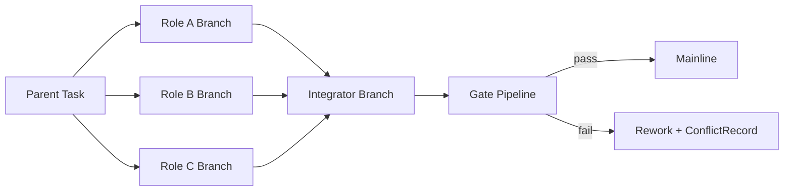

# Lyra Core v1 - Delivery & Governance

## 1. 目标
确保 Oma 模式在“高并发协作”下仍能稳定交付，避免样式冲突、接口漂移、质量失控。

## 2. 并发交付模型
默认采用：`分支隔离 + Integrator 收敛`。

强制规则：
- 每个 `TaskTicket` 必须使用独立分支：`oma/<task_id>/<role_slug>`。
- 禁止多个角色在同一主干分支直接并发写入。
- Integrator 使用收敛分支：`integration/<parent_task_id>`。

## 3. 强门禁（Strong Gates）
Oma 默认门禁不可降级，所有关键项必须通过：

1. `lint`：代码风格与静态规范检查。
2. `test`：单元测试与必要集成测试。
3. `security`：依赖漏洞、密钥泄漏、危险调用扫描。
4. `review`：结构化评审通过。
5. `integration`：集成回归通过。

任一失败结果：
- `GateReport.overall_status = fail`
- 阻断主线合并。
- 自动回传给 owner role 和 integrator 进入返工。

## 4. 冲突治理
冲突分类：
- `style`：代码样式或目录规范冲突。
- `interface`：API/类型契约冲突。
- `logic`：业务逻辑不一致。
- `merge`：版本控制层面冲突。

处理流程：
1. Integrator 生成 `ConflictRecord`。
2. 根据冲突类型指定责任角色。
3. 输出 `resolution_plan` 与截止时间。
4. 返工后重新进入 Gate Pipeline。

## 5. 审计与追责链路
v1 必须形成完整链路：

`UserIntentEnvelope -> TaskTicket -> DelegationContract -> GateReport -> ConflictRecord(optional) -> Final Delivery`

所有链路对象必须有：
- 唯一 ID
- 时间戳
- 责任角色
- 证据引用（artifact/log/report）

## 6. 开发级安全与合规基线
v1 采用开发级基线，不引入企业重合规流程。最低要求：
- 最小权限访问（Least Privilege）。
- 敏感信息不落入公开工件。
- 安全扫描纳入强门禁。
- 所有高风险操作可审计。

## 7. 团队一致性约束
为避免“每个角色写法不同”导致反复修复，v1 必须有统一规范包：
- 代码风格基线（lint + formatter）
- 架构边界基线（模块职责约束）
- 接口契约基线（版本和兼容规则）
- 提交规范基线（commit/PR 模板）

## 8. 发布策略
- 仅当 `GateReport.overall_status = pass` 才可进入主线。
- 紧急发布也必须保留最小门禁（security + integration 不可跳过）。
- 发布失败必须可快速回滚到最近稳定版本。

## 9. 验收标准
- 多角色并行开发时，主干分支无直接冲突写入。
- 任一 gate 失败都可被稳定阻断并可追责。
- 冲突闭环流程可被完整回放。

## 10. Gate-as-Code（参考 Continue）
门禁规则应作为仓库内配置，而非平台硬编码。建议路径：

- `.lyra/checks/security.md`
- `.lyra/checks/quality.md`
- `.lyra/checks/architecture.md`

规则文件可被 CI 直接执行，结果统一映射为 `GateReport.checks[]`。

## 11. 执行快照与回滚（参考 Cline）
为降低并发返工成本，v1 建议引入快照机制：

- 每个关键步骤生成 workspace snapshot。
- 支持 `compare` 与 `restore`（对指定步骤回滚）。
- 快照 ID 必须与 `TaskTicket` 和 `GateReport` 关联。

## 12. 持久化与重启恢复（参考 LangGraph / Agent Framework）
- 长时任务必须支持 checkpoint 续跑。
- Agent 重启后应从最近稳定检查点恢复，不得重复执行已确认步骤。
- 恢复动作必须记录恢复原因与恢复来源。

## 13. 可观测性基线（参考 OpenHands）
最小可观测事件：
- `task.started`
- `task.progress`
- `gate.finished`
- `conflict.opened`
- `delivery.completed`

最小指标：
- 交付时延
- 门禁通过率
- 冲突率
- 平均返工次数
- 审批阻塞时长

## 14. Agent First 交付原则
Oma 引入多角色协作后，不得降低 Agent 单体交付标准：

- 所有关键交付路径必须允许 Apex Agent 单体完成。
- Oma 协作路径是“提效扩展”，不是“能力补丁”。
- 回归测试中需保留 Agent 单体基准场景，确保其效果持续对标一线编码 Agent。
