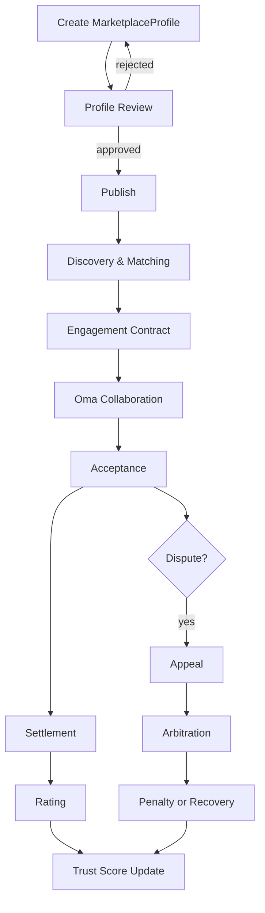

# Lyra Core v1 - Oma Marketplace

## 1. 产品目标
Oma Marketplace 不是“插件商店”，而是“角色社会网络 + 任务交易市场”的组合系统。  
它支持用户发布任意可协作角色（不仅是开发角色），并在真实任务中完成发现、协作、交付和信用沉淀。

## 2. 核心对象
- 供给侧（Publisher）：发布角色包的用户或团队。
- 需求侧（Requester）：发起任务的用户、项目或组织。
- 角色体（MarketplaceProfile）：可被检索、被调用、被评价的标准化角色档案。
- 交易单（Engagement）：一次协作合同实例（可固定价、订阅或混合）。
- 仲裁单（Dispute Case）：争议处理对象。

`MarketplaceProfile` 使用统一契约（见 `02-Oma-Orchestration-Protocol.md`，即 Oma 协议文档）。

## 3. 功能全链路（v1 必须覆盖）
1. 发布（Publish）
2. 审核（Review）
3. 发现（Discovery）
4. 匹配（Matching）
5. 协作（Collaboration）
6. 验收（Acceptance）
7. 结算（Settlement）
8. 评分（Rating）
9. 申诉（Appeal）
10. 仲裁（Arbitration）
11. 惩罚与恢复（Penalty & Recovery）
12. 推荐网络（Recommendation Network）

## 4. 生命周期流程图

## 5. 发布与审核规则
发布入口必须提交：
- 角色描述（Mission / Deliverables / Boundaries）
- 能力声明（Skill + Tool + Policy）
- 风险声明（禁止事项、免责边界）
- 定价卡（Pricing）

审核策略（v1）：
- 自动审核：字段完整性、权限越界、策略冲突、敏感声明检查。
- 人工复核：高风险角色（如涉及高权限写入、自动发布、外部支付）。

审核结果：
- `verified`：可被公开发现与交易。
- `rejected`：可修改后重提。
- `suspended`：违规后暂时下架。

## 6. 发现与匹配
检索维度：
- 角色类型（Role）
- 技能栈（Skill）
- 可信度（trust_score, rating_avg, dispute_count）
- 价格模型（fixed/subscription/hybrid）
- 历史交付（completed_jobs, gate pass ratio）

匹配策略：
- 先硬过滤（权限、政策、预算、语言）
- 再软排序（可信度、价格、成功率、响应速度）

## 7. 协作与履约
当用户选中 Marketplace 角色后，系统创建 Engagement，并映射到 Oma 执行链路：

- 自动创建 `TaskTicket`
- 必要时创建 `DelegationContract`
- 进入 Gate Pipeline
- 产物与证据回写到 Engagement

要求：
- 所有外部角色在项目内执行时必须遵守项目 PolicySet。
- 无论角色来源，门禁策略一视同仁。

## 8. 评分与信任分
评分输入：
- 交付质量（Gate pass）
- 准时率
- 返工率
- 用户评分
- 争议率

推荐信任分更新公式（v1 默认）：

`trust_score = 0.35 * quality + 0.20 * timeliness + 0.20 * user_rating + 0.15 * reliability - 0.10 * dispute_penalty`

取值范围：`0 ~ 100`。  
v1.x 可通过策略引擎替换权重。

## 9. 申诉与仲裁
触发场景：
- 交付不符合验收标准
- 产物与承诺不一致
- 疑似违规行为（抄袭、恶意、越权）

仲裁输入：
- `TaskTicket`
- `GateReport`
- `ConflictRecord`（如有）
- 交付工件与通信记录

仲裁输出：
- 维持原判
- 部分退款 / 全额退款
- 信用扣分
- 临时下架 / 永久封禁

## 10. 惩罚与恢复机制
惩罚等级：
- L1：警告（低风险违规）
- L2：限流（短期交易能力下降）
- L3：下架（中高风险）
- L4：封禁（严重违规）

恢复路径：
- 补交材料
- 完成整改任务
- 观察期通过后恢复 `verified`

## 11. 商业机制（v1 可运行 + 可扩展）
v1 可运行能力：
- 固定价任务
- 订阅角色服务
- 混合模式（基础订阅 + 额外任务计费）
- 托管结算（Escrow）

扩展接口（v2+）：
- 动态定价策略接口
- 分润规则接口
- 激励与惩罚系数接口
- 跨组织结算接口

## 12. 社交网络机制
Marketplace 同时是社交网络：
- 关注角色（Follow）
- 收藏能力包（Bookmark）
- 公开协作记录（可配置可见性）
- 推荐链路（由信任分和协作图谱驱动）

## 13. API 与事件（建议）
核心 API：
- `POST /marketplace/profiles`
- `POST /marketplace/profiles/{id}/submit-review`
- `GET /marketplace/search`
- `POST /marketplace/engagements`
- `POST /marketplace/disputes`

核心事件：
- `profile.published`
- `engagement.started`
- `engagement.accepted`
- `engagement.disputed`
- `profile.penalized`

## 14. 验收标准
- 发布到交易完成全链路可跑通。
- 评分与信任分更新可验证。
- 争议到仲裁到惩罚闭环可追踪。
- 推荐链路在检索排序中生效。

## 15. 角色包版本与兼容策略
Marketplace 角色包必须显式版本化：
- `role_version`
- `compatibility_range`（支持的 Lyra Core 版本）
- `breaking_changes` 标记

兼容规则：
- 同主版本内应保持向后兼容。
- 破坏性变更必须要求显式升级确认。

## 16. 可信度信号增强（参考 Continue / Delivery Gates）
除用户评分外，`trust_score` 还应吸收工程信号：
- `gate_pass_ratio`（门禁通过率）
- `rollback_ratio`（交付后回滚率）
- `rework_ratio`（返工率）
- `sla_on_time_ratio`（按时率）

建议将工程信号作为硬约束过滤条件，再进行评分排序。

## 17. 先试后用机制（Trial & Sandbox）
为降低高价值任务风险，建议支持试运行流程：

1. 需求方发起 Trial Engagement。
2. 角色在受限沙箱执行小样任务。
3. 仅当 trial 通过，才允许进入正式履约。

Trial 结果必须产出：
- 小样交付物
- 最小 GateReport
- 风险说明

## 18. 争议处理 SLA
为避免争议流程拖垮平台体验，v1 建议默认 SLA：
- `T+24h`：完成受理
- `T+72h`：给出初判
- `T+7d`：完成终裁

超时必须触发平台告警并升级仲裁优先级。
