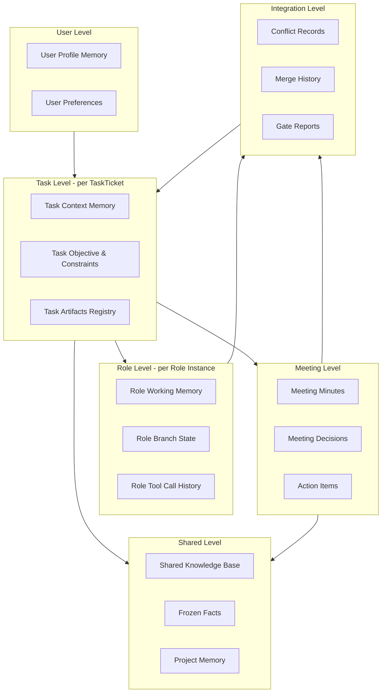

# Lyra Core v1 - Memory Architecture Oma Extension

## 文档定位
- 本文档是 `06-Memory-Architecture.md` 的 Oma 模式扩展
- 定义多角色协作场景下的记忆架构
- 与 `02-Oma-Orchestration-Protocol.md` 保持一致

---

## 1. Oma 模式下的记忆挑战

### 1.1 核心问题

当前记忆架构基于"单会话单执行者"假设，但 Oma 模式引入：

1. **多角色并发** - 同一任务下多个角色同时执行
2. **角色委派链** - 记忆需要在委派关系中传递
3. **会议协商** - 跨角色的决策记录需要共享
4. **分支隔离** - 每个角色在独立分支工作
5. **结果收敛** - Integrator 需要合并多角色经验

### 1.2 不兼容点

| 原架构假设 | Oma 模式现实 | 冲突 |
|---|---|---|
| 单会话单执行者 | 多角色并发执行 | 记忆归属不明确 |
| 线性对话历史 | 并发执行 + 会议 | 时间线分叉 |
| 单一上下文窗口 | 每个角色独立上下文 | 上下文隔离与共享矛盾 |
| 会话级共享记忆 | 角色级 + 任务级记忆 | 共享粒度不匹配 |

---

## 2. Oma 记忆架构设计原则

### 2.1 核心原则

1. **角色记忆隔离** - 每个角色有独立的工作记忆
2. **任务记忆共享** - 同一 TaskTicket 下的角色可访问任务记忆
3. **委派记忆传递** - DelegationContract 定义记忆传递范围
4. **会议记忆归档** - MeetingProtocol 产生的决策进入共享层
5. **Integrator 记忆收敛** - 收敛时合并多角色经验
6. **可追溯性** - 任何记忆片段都能追溯到产生它的角色和任务

### 2.2 设计目标

- Agent 模式：保持原有单会话架构
- Oma 模式：扩展为多角色协作记忆架构
- 模式切换：记忆可平滑迁移

---

## 3. Oma 记忆层次模型



---

## 4. 存储结构扩展

### 4.1 目录结构

```text
~/.lyra/modules/ai/
  sessions/
    <session_id>/
      session.sqlite              # Agent 模式会话
      cuts/
        cut_*.sqlite
      manifests/
        cuts.manifest.json
  
  tasks/                          # 新增：Oma 任务域
    <task_id>/
      task.sqlite                 # 任务级记忆
      roles/
        <role_id>/
          role_work.sqlite        # 角色工作记忆
          role_cuts/
            cut_*.sqlite
      meetings/
        <meeting_id>.sqlite       # 会议记录
      integration/
        conflicts.sqlite          # 冲突记录
        merge_history.sqlite      # 合并历史
        gate_reports.sqlite       # 门禁报告
      manifests/
        task.manifest.json
  
  shared/
    shared_truth.sqlite
    frozen_truth.sqlite
    shared_memory.md
    shared_memory.audit.jsonl
    frozen_memory.md
    frozen_memory.audit.jsonl
    project_memory/               # 新增：项目级记忆
      <project_id>/
        project.md
        project.audit.jsonl
  
  runtime/
    trigger_marks.sqlite
    memory_jobs.sqlite
    prompt_cache.sqlite
    role_context_cache.sqlite     # 新增：角色上下文缓存
```

---

## 5. 核心数据模型扩展

### 5.1 任务记忆（Task Memory）

**文件**: `tasks/<task_id>/task.sqlite`

**表**: `task_context`

```sql
CREATE TABLE task_context (
  record_id TEXT PRIMARY KEY,
  task_id TEXT NOT NULL,
  parent_task_id TEXT,
  record_type TEXT NOT NULL,  -- 'objective' | 'constraint' | 'artifact' | 'decision'
  content TEXT NOT NULL,
  source_role_id TEXT,
  source_meeting_id TEXT,
  visibility TEXT NOT NULL,   -- 'task_local' | 'task_tree' | 'project_wide'
  created_at_ms INTEGER NOT NULL,
  created_at_iso TEXT NOT NULL,
  updated_at_ms INTEGER NOT NULL,
  metadata_json TEXT
);
```

**职责**:
- 存储任务目标、约束、交付物
- 记录任务级决策和里程碑
- 维护任务产物注册表
- 支持子任务继承父任务上下文

---

### 5.2 角色工作记忆（Role Working Memory）

**文件**: `tasks/<task_id>/roles/<role_id>/role_work.sqlite`

**表**: `role_dialog`

```sql
CREATE TABLE role_dialog (
  msg_id TEXT PRIMARY KEY,
  role_id TEXT NOT NULL,
  task_id TEXT NOT NULL,
  turn_index INTEGER NOT NULL,
  speaker TEXT NOT NULL,      -- 'user' | 'role' | 'tool' | 'system'
  content_raw TEXT NOT NULL,
  token_count INTEGER,
  char_count INTEGER,
  tool_call_id TEXT,
  delegation_ref TEXT,        -- 引用 DelegationContract
  created_at_ms INTEGER NOT NULL,
  created_at_iso TEXT NOT NULL,
  metadata_json TEXT
);
```

**表**: `role_tool_history`

```sql
CREATE TABLE role_tool_history (
  call_id TEXT PRIMARY KEY,
  role_id TEXT NOT NULL,
  task_id TEXT NOT NULL,
  tool_name TEXT NOT NULL,
  input_json TEXT NOT NULL,
  output_json TEXT,
  status TEXT NOT NULL,       -- 'pending' | 'success' | 'failed'
  error_message TEXT,
  created_at_ms INTEGER NOT NULL,
  created_at_iso TEXT NOT NULL,
  completed_at_ms INTEGER,
  metadata_json TEXT
);
```

**职责**:
- 角色独立的工作上下文
- 工具调用历史
- 角色内部推理轨迹
- 支持角色级裁剪和归档

---

### 5.3 会议记忆（Meeting Memory）

**文件**: `tasks/<task_id>/meetings/<meeting_id>.sqlite`

**表**: `meeting_record`

```sql
CREATE TABLE meeting_record (
  record_id TEXT PRIMARY KEY,
  meeting_id TEXT NOT NULL,
  task_id TEXT NOT NULL,
  record_type TEXT NOT NULL,  -- 'agenda' | 'discussion' | 'decision' | 'action'
  speaker_role_id TEXT,
  content TEXT NOT NULL,
  vote_result TEXT,           -- JSON: {role_id: vote_option}
  action_task_id TEXT,        -- 关联到后续任务
  created_at_ms INTEGER NOT NULL,
  created_at_iso TEXT NOT NULL,
  metadata_json TEXT
);
```

**职责**:
- 会议议程和讨论记录
- 投票结果和决策
- 行动项映射
- 支持会议纪要生成

---

### 5.4 集成记忆（Integration Memory）

**文件**: `tasks/<task_id>/integration/conflicts.sqlite`

**表**: `conflict_resolution`

```sql
CREATE TABLE conflict_resolution (
  conflict_id TEXT PRIMARY KEY,
  task_id TEXT NOT NULL,
  conflict_type TEXT NOT NULL,
  involved_role_ids TEXT NOT NULL,  -- JSON array
  conflict_description TEXT NOT NULL,
  resolution_plan TEXT,
  resolution_status TEXT NOT NULL,  -- 'open' | 'resolved' | 'escalated'
  resolver_role_id TEXT,
  created_at_ms INTEGER NOT NULL,
  created_at_iso TEXT NOT NULL,
  resolved_at_ms INTEGER,
  metadata_json TEXT
);
```

**职责**:
- 记录角色间冲突
- 追踪解决方案
- 支持冲突复盘

---

## 6. 记忆可见性与访问控制

### 6.1 可见性层级

| 层级 | 范围 | 访问规则 |
|---|---|---|
| `role_private` | 仅角色自己 | 角色工作记忆默认私有 |
| `task_local` | 同一任务下所有角色 | 任务上下文、会议纪要 |
| `task_tree` | 任务树（父子任务） | 委派时可传递的上下文 |
| `project_wide` | 整个项目 | 项目级共享记忆 |
| `user_global` | 用户全局 | 用户画像、偏好 |

### 6.2 访问控制规则

1. **角色读取权限**:
   - 可读：自己的 `role_work`
   - 可读：所属任务的 `task_context`
   - 可读：参与的 `meeting_record`
   - 可读：相关的 `conflict_resolution`
   - 可读：`shared_truth` / `frozen_truth`（及其 Markdown 投影视图）

2. **角色写入权限**:
   - 可写：自己的 `role_work`
   - 可写：所属任务的 `task_context`（追加模式）
   - 可写：参与的 `meeting_record`（追加模式）
   - 受限写：`shared_truth` / `frozen_truth`（需触发器验证，Markdown 由投影器生成）

3. **Integrator 特权**:
   - 可读：所有相关角色的 `role_work`
   - 可写：`integration` 域
   - 可写：合并后的 `task_context`

---

## 7. 委派记忆传递协议

### 7.1 委派时的记忆传递

当创建 `DelegationContract` 时，需要定义记忆传递范围：

```typescript
interface DelegationMemoryScope {
  delegation_id: string;
  from_role_id: string;
  to_role_id: string;
  
  // 传递的任务上下文
  task_context_refs: string[];      // task_context.record_id[]
  
  // 传递的角色记忆片段
  role_memory_refs: string[];       // role_dialog.msg_id[]
  
  // 传递的会议决策
  meeting_decision_refs: string[];  // meeting_record.record_id[]
  
  // 传递模式
  transfer_mode: 'copy' | 'reference';
  
  // 可见性约束
  visibility_constraint: 'read_only' | 'read_write';
}
```

### 7.2 传递规则

1. **默认传递**:
   - 任务目标和约束（`task_context` 中 `record_type='objective'|'constraint'`）
   - 相关会议决策
   - 必要的上下文片段

2. **选择性传递**:
   - 委派方可选择传递部分工作记忆
   - 敏感信息可标记为不可传递

3. **传递模式**:
   - `copy`: 复制记忆片段到被委派角色的上下文
   - `reference`: 仅传递引用，被委派角色可按需读取

---

## 8. 会议记忆归档策略

### 8.1 会议纪要生成

会议结束后，自动生成结构化纪要：

```markdown
# Meeting Minutes: <meeting_id>

**Task**: <task_id>
**Participants**: <role_ids>
**Time**: <created_at_iso>

## Agenda
- <agenda_item_1>
- <agenda_item_2>

## Discussions
<discussion_summary>

## Decisions
- **Decision 1**: <decision_text>
  - Vote: <vote_result>
  - Action: <action_task_id>

## Action Items
- [ ] <action_1> (Owner: <role_id>, Due: <due_at>)
- [ ] <action_2> (Owner: <role_id>, Due: <due_at>)
```

### 8.2 会议记忆提升

高价值会议决策应提升到更高层级：

1. **任务级**: 写入 `task_context`
2. **项目级**: 写入 `project_memory`
3. **共享级**: 写入 `shared_truth`（需触发器验证）
   - `shared_memory.md` 仅作为同步投影视图

---

## 9. Integrator 记忆收敛

### 9.1 收敛职责

Integrator 在合并多角色产物时，需要：

1. **读取所有角色记忆**:
   - 各角色的 `role_work`
   - 各角色的工具调用历史
   - 冲突记录

2. **生成收敛记忆**:
   - 合并策略说明
   - 冲突解决方案
   - 最终产物溯源

3. **更新任务记忆**:
   - 将收敛结果写入 `task_context`
   - 标记各角色贡献

### 9.2 收敛记忆结构

```sql
CREATE TABLE integration_summary (
  summary_id TEXT PRIMARY KEY,
  task_id TEXT NOT NULL,
  integrator_role_id TEXT NOT NULL,
  involved_role_ids TEXT NOT NULL,  -- JSON array
  merge_strategy TEXT NOT NULL,
  conflict_count INTEGER NOT NULL,
  resolution_summary TEXT NOT NULL,
  final_artifacts TEXT NOT NULL,    -- JSON array
  created_at_ms INTEGER NOT NULL,
  created_at_iso TEXT NOT NULL,
  metadata_json TEXT
);
```

---

## 10. 上下文组装策略（Oma 模式）

### 10.1 角色上下文组装

每个角色构建上下文时，按优先级组装：

```text
Context = 
  User Profile (L0)
  + Task Context (必需)
  + Delegation Context (如果被委派)
  + Meeting Decisions (相关会议)
  + Role Working Memory (Head + Middle + Tail)
  + Shared Memory (按需检索)
  + Role Tool History (最近 N 次)
```

### 10.2 Integrator 上下文组装

Integrator 需要更广的视野：

```text
Context = 
  Task Context (完整)
  + All Role Summaries (各角色摘要)
  + Conflict Records (完整)
  + Gate Reports (完整)
  + Meeting Decisions (完整)
  + Shared Memory (项目相关)
```

### 10.3 上下文预算分配

建议 token 预算分配（以 128K 上下文为例）：

| 组件 | Agent 模式 | Oma 角色 | Oma Integrator |
|---|---|---|---|
| System Prompt | 2K | 2K | 3K |
| User Profile | 1K | 1K | 1K |
| Task Context | - | 5K | 10K |
| Role Memory | 100K | 80K | - |
| Role Summaries | - | - | 40K |
| Shared Memory | 10K | 10K | 15K |
| Tool History | 5K | 5K | 10K |
| Meeting/Conflict | - | 5K | 30K |
| Output Buffer | 10K | 10K | 19K |
| **Total** | **128K** | **118K** | **128K** |

---

## 11. 裁剪策略扩展

### 11.1 角色记忆裁剪

角色工作记忆裁剪规则：

1. **保留**:
   - 委派接收时的初始上下文
   - 关键决策点
   - 工具调用成功/失败的关键案例

2. **裁剪**:
   - 中间推理过程
   - 重复的工具调用
   - 低价值的对话轮次

3. **归档**:
   - 裁剪内容进入 `role_cuts/`
   - 保持与主架构一致的去重策略

### 11.2 任务记忆裁剪

任务记忆不轻易裁剪，但可以：

1. **压缩**:
   - 合并相似的约束条目
   - 归纳重复的决策模式

2. **归档**:
   - 已完成子任务的详细记录
   - 历史会议的详细讨论（保留决策）

---

## 12. 共享记忆触发扩展

### 12.1 Oma 特有触发器

除了原有的事件触发和 token 检查点触发，新增：

1. **任务完成触发**:
   - 任务状态变为 `done` 时触发
   - 提取任务级经验教训

2. **会议结束触发**:
   - 会议关闭时触发
   - 提取跨角色共识

3. **冲突解决触发**:
   - 冲突状态变为 `resolved` 时触发
   - 提取解决模式

4. **门禁失败触发**:
   - Gate 失败时触发
   - 提取失败教训

### 12.2 提取优先级

| 触发源 | 优先级 | 目标层 |
|---|---|---|
| 任务完成 | 高 | Project Memory |
| 会议决策 | 高 | Shared Memory |
| 冲突解决 | 中 | Shared Memory |
| 门禁失败 | 中 | Project Memory |
| 角色经验 | 低 | Shared Memory |

---

## 13. 模式切换与记忆迁移

### 13.1 Agent → Oma 升级

当会话从 Agent 模式升级到 Oma 模式：

1. **创建任务记忆**:
   - 从 `session.sqlite` 提取任务目标
   - 创建 `tasks/<task_id>/task.sqlite`

2. **迁移会话记忆**:
   - 将 `session_dialog` 作为 Apex 角色的初始记忆
   - 创建 `tasks/<task_id>/roles/apex/role_work.sqlite`

3. **保留会话引用**:
   - 在任务 manifest 中记录源会话 ID
   - 支持回溯到原始会话

### 13.2 Oma → Agent 降级

当任务降级到 Agent 模式：

1. **合并角色记忆**:
   - 将所有角色记忆合并到单一会话
   - 标注来源角色

2. **保留任务上下文**:
   - 将任务记忆作为会话的系统消息
   - 保持任务约束可见

3. **归档 Oma 结构**:
   - 保留完整的任务目录结构
   - 标记为 `archived`

---

## 14. 实施护栏扩展

在原有护栏基础上，新增：

1. **角色记忆隔离**:
   - 角色不得直接读取其他角色的私有记忆
   - 必须通过任务上下文或会议记录共享

2. **任务记忆一致性**:
   - 任务上下文的写入必须是追加式的
   - 不允许删除或覆盖已有记录

3. **会议记忆完整性**:
   - 会议记录一旦创建不可修改
   - 仅允许追加补充说明

4. **委派记忆传递验证**:
   - 委派时必须显式声明传递的记忆范围
   - 不允许隐式传递敏感信息

5. **Integrator 访问审计**:
   - Integrator 读取角色记忆时必须记录审计日志
   - 支持事后追溯

---

## 15. 配置参数扩展

新增 Oma 模式配置：

```typescript
interface OmaMemoryConfig {
  // 角色记忆
  ROLE_MEMORY_TRIM_TRIGGER_TOKENS: number;      // 默认 80000
  ROLE_MEMORY_HEAD_WINDOW_TOKENS: number;       // 默认 5000
  ROLE_MEMORY_TAIL_WINDOW_TOKENS: number;       // 默认 30000
  
  // 任务记忆
  TASK_CONTEXT_MAX_SIZE_BYTES: number;          // 默认 10MB
  TASK_CONTEXT_COMPRESSION_TRIGGER: number;     // 默认 8MB
  
  // 会议记忆
  MEETING_RECORD_RETENTION_DAYS: number;        // 默认 365
  MEETING_SUMMARY_AUTO_GENERATE: boolean;       // 默认 true
  
  // 集成记忆
  INTEGRATION_SUMMARY_REQUIRED: boolean;        // 默认 true
  CONFLICT_RECORD_RETENTION_DAYS: number;       // 默认 180
  
  // 共享提取
  TASK_COMPLETION_EXTRACT_ENABLED: boolean;     // 默认 true
  MEETING_DECISION_EXTRACT_ENABLED: boolean;    // 默认 true
  CONFLICT_RESOLUTION_EXTRACT_ENABLED: boolean; // 默认 true
}
```

---

## 16. 验证基线扩展

在原有验证基础上，新增：

### 16.1 多角色并发测试

- 验证多角色同时写入不会产生冲突
- 验证角色记忆隔离有效性
- 验证任务记忆的并发安全性

### 16.2 委派记忆传递测试

- 验证委派时记忆正确传递
- 验证传递范围约束有效
- 验证引用模式的正确性

### 16.3 会议记忆测试

- 验证会议记录完整性
- 验证决策提升到共享层
- 验证行动项映射正确性

### 16.4 Integrator 收敛测试

- 验证 Integrator 可读取所有角色记忆
- 验证收敛记忆的溯源性
- 验证冲突记录的完整性

### 16.5 模式切换测试

- 验证 Agent → Oma 升级时记忆迁移
- 验证 Oma → Agent 降级时记忆合并
- 验证切换后的可追溯性

---

## 17. 分阶段落地计划

### Phase 1: 基础扩展
- 实现任务记忆结构（`task.sqlite`）
- 实现角色工作记忆结构（`role_work.sqlite`）
- 实现基本的记忆可见性控制

### Phase 2: 协作机制
- 实现会议记忆结构（`meeting_record`）
- 实现委派记忆传递协议
- 实现角色记忆裁剪和归档

### Phase 3: 收敛与提升
- 实现 Integrator 记忆收敛
- 实现集成记忆结构（`conflicts`, `merge_history`）
- 实现 Oma 特有触发器

### Phase 4: 优化与完善
- 实现模式切换记忆迁移
- 实现项目级记忆管理
- 优化上下文组装性能

---

## 18. 架构对比总结

| 维度 | Agent 模式 | Oma 模式 |
|---|---|---|
| 记忆主体 | 单会话 | 任务 + 多角色 |
| 存储结构 | `sessions/<session_id>/` | `tasks/<task_id>/roles/` |
| 上下文组装 | 单一线性历史 | 多角色 + 任务上下文 |
| 裁剪策略 | 会话级 Head/Middle/Tail | 角色级 + 任务级 |
| 共享记忆 | 用户级 | 用户级 + 项目级 |
| 触发器 | 事件 + 语义打分 + Token 检查点 | + 任务完成 + 会议 + 冲突 |
| 可见性 | 会话私有 | 角色私有 + 任务共享 |
| 记忆传递 | 无 | 委派协议 |
| 收敛机制 | 无 | Integrator 收敛 |

---

## 19. 最终结论

Oma 模式下的记忆架构本质上是：

**从"单会话中心化"到"任务中心化 + 角色分布式"的演进。**

核心变化：

1. **存储**: 从单一会话 DB 到任务树 + 角色矩阵
2. **可见性**: 从会话私有到分层可见性控制
3. **传递**: 从无传递到显式委派协议
4. **收敛**: 从单体结果到 Integrator 多角色收敛
5. **触发**: 从事件 + 语义打分触发到任务生命周期触发

同时保持：

- 本地优先原则
- 不自动删除原则
- 归档而非删除原则
- 可追溯性原则
- 审计日志原则

这样既保持了 Agent 模式的简洁性，又支持了 Oma 模式的复杂协作需求。
