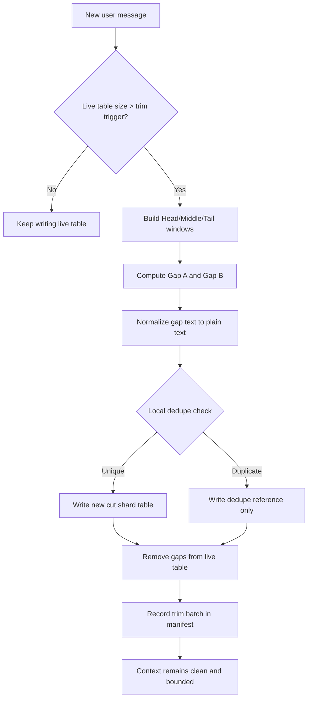
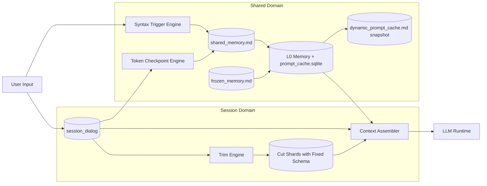

# Lyra AI 记忆架构 

## 文档状态

* **状态**：锁定实现（Locked for implementation）
* **范围**：Lyra 桌面端 AI 记忆与会话持久化
* **核心原则**：

  * 会话隔离
  * 不自动删除会话
  * 用户显式单会话删除
  * 仅迁移/维护场景允许显式会话域清理
  * 通过裁剪保持上下文整洁
  * 通过归档与共享记忆保留长期价值

---

# 1. 设计目标

Lyra AI 记忆架构 V2 的目标如下：

1. **一个会话对应一个独立活跃数据库**，并使用固定表结构。
2. **AI 在需要时可读取 `~/.lyra` 下全部本地数据**。
3. **不允许自动删除会话**；仅允许：

   * 用户意图触发的单会话删除；
   * 迁移或维护场景下的显式会话域清理。
4. **上下文控制基于 token 或字符窗口**，而非消息条数。
5. **被裁剪内容必须归档，不得直接删除**。
6. **裁剪归档仅存纯文本**，移除标点与 emoji。
7. **归档清理由大小阈值驱动**，并保留每个归档分片的头尾。
8. **共享记忆必须是显式、主动的机制**，而非仅被动检索。
9. **共享记忆分为两条通道**：

   * 文件真相存储
   * 动态 Prompt 注入
10. **共享提取由触发器驱动**，结合语法引擎与 token 检查点，并带去重标记。
11. **共享记忆达到大小阈值后先压缩再衰减**。
12. **稳定用户画像事实进入冻结记忆（Frozen Memory）**。
13. **共享记忆与冻结记忆都必须支持更新与纠错**。
14. **可自动更新字段应尽量自动派生维护**。
15. **同一会话下的裁剪归档必须执行本地高相似度直接去重**。
16. **会话数据库与归档分片必须优先使用固定 schema 名称**，不得动态生成表名。
17. **`dynamic_prompt_cache.md` 只是可观察快照，不是真实运行时缓存真相**。
18. **每条消息与每条记忆记录都必须带显式时间戳**，便于本地审计。
19. **时间戳只能由本地确定性代码生成**，绝不可依赖模型输出。
20. **由于用户可以直接查看 `~/.lyra`，时间字段必须同时满足**：

* 人类可读
* 机器可排序

---

# 2. 存储根目录

所有 AI 记忆数据统一存放在：

```text
~/.lyra/modules/ai/
```

推荐的 V2 目录结构如下：

```text
~/.lyra/modules/ai/
  sessions/
    <session_id>/
      session.sqlite
      cuts/
        cut_000001.sqlite
        cut_000002.sqlite
      manifests/
        cuts.manifest.json
  shared/
    shared_memory.md
    shared_memory.audit.jsonl
    frozen_memory.md
    frozen_memory.audit.jsonl
    dynamic_prompt_cache.md
    shared_index.sqlite
  runtime/
    trigger_marks.sqlite
    memory_jobs.sqlite
    prompt_cache.sqlite
  metrics/
    memory_compaction.log
```

---

# 3. 核心模型

---

## 3.1 会话活跃记忆（Session Live Memory）

每个会话都拥有一个独立的活跃 SQLite 数据库文件：

```text
sessions/<session_id>/session.sqlite
```

每个会话数据库使用固定 schema 名称。

### 主活跃消息表

* 表名：`session_dialog`

由于数据库文件本身已经是会话隔离的，所以主表**不需要** `session_id` 列。

如果未来 V2 引入会话内分支或子线程，应通过 `stream_id` 或类似字段扩展，而不是通过动态表名实现。

### 建议字段

* `msg_id`：稳定消息 ID
* `turn_index`：轮次索引
* `role`：`user | assistant | tool | system`
* `content_raw`：原始内容
* `token_count`：token 数
* `char_count`：字符数
* `created_at_ms`：Unix Epoch 毫秒时间戳，必填
* `created_at_iso`：带时区偏移的 ISO8601/RFC3339 字符串，必填
* `updated_at_ms`：Unix Epoch 毫秒时间戳，必填
* `metadata_json`：扩展元数据
* `stream_id`：可选，预留给未来会话内分支能力

### 设计原则

1. 一个会话一个数据库文件。
2. 固定表名，避免动态 schema。
3. 当前会话读取默认只访问本会话数据库。
4. 所有写入必须经由 AI 存储服务，不允许跨模块直接写入。

---

## 3.2 裁剪归档分片（Trim Archive Shards）

每次上下文裁剪操作，都会生成一个新的归档分片数据库文件。

### 命名规则

* 文件：`cut_000001.sqlite`、`cut_000002.sqlite` ...
* 路径：`sessions/<session_id>/cuts/`

### 固定表结构

每个分片固定包含以下表：

* `cut_payload`
* `cut_refs`
* `cut_meta`

### `cut_payload` 建议字段

* `archive_id`
* `source_session_id`
* `source_msg_start_id`
* `source_msg_end_id`
* `role`
* `content_plain`：规范化纯文本（已去标点与 emoji）
* `token_count_plain`
* `char_count_plain`
* `trim_batch_id`
* `created_at_ms`：必填
* `created_at_iso`：必填

### `cut_refs` 建议字段

* `dedupe_ref_id`
* `source_archive_id`
* `target_archive_id`
* `dedupe_reason`
* `similarity_score`
* `created_at_ms`：必填
* `created_at_iso`：必填

### 归档职责

1. 保存从活跃会话中移除的内容。
2. 为 AI 提供后续可检索历史语义。
3. 通过 lineage 维护来源范围与去重引用关系。
4. 保证任何被裁掉的 live 内容都有对应归档或引用记录。

---

# 4. 时间戳与本地透明性策略

Lyra 的记忆数据允许用户直接在本地查看，因此时间字段不仅是实现元数据，也是产品体验的一部分。

## 硬性规则

1. 每条消息必须带时间戳。
2. 每条 archive/shared/frozen/audit 记录必须带时间戳。
3. 时间写入只能由本地代码完成：

   * 系统时钟
   * 确定性格式化逻辑
4. 排序、去重、合并以 `*_ms` 为事实真值。
5. 用户可读性以 `*_iso` 为准。

## 推荐时间字段对

* `*_ms`：Unix Epoch 毫秒整数
* `*_iso`：带时区偏移的 ISO8601 / RFC3339 字符串

---

# 5. 共享记忆与冻结记忆

共享域位于：

```text
~/.lyra/modules/ai/shared/
```

包含以下核心文件：

## 5.1 共享记忆（Shared Memory）

* `shared_memory.md`

  * 高价值、跨会话可复用知识的**当前真相层**
  * 允许演进、修订、替换、合并

* `shared_memory.audit.jsonl`

  * 共享记忆的追加式审计日志
  * 记录 replace / merge / deprecate / bootstrap 等事件

## 5.2 冻结记忆（Frozen Memory）

* `frozen_memory.md`

  * 长期稳定、低变动、接近身份档案性质的事实
  * 为当前真相层，不是追加日志

* `frozen_memory.audit.jsonl`

  * 冻结记忆更新与纠错的追加式审计记录

## 5.3 动态 Prompt 可观察快照

* `dynamic_prompt_cache.md`

  * 用于调试、审计、观察注入内容
  * **不是运行时缓存真相**
  * **不是热缓存来源**
  * **不是事实存储层**

## 5.4 共享索引

* `shared_index.sqlite`

  * 基于 Markdown 真相文件派生出的索引与结构化检索缓存
  * 可重建
  * **不是事实真相层**

---

# 6. 上下文组装算法（Context Assembly）

当为某一会话构建模型输入时，采用三段式窗口策略：

1. 保留开头窗口 `HEAD_WINDOW`
2. 保留中间锚点窗口 `MIDDLE_WINDOW`
3. 保留末尾窗口 `TAIL_WINDOW`

最终上下文公式：

```text
Context = Head(H tokens/chars) + Middle(M tokens/chars) + Tail(T tokens/chars)
```

## 规则

* 优先使用 token 作为控制单位，字符数作为回退。
* 绝不以消息条数作为主控制方式。
* 被裁掉的部分必须立刻归档成新的 cut shard。

## 被裁剪的两段 Gap

* Gap A：Head 与 Middle 之间
* Gap B：Middle 与 Tail 之间

### 设计目的

1. 保留会话开头的任务定义与长期约束。
2. 保留中段关键锚点信息。
3. 保留当前最近上下文。
4. 避免仅保留尾部消息导致早期约束丢失。

---

# 7. 裁剪流水线（Trim Pipeline）



## 流程说明

1. 新消息写入 live 表。
2. 如果活跃上下文超过裁剪阈值，则执行裁剪。
3. 计算 Head / Middle / Tail。
4. 识别 Gap A 与 Gap B。
5. 将 gap 文本做本地规范化。
6. 执行 session 内本地去重。
7. 若唯一，则写入新 cut shard。
8. 若重复，则只写 dedupe 引用。
9. 在归档或引用建立完成后，才允许从 live 表移除。
10. 记录 trim 批次到 manifest。

---

# 8. 归档纯文本规范化策略

归档时只做本地、确定性规范化，不依赖远程服务，不依赖模型。

## 规范化步骤

1. 移除标点类字符
2. 移除 emoji 与 pictographic symbols
3. 折叠重复空白
4. 保留语言字符、数字与结构分隔符

## 目标

1. 提高去重稳定性
2. 降低归档体积
3. 提高近重复检测一致性
4. 保持实现纯本地可审计

---

# 9. 裁剪归档去重（Session Local Only）

## 去重范围

仅在**同一 session 的 `cuts/` 目录内**执行去重。

V2 不做跨会话去重。

## 硬性要求

1. 必须纯本地代码实现，不允许远程服务或模型调用。
2. 精确重复必须立即消除。
3. 高相似度近重复必须直接判重。
4. 必须保留引用链，不能让信息路径不可追踪。

---

## 9.1 精确去重（Exact Dedupe）

### 规则

* 对规范化后的纯文本计算 `sha256`
* 若 hash 已存在于该 session 的 cut index：

  * 不重复写 `cut_payload`
  * 仅写一条 `cut_refs` 引用指向已有 payload

### 目的

* 消除完全重复归档
* 降低空间浪费
* 维持引用链完整

---

## 9.2 近重复去重（Near-Duplicate Dedupe）

### 推荐做法

* 基于 3-gram token 构建指纹
* 推荐使用 `simhash`
* 对候选集做相似度比较
* 若相似度 `>= CUT_DEDUPE_SIM_THRESHOLD`，直接视为重复

### 默认阈值

* `0.985`

### 设计理由

* 该阈值刻意保守
* 优先避免误杀“相近但不等价”的内容

---

## 9.3 候选缩小（Candidate Narrowing）

为避免大规模全量比对，先做廉价预过滤：

1. 长度桶
2. token 数差
3. 前缀 checksum
4. 后缀 checksum

仅在候选范围缩小后再运行高成本相似度计算。

---

## 9.4 引用记录字段

建议引用记录具备：

* `dedupe_ref_id`
* `source_archive_id`
* `target_archive_id`
* `dedupe_reason`：`exact_hash | near_duplicate`
* `similarity_score`
* `created_at_ms`
* `created_at_iso`

---

## 9.5 可选索引

* `cuts/dedupe_index.sqlite`

用于提升本 session 下去重查询效率。

---

# 10. 归档清理策略（仅 Cuts）

会话 live memory 永不因该策略被删除。

该策略只作用于：

```text
sessions/<session_id>/cuts/
```

## 触发条件

当一个 session 的 `cuts/` 总体积超过：

* `CUTS_SIZE_TRIGGER_BYTES`

## 清理目标

压缩到：

* `CUTS_SIZE_TARGET_BYTES`

## 清理步骤

1. 遍历每个 cut shard。
2. 保留该 shard 的头部段。
3. 保留该 shard 的尾部段。
4. 移除中间段。
5. 重新计算总大小。
6. 持续执行直到低于目标阈值。
7. 压缩后重新运行本地 dedupe，合并新产生的高相似保留片段。

## 硬性约束

1. 不得删除整个 session。
2. 不得无条件抹除整个 cut shard。
3. 只有在一个 shard 已经没有任何可保留内容时，才允许完全移除。
4. compaction 必须保持 lineage 可追踪。

---

# 11. 裁剪 / 删除一致性控制

Trim、dedupe、compaction、decay 必须被视为一个**确定性状态机**。

## 必备不变式

1. 任意 live 被移除内容，必须先归档或建立 dedupe 引用。
2. archive lineage 必须始终可解析。
3. 同一 session cuts 域中不应长期存在重复完整 payload。
4. 每次 compaction 必须保留每个 cut shard 的头尾恢复能力。

## 必测边界场景

1. 极短会话，导致 head / middle / tail 重叠
2. trim 阈值附近的 token 抖动
3. 短时间连续多次 trim
4. 多语言混杂与 emoji 密集文本
5. compaction 紧接 dedupe

---

# 12. 共享记忆机制

共享记忆不是单纯“查一下”，而是显式、主动、双通道设计。

---

## 12.1 通道 A：共享文件真相层

### `shared_memory.md`

保存跨会话高价值知识的当前真相。

### `frozen_memory.md`

保存长期稳定事实的当前真相。

### 特征

1. 都是当前生效状态，不是纯追加原始历史。
2. 历史演进通过对应 `audit.jsonl` 保存。
3. 可供 AI 主动读取，也可供用户直接检查。

---

## 12.2 通道 B：动态 Prompt 注入

运行时从 shared / frozen 中生成压缩注入片段，而不是把全部共享记忆直接塞进上下文。

### 注入层级

* `L0`：抽象层
  用于快速提示相关性
* `L1`：概览层
  用于规划与轻量 grounding
* `L2`：细节层
  仅在高价值命中时按需加载

### 运行时缓存层

* `L0`：内存热缓存
* `L1`：`runtime/prompt_cache.sqlite`
* `L2`：`shared/dynamic_prompt_cache.md` 仅作可观察快照

### 关键原则

* `dynamic_prompt_cache.md` 不是 source of truth
* 不是实际热缓存
* 不是注入决策真相
* 真正真相始终在 session DB、cut shards、shared/frozen Markdown

---

# 13. 触发引擎（Trigger Engine）

共享提取并非每条消息强制运行，而是由触发器决定。

---

## 13.1 语法触发（Syntax Trigger）

### 规则

* 使用多语言语法引擎分析用户输入
* 必须满足语法级模式匹配，不能只靠关键词

### 典型可触发内容

1. 用户画像陈述
2. 更正 / 更新陈述
3. 长期偏好表达
4. 长期项目约束

### 行为

命中的消息会进入额外分析流程，再决定是否写入 shared / frozen。

---

## 13.2 Token 检查点触发（Token Checkpoint Trigger）

### 触发条件

当上下文累计达到配置 token 阈值时触发。

### 行为

* 回溯扫描尚未检查过的用户消息
* 提取潜在共享价值信息
* 避免逐消息同步重分析

### 节流参数

* `TOKEN_TRIGGER_COOLDOWN_MS`
* `TOKEN_TRIGGER_BATCH_LIMIT`
* `TOKEN_TRIGGER_MAX_CPU_MS`

---

## 13.3 去重标记与检查记录

由：

```text
runtime/trigger_marks.sqlite
```

记录：

* 哪些消息已分析
* 分析结果是什么
* 是否需要重新检查

规则：

* 已检查消息默认跳过
* 除非明确请求 recheck

---

# 14. 分层检索与可追踪性

Lyra 不将记忆检索视为“平铺文本块列表”，而是按层次进行。

## 检索层级

* `L0`：abstract
* `L1`：overview
* `L2`：detail

## 可观察要求

动态注入快照必须记录：

1. 为什么选中某条 shared / frozen 记忆
2. 为什么选中某个 archive shard
3. 粗排与精排过程的摘要
4. 最终注入了哪些内容

---

## 14.1 Archive 检索策略

1. 从当前任务焦点构建 query terms 与 bigrams
2. 先对 shard 级候选做粗排
3. 只展开 Top shard 集合
4. 对具体 item 做精排
5. 仅为最高价值项加载 `L2` 细节
6. 将检索轨迹写入动态 Prompt 快照

### 目标

* 降低上下文污染
* 控制成本
* 提高相关性
* 提供可审计检索路径

---

# 15. 性能与时延控制

为了避免动态注入和触发分析拖慢回复速度，V2 使用分阶段执行。

## 15.1 回复关键路径

当前轮回复必须优先：

* 使用现成 session / shared 快照构建上下文
* 不被重型回溯扫描阻塞

## 15.2 后台路径

以下工作应异步或后台进行：

* 语法深分析
* token checkpoint 回顾扫描
* 共享价值分类
* 更新 shared / frozen 派生缓存

## 15.3 设计原则

1. 当前回复延迟优先可控
2. 后台分析影响后续轮次，而非当前轮次
3. 缓存 miss 不得影响正确性，只影响性能
4. 真相层始终优先于缓存层

---

# 16. 共享价值分类策略

共享价值判断不能只靠关键词。

## 16.1 分类信号

### 语法信号

* profile statement
* correction / update statement
* durable preference statement
* long-term project constraint

### 词汇信号

* 多语言关键词词典
* 仅作为弱信号

### 上下文信号

* 重复频率
* 与现有 shared / frozen 是否冲突
* 新近性与稳定性提示

---

## 16.2 决策逻辑

采用加权评分：

```text
score = syntax + lexical + context
```

当评分高于：

* `SHARED_CLASSIFY_SCORE_THRESHOLD`

才允许直接写入 shared / frozen。

若评分不确定：

* 进入 review candidates
* 不直接进入真相层

### review candidates 存放要求

* 存在于派生索引层
* 可供检查
* 不进入 Markdown 真相层

---

# 17. 共享记忆压缩与衰减

当共享记忆文件体积超过阈值时，执行压缩与衰减。

## 规则

1. 先压缩，再衰减
2. 优先合并与重写，而非直接删除
3. 保留证据链与更新时间
4. 优先软衰减低价值、重复、弱稳定项目

## 当前实现要求

在真正的模型引导 compactor 上线前，应先用本地规则进行：

* relevance-guided compaction
* field priority
* confidence
* classification signal

并产出可审计的 deprecate 记录。

---

# 18. 更新与纠错规则

Shared 与 Frozen 都必须支持更新。

## 更新模式

1. **Replace**

   * 新值明显替代旧值
2. **Merge**

   * 新值是对旧值的补充扩展
3. **Deprecate**

   * 旧值保留但标记为失效/不再使用

## 示例

* 用户姓名修正：应覆盖旧值
* 历史错误事实：应保留审计痕迹，不能无痕改写

---

# 19. 可自动更新字段

应优先自动维护那些天然可派生的字段。

## 典型例子

* 年龄由出生日期与当前日期推导
* 相对时间标签在读取时重算

## 规则

1. 不应要求人工频繁维护派生信息
2. 自动更新只允许对白名单字段生效
3. 敏感字段不得自动推断更新

---

# 20. 更新安全与审计日志

Shared / Frozen 每次更新都必须写审计日志。

## 建议字段

* `update_id`
* `target_space`：`shared | frozen | dynamic`
* `target_key`
* `old_value_digest`
* `new_value_digest`
* `update_reason`
* `evidence_source`
* `confidence`
* `created_at_ms`
* `created_at_iso`

## 安全规则

1. Frozen 默认受保护。
2. Frozen 覆盖必须具备明确纠错证据。
3. 自动更新只允许白名单字段。
4. 姓名、性别、电话等敏感身份字段不得自动覆盖。
5. 每次覆盖都必须保留 revision history，支持回滚与审计。

---

# 21. 读取访问策略

AI 可以读取 `~/.lyra` 下全部本地 AI 数据。

## 读取策略

1. 默认优先 session-local
2. 任务相关时可按需跨 session 读取
3. Shared / Frozen 可由触发策略主动加载

## 设计目标

* 保持当前会话聚焦
* 避免默认全局噪声
* 必要时仍具备跨会话回忆能力

---

# 22. 不删除会话策略（No-Delete Session Policy）

## 基本原则

* 正常记忆维护流程不得自动硬删除会话
* 用户可显式删除单个会话
* 会话域清理仅用于迁移或维护，不属于日常清理路径

## 单会话显式删除范围

允许清除该 session 的：

* live DB
* cuts
* registry rows
* turn state
* session-local caches/jobs

## 明确不受影响的内容

* `shared_memory.md`
* `shared_memory.audit.jsonl`
* `frozen_memory.md`
* `frozen_memory.audit.jsonl`

---

# 23. 多设备同步准备

V2 采用本地优先架构，但为未来同步预留能力。

## 要求

* 每条消息、归档批次、共享项都必须有稳定 ID
* 元数据中保留：

  * `created_at`
  * `updated_at`
  * `revision`
  * `source_device`

## 目标

1. 支持未来多设备同步
2. 支持冲突可检查
3. 支持审计式合并与排查

---

# 24. 架构图



---

# 25. 实施护栏（Implementation Guardrails）

1. 会话写入必须统一走 AI 存储服务。
2. AI 真相数据不得存入浏览器本地存储。
3. 不允许跨模块直接写 `~/.lyra/modules/ai`。
4. 裁剪归档必须保留 source lineage。
5. 共享触发引擎必须支持多语言语法解析。
6. 触发引擎必须持久化检查标记，避免重复扫描。
7. 会话删除绝不自动发生；仅允许用户显式删除单会话，域清理仅限迁移/维护。
8. cut dedupe 必须纯本地、确定性执行。
9. dedupe 引用链必须可被 AI 查询与追踪。
10. token checkpoint 扫描必须遵守 cooldown 与 CPU 预算。
11. shared / frozen 更新必须写审计日志。
12. session-local DB 必须使用固定表名，不允许动态表名。
13. cut shard DB 必须使用固定表名：

* `cut_payload`
* `cut_refs`
* `cut_meta`

14. `dynamic_prompt_cache.md` 绝不可作为运行时缓存真相。

---

# 26. 可配置参数（Required Config）

所有阈值必须是**可配置、可观察**的：

* `HEAD_WINDOW_TOKENS`
* `MIDDLE_WINDOW_TOKENS`
* `TAIL_WINDOW_TOKENS`
* `CUTS_SIZE_TRIGGER_BYTES`
* `CUTS_SIZE_TARGET_BYTES`
* `CUT_DEDUPE_SIM_THRESHOLD`
* `TOKEN_TRIGGER_COOLDOWN_MS`
* `TOKEN_TRIGGER_BATCH_LIMIT`
* `TOKEN_TRIGGER_MAX_CPU_MS`
* `SHARED_CLASSIFY_SCORE_THRESHOLD`

## 配置要求

1. 默认值必须保守
2. 需要基于 profiling 数据持续调优
3. 配置变化应可观测、可审计、可回溯

---

# 27. 验证基线（Verification Baseline）

在默认启用前，V2 必须通过以下验证：

## 27.1 完整性测试

验证 trim / dedupe / compaction 全流程下的**无丢失保证**。

## 27.2 性能测试

在触发器负载下，p95 回复延迟必须在目标预算内。

## 27.3 分类测试

验证多语言共享价值检测的 precision / recall。

## 27.4 更新安全测试

验证 frozen 与敏感字段不会被意外覆盖。

---

# 28. 分阶段落地计划

## Phase 1

* 实现会话隔离 live DB 与固定 schema（`session_dialog`）
* 启用 Head / Middle / Tail 上下文组装
* 实现 cut shard 固定 schema：

  * `cut_payload`
  * `cut_refs`
  * `cut_meta`
* 实现 session 内 exact + near-duplicate dedupe

## Phase 2

* 启用 syntax trigger 与 token checkpoint trigger
* 启用 shared / frozen 文件更新流水线
* 增加：

  * `runtime/prompt_cache.sqlite`
  * `dynamic_prompt_cache.md` 快照生成

## Phase 3

* 启用 archive size compaction
* 启用共享记忆压缩与更高级的 model-guided compaction
* 补齐 sync-ready 元数据能力

---

# 29. 最终架构结论

Lyra AI 记忆架构 V2 的本质，是一个：

**本地优先、会话隔离、可裁剪归档、支持共享与冻结记忆、具备审计与可追踪能力的分层记忆系统。**

它将 AI 记忆明确拆分为四层：

1. **Live Session Memory**
   当前会话的活跃上下文与对话真相

2. **Cut Archives**
   被裁剪但未丢失、可去重、可压缩、可检索的会话归档

3. **Shared Memory**
   跨会话、可更新、可合并、可衰减的高价值共享知识

4. **Frozen Memory**
   稳定、低变动、受保护、可审计修正的长期事实层

并通过以下能力将它们连接起来：

* 三段式上下文装配
* 本地确定性裁剪与归档
* session 内高相似度去重
* 触发式共享提取
* 分层检索与动态 Prompt 注入
* 审计日志与更新安全机制
* 后台分析与前台低时延解耦

最终目标不是“把聊天记录存起来”，而是构建一个：

**可持续增长、可压缩、可解释、可恢复、可校正、且用户能直接检查的 AI 记忆底座。**