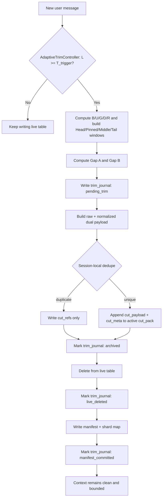
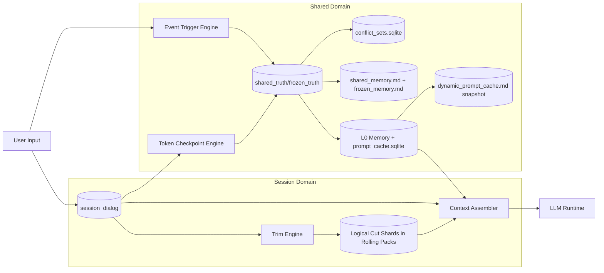

# Lyra Core v1 - Memory Architecture V2

## 文档状态

* **状态**：锁定实现（Locked for implementation）
* **范围**：Lyra 桌面端 AI 记忆与会话持久化
* **定位**：Core v1 的 Agent 模式记忆底座；Oma 多角色扩展见 `06-Memory-Architecture-Oma-Extension.md`
* **核心原则**：

  * 会话隔离
  * 不自动删除会话
  * 用户显式单会话删除
  * 仅迁移/维护场景允许显式会话域清理
  * 通过裁剪保持上下文整洁
  * 通过归档与共享记忆保留长期价值

---

# 1. 设计目标

Lyra Core v1 记忆架构 V2 的目标如下：

1. **一个会话对应一个独立活跃数据库**，并使用固定表结构。
2. **运行时具备访问 `~/.lyra` 全域数据的能力，但检索必须受策略调度**（默认 session-local，按需扩域）。
3. **不允许自动删除会话**；仅允许：

   * 用户意图触发的单会话删除；
   * 迁移或维护场景下的显式会话域清理。
4. **上下文控制基于 token 或字符窗口**，而非消息条数。
5. **被裁剪内容必须归档，不得直接删除**。
6. **裁剪归档必须双轨存储**：`raw` 保真真相 + `normalized` 检索视图，禁止只保留纯文本。
7. **归档清理由大小阈值驱动**，并保留每个归档分片的头尾。
8. **共享记忆必须是显式、主动的机制**，而非仅被动检索。
9. **共享/冻结必须采用结构化真相层作为权威主存储**，支持高频更新、字段级修订、并发安全。
10. **Markdown 文件仅作为投影视图用于可读、审计、导出**，不是 primary truth。
11. **共享提取仅由语言无关事件、结构化行为信号和多语言语义评分驱动**，禁止基于自然语言词表、短语模板或地区化表达规则触发写入。
12. **共享记忆分为两条运行通道**：

   * 结构化真相层检索
   * 动态 Prompt 注入
13. **共享记忆达到大小阈值后先压缩再衰减**。
14. **稳定用户画像事实进入冻结记忆（Frozen Memory）**。
15. **共享记忆与冻结记忆都必须支持更新与纠错**。
16. **冲突与负记忆必须显式建模**，互斥候选可并存，待裁决后再升格。
17. **可自动更新字段应尽量自动派生维护**。
18. **同一会话下的裁剪归档必须执行本地稳健去重**，并按内容类型采用不同策略。
19. **近重复去重上线默认 `candidate_only`，积累评估后再启用自动合并**。
20. **会话数据库与归档分片必须优先使用固定 schema 名称**，不得动态生成表名。
21. **`dynamic_prompt_cache.md` 只是可观察快照，不是真实运行时缓存真相**。
22. **每条消息与每条记忆记录都必须带显式时间戳**，便于本地审计。
22a. **消息内联引用必须保留 lineage**，文件引用和消息引用的插入位置、目标对象、局部范围不得在压缩、归档或回滚中丢失。
22b. **原生长工作状态必须保留恢复锚点**，`LongWorkRun`、WorkSlice、ContinuationPacket、未完成 Todo 和证据引用不得在上下文压缩中丢失。
22c. **Follow 高频过程流必须分层持久化**，LiveEditDelta、终端输出和日志流可压缩为摘要，但 FollowSession、active target、commit 关系和 rollback 标记不得丢失。
22d. **RuntimeTurn 是会话恢复主索引**，每条用户消息的 RuntimeLoopState、关键决策、blocker、交付和回滚标记不得在压缩、归档或恢复中丢失。
22e. **执行与交付证据必须保留恢复锚点**，`ExecutionRun`、`ExecutionStep`、`VerificationRun`、`CompletionAudit`、`DeliveryProof`、EvidenceRecord 和 ArtifactRecord refs 不得在裁剪、压缩、归档或回滚中丢失。
22f. **项目策略与安全边界必须可恢复**，RuntimeTurn 绑定的 Project EffectivePolicy 和 SecurityPolicy 快照 refs 必须保留；secret 明文不得写入会话记忆、共享记忆、冻结记忆或 dynamic prompt cache。
23. **时间戳只能由本地确定性代码生成**，绝不可依赖模型输出。
24. **由于用户可以直接查看 `~/.lyra`，时间字段必须同时满足**：

   * 人类可读
   * 机器可排序

25. **共享/冻结写入必须默认全自动无感执行**，禁止要求用户逐条手动确认。
26. **记忆流水线必须具备可恢复状态机**，支持崩溃后自动修复与重放。
27. **后台任务必须预算化执行**，不得阻塞主回复链路或引发队列风暴。
28. **上下文装配必须包含 `Pinned` 层**（pinned facts / pinned spans / unresolved commitments），避免中段锚点误选。
29. **Token checkpoint 仅允许增量、限窗回溯**，禁止全量重扫长会话。
30. **裁剪触发阈值与保留目标必须由动态公式计算**（上下文压力 + 增长速度 + 脏度 + 历史命中），禁止单一固定阈值硬编码。
31. **动态裁剪必须具备滞回与冷却机制**，避免阈值抖动导致频繁重复 trim。
32. **裁剪决策必须在“长期记忆收益”与“上下文洁净度”之间自动平衡**，随会话阶段自适应调整保留比例。

---

# 2. 存储根目录

所有 AI 记忆数据统一存放在：

```text
~/.lyra/modules/ai/
```

推荐的 V2 目录结构如下：

```text
~/.lyra/modules/ai/
  sessions/
    <session_id>/
      session.sqlite
      cuts/
        cut_pack_0001.sqlite
        cut_pack_0002.sqlite
      manifests/
        cuts.manifest.json        # 逻辑 shard -> 物理 pack 映射
  shared/
    shared_truth.sqlite
    frozen_truth.sqlite
    shared_memory.md
    shared_memory.audit.jsonl
    frozen_memory.md
    frozen_memory.audit.jsonl
    conflict_sets.sqlite
    dynamic_prompt_cache.md
    shared_index.sqlite
  runtime/
    trigger_marks.sqlite
    memory_jobs.sqlite
    prompt_cache.sqlite
  artifacts/
    index.sqlite
    blobs/
    projections/
    thumbnails/
  metrics/
    memory_compaction.log
```

---

# 3. 核心模型

---

## 3.1 会话活跃记忆（Session Live Memory）

每个会话都拥有一个独立的活跃 SQLite 数据库文件：

```text
sessions/<session_id>/session.sqlite
```

每个会话数据库使用固定 schema 名称。

### 主活跃消息表

* 表名：`session_dialog`

由于数据库文件本身已经是会话隔离的，所以主表**不需要** `session_id` 列。

如果未来 V2 引入会话内分支或子线程，应通过 `stream_id` 或类似字段扩展，而不是通过动态表名实现。

### 建议字段

* `msg_id`：稳定消息 ID
* `turn_index`：轮次索引
* `role`：`user | assistant | tool | system`
* `content_raw`：原始内容
* `token_count`：token 数
* `char_count`：字符数
* `created_at_ms`：Unix Epoch 毫秒时间戳，必填
* `created_at_iso`：带时区偏移的 ISO8601/RFC3339 字符串，必填
* `updated_at_ms`：Unix Epoch 毫秒时间戳，必填
* `metadata_json`：扩展元数据
* `stream_id`：可选，预留给未来会话内分支能力

### 设计原则

1. 一个会话一个数据库文件。
2. 固定表名，避免动态 schema。
3. 当前会话读取默认只访问本会话数据库。
4. 所有写入必须经由 AI 存储服务，不允许跨模块直接写入。

---

## 3.2 裁剪归档分片（Trim Archive Shards）

每次上下文裁剪都会生成一个新的**逻辑归档分片**（logical shard），但物理存储采用滚动聚合 pack，避免小文件碎片化。

### 命名规则

* 逻辑分片 ID：`trim_batch_id`（每次 trim 唯一）
* 物理 pack 文件：`cut_pack_0001.sqlite`、`cut_pack_0002.sqlite` ...
* 路径：`sessions/<session_id>/cuts/`
* 映射记录：`manifests/cuts.manifest.json`（记录每个 `trim_batch_id` 所在 pack）

### 物理聚合规则

1. trim 默认写入当前活跃 `cut_pack`。
2. 当 pack 达到大小或时间窗口阈值时滚动到下一个 pack。
3. compaction 针对逻辑分片执行，不要求“一次 trim 一个 sqlite 文件”。
4. 任何逻辑分片都必须可通过 manifest 追溯到物理存储位置。

### 固定表结构

每个 pack 固定包含以下表：

* `cut_payload`
* `cut_refs`
* `cut_meta`
* `cut_shard_map`

### `cut_payload` 建议字段

* `archive_id`
* `source_session_id`
* `source_msg_start_id`
* `source_msg_end_id`
* `role`
* `content_raw`：原文真相（保留标点、emoji、代码、路径、命令、配置）
* `content_normalized`：归一化检索视图（仅用于检索/去重）
* `content_kind`：`prose | code | command | path | config | mixed`
* `token_count_raw`
* `char_count_raw`
* `token_count_normalized`
* `char_count_normalized`
* `raw_digest`
* `normalized_digest`
* `trim_batch_id`
* `created_at_ms`：必填
* `created_at_iso`：必填

### `cut_refs` 建议字段

* `dedupe_ref_id`
* `source_archive_id`
* `target_archive_id`
* `dedupe_reason`
* `similarity_score`
* `created_at_ms`：必填
* `created_at_iso`：必填

### `cut_meta` 建议字段补充

* `trim_batch_id`
* `pack_id`
* `omitted_span_summary`：当 compaction 移除中段时写入结构化摘要，标记“此处有省略”
* `created_at_ms`：必填
* `created_at_iso`：必填

### 归档职责

1. 保存从活跃会话中移除的内容。
2. 为 AI 提供后续可检索历史语义。
3. 通过 lineage 维护来源范围与去重引用关系。
4. 保证任何被裁掉的 live 内容都有对应归档或引用记录。

---

# 4. 时间戳与本地透明性策略

Lyra 的记忆数据允许用户直接在本地查看，因此时间字段不仅是实现元数据，也是产品体验的一部分。

## 硬性规则

1. 每条消息必须带时间戳。
2. 每条 archive/shared/frozen/audit 记录必须带时间戳。
3. 时间写入只能由本地代码完成：

   * 系统时钟
   * 确定性格式化逻辑
4. 排序、去重、合并以 `*_ms` 为事实真值。
5. 用户可读性以 `*_iso` 为准。

## 推荐时间字段对

* `*_ms`：Unix Epoch 毫秒整数
* `*_iso`：带时区偏移的 ISO8601 / RFC3339 字符串

---

# 5. 共享记忆与冻结记忆

共享域位于：

```text
~/.lyra/modules/ai/shared/
```

包含以下核心文件：

## 5.1 结构化真相层（Primary Truth Layer）

* `shared_truth.sqlite`
* `frozen_truth.sqlite`

这两个结构化存储是共享/冻结记忆的唯一权威真相层，所有 replace/merge/deprecate、纠错、并发写入都在这里落地。

### 共享/冻结条目的最小原子模型（必备字段）

* `memory_id`
* `namespace`
* `kind`
* `value`
* `evidence_refs`
* `confidence`
* `stability`
* `status`
* `revision`
* `supersedes`
* `created_at_ms`
* `created_at_iso`
* `updated_at_ms`
* `updated_at_iso`

### 建议状态枚举

* `active`
* `deprecated`
* `conflict_candidate`
* `rejected`

## 5.2 Markdown 投影视图（Human-facing Projection）

* `shared_memory.md`

  * 人类可读的共享记忆投影视图
  * 由结构化真相层确定性生成，不作为 primary truth

* `shared_memory.audit.jsonl`

  * 共享记忆的追加式审计日志
  * 记录 replace / merge / deprecate / bootstrap 等事件

## 5.3 冻结记忆（Frozen Memory）

* `frozen_memory.md`

  * 人类可读的冻结记忆投影视图
  * 由结构化真相层确定性生成，不作为 primary truth

* `frozen_memory.audit.jsonl`

  * 冻结记忆更新与纠错的追加式审计记录

## 5.4 冲突记忆与负记忆（Conflict Sets）

* `conflict_sets.sqlite`

用于管理同一事实键下的互斥候选，支持“并存待裁决”而不是误覆盖。

建议字段：

* `conflict_id`
* `namespace`
* `conflict_key`
* `candidate_memory_ids`
* `decision_status`：`open | resolved | discarded`
* `resolution_memory_id`
* `created_at_ms`
* `created_at_iso`
* `updated_at_ms`
* `updated_at_iso`

## 5.5 动态 Prompt 可观察快照

* `dynamic_prompt_cache.md`

  * 用于调试、审计、观察注入内容
  * **不是运行时缓存真相**
  * **不是热缓存来源**
  * **不是事实存储层**

## 5.6 共享索引

* `shared_index.sqlite`

  * 基于结构化真相层派生出的检索缓存（可包含 Markdown projection 索引）
  * 可重建
  * **不是事实真相层**

---

# 6. 上下文组装算法（Context Assembly）

当为某一会话构建模型输入时，采用分层窗口策略：

1. 保留开头窗口 `HEAD_WINDOW`
2. 保留强约束 `PINNED_WINDOW`
3. 保留中间锚点窗口 `MIDDLE_WINDOW`
4. 保留末尾窗口 `TAIL_WINDOW`

最终上下文公式：

```text
Context = Head(H) + Pinned(P) + Middle(M) + Tail(T)
```

## 规则

* 优先使用 token 作为控制单位，字符数作为回退。
* 绝不以消息条数作为主控制方式。
* 被裁掉的部分必须立刻归档成新的 cut shard。
* `Pinned` 先于 `Middle` 选择，且不参与普通 salience 竞争。

## 6.1 动态裁剪控制器（Adaptive Trim Controller）

裁剪触发与裁剪幅度不使用固定硬编码阈值，而是由动态控制器计算。

### 预算定义

```text
C = model_context_window_tokens
O = clamp(
      p95(last_30_output_tokens) + TRIM_OUTPUT_RESERVE_PAD_TOKENS,
      TRIM_OUTPUT_RESERVE_MIN_TOKENS,
      TRIM_OUTPUT_RESERVE_MAX_TOKENS
    )
S = system/tool/runtime_reserved_tokens
B = max(0, C - O - S)                # 本轮可用上下文预算
L = current_live_tokens              # 当前 live token 占用
```

### 决策信号

```text
U = L / B
G = clamp(EMA(delta_tokens_per_turn, TRIM_GROWTH_EMA_ALPHA) / B, 0, 1)
D = clamp(
      TRIM_DIRT_WEIGHT_DUP      * dup_ratio +
      TRIM_DIRT_WEIGHT_STALE    * stale_ratio +
      TRIM_DIRT_WEIGHT_CONFLICT * conflict_ratio +
      TRIM_DIRT_WEIGHT_LOW_VALUE* low_value_ratio,
      0, 1
    )
R = clamp(EMA(retrieval_hit_ratio, TRIM_RETRIEVAL_EMA_ALPHA), 0, 1)
```

### 触发线（什么时候切）

```text
rho_trigger = clamp(
  TRIM_TRIGGER_BASE_RATIO
  - TRIM_TRIGGER_DIRT_COEF      * D
  - TRIM_TRIGGER_GROWTH_COEF    * G
  + TRIM_TRIGGER_RETRIEVAL_COEF * R,
  TRIM_TRIGGER_RATIO_MIN,
  TRIM_TRIGGER_RATIO_MAX
)
T_trigger = B * rho_trigger
```

### 保留线（切到哪里）

```text
rho_keep = clamp(
  TRIM_KEEP_BASE_RATIO
  + TRIM_KEEP_RETRIEVAL_COEF * R
  - TRIM_KEEP_DIRT_COEF      * D
  - TRIM_KEEP_GROWTH_COEF    * G,
  TRIM_KEEP_RATIO_MIN,
  TRIM_KEEP_RATIO_MAX
)
T_keep = B * rho_keep

trim_amount = clamp(
  L - T_keep,
  TRIM_DELTA_MIN_RATIO * B,
  TRIM_DELTA_MAX_RATIO * B
)
```

### 滞回与冷却（避免抖动）

```text
enter_trim  = (L >= T_trigger) && (turns_since_last_trim >= TRIM_COOLDOWN_TURNS)
force_trim  = (L >= TRIM_HARD_LIMIT_RATIO * B)
hysteresis  = (T_trigger - T_keep) >= (TRIM_HYSTERESIS_MIN_RATIO * B)
exit_target = (L <= T_keep)
```

规则：

1. 满足 `force_trim` 时无条件进入 trim。
2. 常规进入条件为 `enter_trim && hysteresis`。
3. trim 成功后进入 cooldown；cooldown 内仅 `force_trim` 可打破。
4. trim 目标是 `L -> T_keep`，不是“每次固定裁掉 N 条消息”。

### 示例（可执行数值）

设某轮参数如下：

```text
C = 200000
O = 4000
S = 14000
B = 200000 - 4000 - 14000 = 182000
L = 160000

G = 0.22
D = 0.30
R = 0.45
```

若使用保守默认系数：

```text
TRIM_TRIGGER_BASE_RATIO      = 0.82
TRIM_TRIGGER_DIRT_COEF       = 0.10
TRIM_TRIGGER_GROWTH_COEF     = 0.08
TRIM_TRIGGER_RETRIEVAL_COEF  = 0.05

TRIM_KEEP_BASE_RATIO         = 0.66
TRIM_KEEP_RETRIEVAL_COEF     = 0.10
TRIM_KEEP_DIRT_COEF          = 0.08
TRIM_KEEP_GROWTH_COEF        = 0.06
```

则：

```text
rho_trigger = 0.82 - 0.10*0.30 - 0.08*0.22 + 0.05*0.45 = 0.7949
T_trigger   = 182000 * 0.7949 = 144672

rho_keep    = 0.66 + 0.10*0.45 - 0.08*0.30 - 0.06*0.22 = 0.6678
T_keep      = 182000 * 0.6678 = 121540

trim_amount = L - T_keep = 38460 tokens
```

结论：本轮触发 trim，并将 live 从 `160000` 收敛到约 `121540`（约裁剪 `24%`）。

## 6.2 动态保留配额分配（Head/Pinned/Middle/Tail）

在确定 `T_keep` 后，四段窗口预算按公式分配：

```text
P = min(
      tokens(pinned_facts + pinned_spans + unresolved_commitments),
      PINNED_MAX_RATIO * B
    )

H = clamp(
      HEAD_BASE_RATIO * B * exp(-turn_index / HEAD_DECAY_TURNS),
      HEAD_MIN_RATIO * B,
      HEAD_MAX_RATIO * B
    )

T = clamp(
      (TAIL_BASE_RATIO + TAIL_UNRESOLVED_BOOST * unresolved_ratio) * B,
      TAIL_MIN_RATIO * B,
      TAIL_MAX_RATIO * B
    )

M = max(0, T_keep - (P + H + T))
```

规则：

1. `Pinned` 预算优先级最高，不参与普通 salience 竞争。
2. `Middle` 仅在 `M` 预算内按 salience 精排选择。
3. 当预算冲突时优先收缩 `Head` 与 `Middle`，尽量保持 `Pinned` 与 `Tail` 稳定。

## 6.3 Pinned 组成（必选）

* `pinned_facts`：用户硬约束、系统强规则、已确认偏好
* `pinned_spans`：高价值原文片段（如关键命令/路径/配置）
* `unresolved_commitments`：尚未完成的承诺、未关闭任务、待验证假设

## 6.4 被裁剪的两段 Gap

* Gap A：Head/Pinned 与 Middle 之间
* Gap B：Middle 与 Tail 之间

### 设计目的

1. 保留会话开头的任务定义与长期约束。
2. 稳定保留未完成承诺与硬约束，避免中段误选导致“稳定错误”。
3. 保留中段关键锚点信息。
4. 避免仅保留尾部消息导致早期约束丢失。

---

# 7. 裁剪流水线（Trim Pipeline）



## 流程说明

1. 新消息写入 live 表。
2. 计算本轮 `B/U/G/D/R` 与 `T_trigger/T_keep/trim_amount`。
3. 若 `L < T_trigger` 且未达到硬保护阈值，则继续写 live。
4. 若 `L >= T_trigger` 或达到硬保护阈值，则执行 trim。
5. 按动态配额公式计算 Head / Pinned / Middle / Tail。
6. 识别 Gap A 与 Gap B。
7. 先写入 `trim_journal`（`pending_trim`），确保可恢复。
8. 对 gap 同时构建 `raw` 与 `normalized` 两套内容。
9. 执行 session 内本地去重。
10. 若唯一，则写入当前活跃 cut pack 并登记逻辑 shard 映射；若重复，则只写 dedupe 引用。
11. 归档或引用成功后，标记 `archived`，才允许从 live 表移除。
12. live 删除后标记 `live_deleted`，再写 manifest/shard-map 并提交 `manifest_committed`。
13. trim 完成后进入 cooldown；仅硬保护可打破 cooldown。
14. 任一阶段失败必须可幂等重放，不得出现“已删 live 但无归档”。

---

# 8. 归档双轨表示与规范化策略

归档必须采用双轨表示，不依赖远程服务，不依赖模型。

## 双轨定义

1. `raw`：完整保真，作为唯一事实源。
2. `normalized`：仅用于检索与去重，不作为事实源。
3. `normalized` 的生成必须由本地确定性代码完成。
4. 代码、命令、路径、配置默认禁止激进归一化。

## 归一化步骤（仅对 prose / mixed 生效）

1. Unicode 规范化。
2. 折叠重复空白。
3. 可选弱归一化（大小写、全半角等）。
4. 严禁破坏结构语义的裁剪。

## 保真通道规则

1. `code | command | path | config` 使用保真通道。
2. 不移除标点，不移除 emoji，不改结构分隔符。
3. 去重可参考结构信号，但不得覆盖 `raw` 真相。

## 目标

1. 提高去重稳定性
2. 降低归档体积
3. 提高近重复检测一致性
4. 保持实现纯本地可审计
5. 消除语义损失与可执行信息失真风险

---

# 9. 裁剪归档去重（Session Local Only）

## 去重范围

仅在**同一 session 的 `cuts/` 目录内**执行去重。

V2 不做跨会话去重。

## 硬性要求

1. 必须纯本地代码实现，不允许远程服务或模型调用。
2. 精确重复必须立即消除。
3. 近重复去重必须按内容类型采用不同策略。
4. 必须保留引用链，不能让信息路径不可追踪。
5. 默认策略为“建引用优先”，禁止误删原文。

---

## 9.1 精确去重（Exact Dedupe）

### 规则

* 对 `raw` 与 `normalized` 分别计算 digest
* 若 hash 已存在于该 session 的 cut index：

  * 不重复写 `cut_payload`
  * 仅写一条 `cut_refs` 引用指向已有 payload

### 目的

* 消除完全重复归档
* 降低空间浪费
* 维持引用链完整

---

## 9.2 近重复去重（Near-Duplicate Dedupe）

### 推荐做法

* 基于多信号组合判定，不依赖单一算法：
  * 语义向量相似度
  * n-gram / token overlap
  * 结构特征一致性（代码 AST 片段、命令参数骨架、路径模式等）
* 必须“至少双信号命中”才可自动近重复合并。
* 短文本与代码片段默认不做自动硬合并，仅做候选引用。

### 默认阈值策略

* 不采用全局单阈值。
* 阈值按 `content_kind` 分层配置，例如：
  * `prose` 使用较高语义阈值
  * `code/command/path/config` 使用更保守阈值并附加结构校验

### 设计理由

* 避免中英混合、短文本、代码片段的误判合并。
* 优先避免误杀“相近但不等价”的内容。

---

## 9.3 候选缩小（Candidate Narrowing）

为避免大规模全量比对，先做廉价预过滤：

1. 长度桶
2. token 数差
3. 前缀 checksum
4. 后缀 checksum
5. 内容类型分桶（prose/code/command/path/config）
6. 结构签名分桶（可选）

仅在候选范围缩小后再运行高成本相似度计算。

---

## 9.4 引用记录字段

建议引用记录具备：

* `dedupe_ref_id`
* `source_archive_id`
* `target_archive_id`
* `dedupe_reason`：`exact_hash | near_duplicate`
* `similarity_score`
* `similarity_features`
* `decision_mode`：`auto_merge | auto_ref | candidate_only`
* `created_at_ms`
* `created_at_iso`

---

## 9.5 可选索引

* `cuts/dedupe_index.sqlite`

用于提升本 session 下去重查询效率。

---

## 9.6 上线策略（Risk-first Rollout）

1. 初始阶段默认 `decision_mode = candidate_only`，只产出候选引用，不做自动硬合并。
2. 累积真实线上样本并完成误判评估后，才可按内容类型逐步开启 `auto_ref` / `auto_merge`。
3. 任一类型误合并率超预算时，必须自动回退到 `candidate_only`。

---

# 10. 归档清理策略（仅 Cuts）

会话 live memory 永不因该策略被删除。

该策略只作用于：

```text
sessions/<session_id>/cuts/
```

## 触发条件

当一个 session 的 `cuts/` 总体积超过：

* `CUTS_SIZE_TRIGGER_BYTES`

## 清理目标

压缩到：

* `CUTS_SIZE_TARGET_BYTES`
* `GLOBAL_ARCHIVE_TARGET_BYTES`

## 清理步骤

1. 按逻辑 shard 遍历（物理上可跨多个 cut pack）。
2. 保留该 shard 的头部段。
3. 保留该 shard 的尾部段。
4. 移除中间段，并在 `cut_meta.omitted_span_summary` 写入结构化省略摘要。
5. 重新计算总大小。
6. 对每轮 compaction 施加预算上限（CPU/IO/处理条数）。
7. 持续执行直到低于目标阈值。
8. 压缩后重新运行本地 dedupe，合并新产生的高相似保留片段。
9. 超出全局配额时优先清理派生层（cache/index），不删除真相层会话。
10. 必要时做 pack 级重排/合并，降低碎片化与句柄开销。

## 硬性约束

1. 不得删除整个 session。
2. 不得无条件抹除整个 cut shard。
3. 只有在一个 shard 已经没有任何可保留内容时，才允许完全移除。
4. compaction 必须保持 lineage 可追踪。
5. compaction 与 trim/dedupe 必须隔离队列，避免高峰期互相阻塞。
6. 任何被移除中段都必须有 `omitted_span_summary`，让检索链路可感知“此处有省略”。

---

# 11. 裁剪 / 删除一致性控制

Trim、dedupe、compaction、decay 必须被视为一个**确定性状态机**。

推荐状态：

* `pending_trim`
* `archived`
* `live_deleted`
* `manifest_committed`
* `failed_recoverable`

## 必备不变式

1. 任意 live 被移除内容，必须先归档或建立 dedupe 引用。
2. archive lineage 必须始终可解析。
3. 同一 session cuts 域中不应长期存在重复完整 payload。
4. 每次 compaction 必须保留每个 cut shard 的头尾恢复能力。
5. 所有状态推进必须幂等；重启后可从任意中间状态继续。
6. 必须提供自动修复流程：补 manifest、补索引、修 dangling 引用。
7. 若存在中段省略，必须可从 `cut_meta` 恢复省略摘要并追溯对应 lineage。

## 必测边界场景

1. 极短会话，导致 head / middle / tail 重叠
2. trim 阈值附近的 token 抖动
3. 短时间连续多次 trim
4. 多语言混杂与 emoji 密集文本
5. compaction 紧接 dedupe
6. 进程在 `archived` 与 `live_deleted` 之间崩溃
7. 后台任务堆积后的恢复重放

---

# 12. 共享记忆机制

共享记忆不是单纯“查一下”，而是显式、主动、双通道设计。

---

## 12.1 通道 A：结构化真相层检索

### `shared_truth.sqlite` / `frozen_truth.sqlite`

保存跨会话知识与稳定事实的权威真相。

### 特征

1. 支持高频细粒度更新、字段级 revision、并发安全写入。
2. replace/merge/deprecate 与冲突裁决在结构化层完成。
3. `shared_memory.md` / `frozen_memory.md` 只作为投影视图与审计阅读入口。

---

## 12.2 通道 B：动态 Prompt 注入

运行时从 shared / frozen 中生成压缩注入片段，而不是把全部共享记忆直接塞进上下文。

### 注入层级

* `L0`：抽象层
  用于快速提示相关性
* `L1`：概览层
  用于规划与轻量 grounding
* `L2`：细节层
  仅在高价值命中时按需加载

### 运行时缓存层

* `L0`：内存热缓存
* `L1`：`runtime/prompt_cache.sqlite`
* `L2`：`shared/dynamic_prompt_cache.md` 仅作可观察快照

### 关键原则

* `dynamic_prompt_cache.md` 不是 source of truth
* 不是实际热缓存
* 不是注入决策真相
* 真正真相始终在 session DB、cut shards、shared/frozen 结构化真相层

---

# 13. 触发引擎（Trigger Engine）

共享提取并非每条消息强制运行，而是由事件驱动调度并结合语义评分决定。

---

## 13.1 事件触发（Event Trigger）

### 规则

* 禁止基于自然语言词表、短语模板或地区化表达规则触发共享写入。
* 仅消费可验证事件：
  * `turn_completed`
  * `tool_call_completed`
  * `file_change_recorded`
  * `test_result_changed`
  * `decision_applied_or_rolled_back`
* 每个事件进入语义评分器后，才允许进入共享候选流程。

### 典型可触发内容

1. 跨轮次反复出现的稳定偏好
2. 多次执行验证后的项目约束
3. 已被执行链路消费的决策事实
4. 对既有共享事实的更正证据

### 行为

命中事件先进入候选层，再由“价值门 + 稳定门 + 冲突门”决定是否写入 shared / frozen。

---

## 13.2 Token 检查点触发（Token Checkpoint Trigger）

### 触发条件

当上下文累计达到配置 token 阈值时触发。

### 行为

* 仅回溯最近受限窗口（如最近 N 轮 / N 个事件）的未分析事件
* 基于 `trigger_marks` 做增量补扫，禁止长会话全量重扫
* 补做语义评分与稳定性计算，避免逐消息同步重分析

### 节流参数

* `TOKEN_TRIGGER_COOLDOWN_MS`
* `TOKEN_TRIGGER_BATCH_LIMIT`
* `TOKEN_TRIGGER_MAX_CPU_MS`
* `TRIGGER_QUEUE_MAX_CONCURRENCY`

---

## 13.3 去重标记与检查记录

由：

```text
runtime/trigger_marks.sqlite
```

记录：

* 哪些事件已分析
* 分析结果是什么
* 是否需要重新检查
* 对应的候选状态（`candidate | promoted | rejected | expired`）

规则：

* 已检查事件默认跳过
* 除非明确请求 recheck

---

# 14. 分层检索与可追踪性

Lyra 不将记忆检索视为“平铺文本块列表”，而是按层次进行。

## 检索层级

* `L0`：abstract
* `L1`：overview
* `L2`：detail

## 可观察要求

动态注入快照必须记录：

1. 为什么选中某条 shared / frozen 记忆
2. 为什么选中某个 archive shard
3. 粗排与精排过程的摘要
4. 最终注入了哪些内容

---

## 14.1 Archive 检索策略

1. 从当前任务焦点构建 query terms 与 bigrams
2. 先对 shard 级候选做粗排
3. 只展开 Top shard 集合
4. 对具体 item 做精排
5. 仅为最高价值项加载 `L2` 细节
6. 将检索轨迹写入动态 Prompt 快照

### 目标

* 降低上下文污染
* 控制成本
* 提高相关性
* 提供可审计检索路径

---

# 15. 性能与时延控制

为了避免动态注入和触发分析拖慢回复速度，V2 使用分阶段执行与预算调度。

## 15.1 回复关键路径

当前轮回复必须优先：

* 使用现成 session / shared-frozen truth 快照构建上下文
* 不被重型回溯扫描阻塞
* 只允许轻量写入，不允许在主链路执行大规模 dedupe/compaction

## 15.2 后台路径

以下工作应异步或后台进行：

* 事件语义深分析
* token checkpoint 回顾扫描
* 共享价值分类
* 更新 shared / frozen 派生缓存
* trim/dedupe/compaction 的重型批处理

## 15.3 设计原则

1. 当前回复延迟优先可控
2. 后台分析影响后续轮次，而非当前轮次
3. 缓存 miss 不得影响正确性，只影响性能
4. 真相层始终优先于缓存层
5. 后台队列必须设置 CPU/IO/并发预算并支持自动降级
6. 任务积压时优先保障回复链路，不要求用户手动干预

---

# 16. 共享价值分类策略

共享价值判断必须基于多语言语义理解、结构化上下文和可验证行为证据。

## 16.1 分类信号

### 语义信号

* 多语言语义向量相似度
* 事实稳定性与跨轮复现度
* 与历史 shared/frozen 条目的语义差异度

### 上下文信号

* 重复频率
* 与现有 shared / frozen 是否冲突
* 新近性与稳定性提示
* 是否被真实执行链路消费（工具调用、文件变更、测试通过等）

---

## 16.2 决策逻辑

采用加权评分：

```text
score = semantic + context + execution_evidence
```

当评分高于：

* `SHARED_CLASSIFY_SCORE_THRESHOLD`

才允许直接写入 shared / frozen。

若评分不确定：

* 进入 review candidates
* 不直接进入真相层

若评分高但稳定性不足：

* 进入 delayed-promotion 队列
* 在后续窗口复核通过后自动升格

### review candidates 存放要求

* 存在于派生索引层
* 可供检查
* 不进入 active truth 集合（仅可选地出现在审计/投影视图）

---

## 16.3 冲突与负记忆裁决（Conflict-aware Promotion）

当同一 `namespace/key` 出现互斥事实时：

1. 新旧候选都写入结构化真相层，但状态为 `conflict_candidate`。
2. 同步创建或更新 `conflict_sets.sqlite` 中的 conflict set。
3. 注入层默认不直接使用冲突候选，只可注入“存在冲突”的摘要提示。
4. 经过后续证据与稳定性门控后，选出 `resolution_memory_id`，其余候选标记 `deprecated` 或 `rejected`。

---

# 17. 共享记忆压缩与衰减

当共享记忆真相层（及其投影）体积超过阈值时，执行压缩与衰减。

## 规则

1. 先压缩，再衰减
2. 优先合并与重写，而非直接删除
3. 保留证据链与更新时间
4. 优先软衰减低价值、重复、弱稳定项目

## 当前实现要求

在真正的模型引导 compactor 上线前，应先用本地规则进行：

* relevance-guided compaction
* field priority
* confidence
* classification signal

并产出可审计的 deprecate 记录。

---

# 18. 更新与纠错规则

Shared 与 Frozen 都必须支持更新。

## 更新模式

1. **Replace**

   * 新值明显替代旧值
   * `revision +1`，并写 `supersedes=<old_memory_id>`
2. **Merge**

   * 新值是对旧值的补充扩展
   * 保留原 `memory_id`，更新 `value/evidence_refs/confidence/stability`
3. **Deprecate**

   * 旧值保留但标记为失效/不再使用
   * 必须保留可追溯的 `update_reason` 与证据引用

## 示例

* 用户姓名修正：应覆盖旧值
* 历史错误事实：应保留审计痕迹，不能无痕改写

## 原子条目约束

所有更新都必须以 `memory_id` 为最小原子单位执行，不允许在无 ID 的 Markdown 文本块上直接做“猜测式改写”。

---

# 19. 可自动更新字段

应优先自动维护那些天然可派生的字段。

## 典型例子

* 年龄由出生日期与当前日期推导
* 相对时间标签在读取时重算

## 规则

1. 不应要求人工频繁维护派生信息
2. 自动更新只允许对白名单字段生效
3. 敏感字段不得自动推断更新

---

# 20. 更新安全与审计日志

Shared / Frozen 每次更新都必须写审计日志。

## 建议字段

* `update_id`
* `target_space`：`shared | frozen | dynamic`
* `target_key`
* `old_value_digest`
* `new_value_digest`
* `update_reason`
* `evidence_source`
* `confidence`
* `created_at_ms`
* `created_at_iso`

## 安全规则

1. Frozen 默认受保护。
2. Frozen 覆盖必须具备明确纠错证据。
3. 自动更新只允许白名单字段。
4. 姓名、性别、电话等敏感身份字段不得自动覆盖，必须进入 `review_candidates` 或等待明确指令。
5. 每次覆盖都必须保留 revision history，支持回滚与审计。
6. 默认不要求用户逐条确认；通过自动门控与延迟升格控制写入风险。
7. 系统必须提供自动回滚与自动修复，不将运维操作转嫁给用户。

---

# 21. 读取访问策略

运行时具备读取 `~/.lyra` 下全部本地 AI 数据的能力，但读取行为必须由检索策略调度，而非默认全域扫描。

## 读取策略

1. 默认优先 session-local（零扩域）
2. 仅当当前上下文证据不足时，策略层才逐级扩域：`session -> task/project -> shared/frozen -> cross-session archive`
3. Shared / Frozen 由触发策略主动加载，cross-session 检索需满足价值门与预算门

## 设计目标

* 保持当前会话聚焦
* 避免默认全局噪声
* 必要时仍具备跨会话回忆能力

---

# 22. 不删除会话策略（No-Delete Session Policy）

## 基本原则

* 正常记忆维护流程不得自动硬删除会话
* 用户可显式删除单个会话
* 会话域清理仅用于迁移或维护，不属于日常清理路径

## 单会话显式删除范围

允许清除该 session 的：

* live DB
* cuts
* registry rows
* turn state
* session-local caches/jobs

## 明确不受影响的内容

* `shared_truth.sqlite`
* `frozen_truth.sqlite`
* `shared_memory.md`
* `shared_memory.audit.jsonl`
* `frozen_memory.md`
* `frozen_memory.audit.jsonl`

---

# 23. 多设备同步准备

V2 采用本地优先架构，但为未来同步预留能力。

## 要求

* 每条消息、归档批次、共享项都必须有稳定 ID
* 元数据中保留：

  * `created_at`
  * `updated_at`
  * `revision`
  * `source_device`

## 目标

1. 支持未来多设备同步
2. 支持冲突可检查
3. 支持审计式合并与排查

---

# 24. 架构图



---

# 25. 实施护栏（Implementation Guardrails）

1. 会话写入必须统一走 AI 存储服务。
2. AI 真相数据不得存入浏览器本地存储。
3. 不允许跨模块直接写 `~/.lyra/modules/ai`。
4. 裁剪归档必须保留 source lineage。
5. 共享触发引擎必须基于事件驱动、结构化行为信号与多语言语义评分，禁止依赖自然语言词表、短语模板或地区化表达规则。
6. 触发引擎必须持久化检查标记，避免重复扫描。
7. 会话删除绝不自动发生；仅允许用户显式删除单会话，域清理仅限迁移/维护。
8. cut dedupe 必须纯本地、确定性执行。
9. dedupe 引用链必须可被 AI 查询与追踪。
10. 近重复去重默认 `candidate_only`，未通过评估前不得自动硬合并。
11. token checkpoint 扫描必须遵守 cooldown、CPU 预算、回溯窗口上限，禁止全量重扫。
12. shared / frozen 更新必须写审计日志。
13. shared / frozen 的 primary truth 必须是结构化存储，Markdown 仅能作为投影视图。
14. 共享条目必须具备最小原子字段（`memory_id` 等），禁止无 ID 文本块直改。
15. session-local DB 必须使用固定表名，不允许动态表名。
16. cut shard DB 必须使用固定表名：

* `cut_payload`
* `cut_refs`
* `cut_meta`

17. `dynamic_prompt_cache.md` 绝不可作为运行时缓存真相。
18. 默认无感自动化执行，不得要求用户逐条确认记忆写入。
19. Frozen 敏感身份字段不得自动覆盖，只能进入候选或等待明确指令。
20. 冲突事实必须写入 conflict set 并存待裁决，禁止直接覆盖旧真相。
21. compaction 移除中段时必须写 `omitted_span_summary`，保留可追踪省略信息。
22. 必须提供自动恢复与自动重放机制，确保崩溃后可收敛到一致状态。
23. trim 触发与保留目标必须由 `Adaptive Trim Controller` 动态计算，禁止单一固定阈值硬编码。
24. trim 控制器必须实现 `cooldown + hysteresis + hard-limit` 三重保护，避免抖动与失控增长。
25. Follow 原始高频 delta 不得无界写入长期记忆；必须通过 result refs、摘要和 commit evidence 保留可追溯性。

---

# 26. 可配置参数（Required Config）

所有阈值与系数必须是**可配置、可观察**的：

* `HEAD_WINDOW_TOKENS`
* `PINNED_WINDOW_TOKENS`
* `PINNED_UNRESOLVED_COMMITMENTS_TOKENS`
* `MIDDLE_WINDOW_TOKENS`
* `TAIL_WINDOW_TOKENS`
* `TRIM_OUTPUT_RESERVE_MIN_TOKENS`
* `TRIM_OUTPUT_RESERVE_MAX_TOKENS`
* `TRIM_OUTPUT_RESERVE_PAD_TOKENS`
* `TRIM_GROWTH_EMA_ALPHA`
* `TRIM_RETRIEVAL_EMA_ALPHA`
* `TRIM_DIRT_WEIGHT_DUP`
* `TRIM_DIRT_WEIGHT_STALE`
* `TRIM_DIRT_WEIGHT_CONFLICT`
* `TRIM_DIRT_WEIGHT_LOW_VALUE`
* `TRIM_TRIGGER_BASE_RATIO`
* `TRIM_TRIGGER_RATIO_MIN`
* `TRIM_TRIGGER_RATIO_MAX`
* `TRIM_TRIGGER_DIRT_COEF`
* `TRIM_TRIGGER_GROWTH_COEF`
* `TRIM_TRIGGER_RETRIEVAL_COEF`
* `TRIM_KEEP_BASE_RATIO`
* `TRIM_KEEP_RATIO_MIN`
* `TRIM_KEEP_RATIO_MAX`
* `TRIM_KEEP_DIRT_COEF`
* `TRIM_KEEP_GROWTH_COEF`
* `TRIM_KEEP_RETRIEVAL_COEF`
* `TRIM_DELTA_MIN_RATIO`
* `TRIM_DELTA_MAX_RATIO`
* `TRIM_HARD_LIMIT_RATIO`
* `TRIM_COOLDOWN_TURNS`
* `TRIM_HYSTERESIS_MIN_RATIO`
* `HEAD_BASE_RATIO`
* `HEAD_MIN_RATIO`
* `HEAD_MAX_RATIO`
* `HEAD_DECAY_TURNS`
* `PINNED_MAX_RATIO`
* `TAIL_BASE_RATIO`
* `TAIL_MIN_RATIO`
* `TAIL_MAX_RATIO`
* `TAIL_UNRESOLVED_BOOST`
* `CUTS_SIZE_TRIGGER_BYTES`
* `CUTS_SIZE_TARGET_BYTES`
* `GLOBAL_ARCHIVE_TRIGGER_BYTES`
* `GLOBAL_ARCHIVE_TARGET_BYTES`
* `CUT_PACK_MAX_BYTES`
* `CUT_PACK_ROLL_INTERVAL_MS`
* `CUT_DEDUPE_SIM_THRESHOLD_PROSE`
* `CUT_DEDUPE_SIM_THRESHOLD_CODE`
* `CUT_DEDUPE_SIM_THRESHOLD_COMMAND`
* `CUT_DEDUPE_SIM_THRESHOLD_PATH_CONFIG`
* `CUT_DEDUPE_DEFAULT_DECISION_MODE`
* `CUT_DEDUPE_AUTO_MERGE_ENABLE`
* `TOKEN_TRIGGER_COOLDOWN_MS`
* `TOKEN_TRIGGER_BATCH_LIMIT`
* `TOKEN_TRIGGER_MAX_CPU_MS`
* `TRIGGER_QUEUE_MAX_CONCURRENCY`
* `TOKEN_CHECKPOINT_LOOKBACK_TURNS`
* `TOKEN_CHECKPOINT_MAX_EVENTS_PER_RUN`
* `BACKGROUND_CPU_BUDGET_MS`
* `BACKGROUND_IO_BUDGET_BYTES`
* `SHARED_PROMOTION_STABILITY_WINDOW`
* `SHARED_CLASSIFY_SCORE_THRESHOLD`
* `SHARED_PROJECTION_REFRESH_INTERVAL_MS`
* `CONFLICT_SET_MAX_OPEN`
* `FROZEN_SENSITIVE_AUTO_UPDATE_ENABLED`（默认 `false`）

## 配置要求

1. 默认值必须保守
2. 需要基于 profiling 数据持续调优
3. 配置变化应可观测、可审计、可回溯

## 26.1 动态裁剪默认值建议（Conservative Defaults）

以下为 Phase 1 可直接落地的保守默认值（建议先跑压测再放宽）：

* `TRIM_OUTPUT_RESERVE_MIN_TOKENS = 1200`
* `TRIM_OUTPUT_RESERVE_MAX_TOKENS = 6000`
* `TRIM_OUTPUT_RESERVE_PAD_TOKENS = 800`
* `TRIM_GROWTH_EMA_ALPHA = 0.35`
* `TRIM_RETRIEVAL_EMA_ALPHA = 0.20`
* `TRIM_DIRT_WEIGHT_DUP = 0.35`
* `TRIM_DIRT_WEIGHT_STALE = 0.25`
* `TRIM_DIRT_WEIGHT_CONFLICT = 0.20`
* `TRIM_DIRT_WEIGHT_LOW_VALUE = 0.20`
* `TRIM_TRIGGER_BASE_RATIO = 0.82`
* `TRIM_TRIGGER_RATIO_MIN = 0.72`
* `TRIM_TRIGGER_RATIO_MAX = 0.90`
* `TRIM_TRIGGER_DIRT_COEF = 0.10`
* `TRIM_TRIGGER_GROWTH_COEF = 0.08`
* `TRIM_TRIGGER_RETRIEVAL_COEF = 0.05`
* `TRIM_KEEP_BASE_RATIO = 0.66`
* `TRIM_KEEP_RATIO_MIN = 0.50`
* `TRIM_KEEP_RATIO_MAX = 0.78`
* `TRIM_KEEP_DIRT_COEF = 0.08`
* `TRIM_KEEP_GROWTH_COEF = 0.06`
* `TRIM_KEEP_RETRIEVAL_COEF = 0.10`
* `TRIM_DELTA_MIN_RATIO = 0.08`
* `TRIM_DELTA_MAX_RATIO = 0.35`
* `TRIM_HARD_LIMIT_RATIO = 0.95`
* `TRIM_COOLDOWN_TURNS = 2`
* `TRIM_HYSTERESIS_MIN_RATIO = 0.06`
* `HEAD_BASE_RATIO = 0.16`
* `HEAD_MIN_RATIO = 0.08`
* `HEAD_MAX_RATIO = 0.22`
* `HEAD_DECAY_TURNS = 18`
* `PINNED_MAX_RATIO = 0.30`
* `TAIL_BASE_RATIO = 0.34`
* `TAIL_MIN_RATIO = 0.22`
* `TAIL_MAX_RATIO = 0.45`
* `TAIL_UNRESOLVED_BOOST = 0.12`

建议：

1. 先固定以上默认值跑一周真实负载，再调系数，不要首日就调多个旋钮。
2. 优先调 `TRIM_TRIGGER_*` 与 `TRIM_KEEP_*`，窗口配额（Head/Tail/Pinned）放到第二阶段再细调。

---

# 27. 验证基线（Verification Baseline）

在默认启用前，V2 必须通过以下验证：

## 27.1 完整性测试

验证 trim / dedupe / compaction 全流程下的**无丢失保证**，并验证逻辑 shard 与 pack 映射一致。

## 27.2 性能测试

在触发器负载下，p95 回复延迟必须在目标预算内。

## 27.3 分类测试

验证多语言语义分类的 precision / recall，并验证共享污染率在预算内。

## 27.4 更新安全测试

验证 frozen 与敏感字段不会被意外覆盖。

## 27.5 去重安全测试

验证中英混合、短文本、代码片段、命令与路径场景下不发生误合并。
验证 `candidate_only` 初期策略下不会发生自动硬合并。

## 27.6 恢复性测试

验证在 `pending_trim/archived/live_deleted` 任意阶段崩溃后，系统可自动修复并收敛。

## 27.7 容量治理测试

验证在长周期运行下可控增长，且优先回收派生层不破坏真相层。

## 27.8 投影一致性测试

验证结构化真相层与 Markdown 投影视图的一致性、幂等重建能力。

## 27.9 冲突裁决测试

验证 conflict set 中互斥候选可并存、可裁决、可追溯，且未裁决候选不会污染主注入。

## 27.10 中段锚点可靠性测试

验证 `Pinned` 层可稳定保留未完成承诺/硬约束，不因普通 salience 波动而丢失。

## 27.11 动态阈值决策测试

验证在 `D/G/R` 不同组合下，`T_trigger` 与 `T_keep` 的变化方向符合设计预期（脏度升高应更早触发、命中升高应提高保留）。

## 27.12 滞回与冷却测试

验证 `cooldown + hysteresis` 可抑制 trim 抖动，避免“相邻轮次连续重复裁剪”。

## 27.13 硬保护与极端增长测试

验证在突发长输出、工具暴涨、连续大附件场景下，`TRIM_HARD_LIMIT_RATIO` 可及时触发强制收敛。

---

# 28. 分阶段落地计划

## Phase 1

* 实现会话隔离 live DB 与固定 schema（`session_dialog`）
* 实现动态 `Adaptive Trim Controller`（触发线/保留线/滞回/冷却）
* 启用 Head / Pinned / Middle / Tail 上下文组装
* 实现逻辑 shard + rolling pack 的归档结构与固定 schema：

  * `cut_payload`
  * `cut_refs`
  * `cut_meta`
* 实现 `raw + normalized` 双轨归档
* 实现 session 内 exact + 分类型 near-duplicate dedupe（默认 `candidate_only`）
* 实现 trim 状态机与 journal（可恢复）

## Phase 2

* 启用 event trigger 与 token checkpoint trigger
* 启用 shared / frozen 结构化真相层更新流水线
* 增加：

  * `runtime/prompt_cache.sqlite`
  * `shared_truth.sqlite` / `frozen_truth.sqlite`
  * `conflict_sets.sqlite`
  * `dynamic_prompt_cache.md` 快照生成
  * `trigger_marks` 候选状态机（candidate/promoted/rejected/expired）

## Phase 3

* 启用 archive size compaction
* 启用中段省略摘要（`omitted_span_summary`）与 pack 重排
* 启用共享记忆压缩与更高级的语义驱动 compaction
* 补齐 sync-ready 元数据能力
* 完成全自动无感治理：容量预算、后台预算、自动修复

---

# 29. 最终架构结论

Lyra Core v1 记忆架构 V2 的本质，是一个：

**本地优先、会话隔离、可裁剪归档、支持共享与冻结记忆、具备审计与可追踪能力的分层记忆系统。**

它将 AI 记忆明确拆分为四层：

1. **Live Session Memory**
   当前会话的活跃上下文与对话真相

2. **Cut Archives**
   被裁剪但未丢失、可去重、可压缩、可检索的会话归档

3. **Shared Memory**
   基于结构化真相层管理、可更新、可合并、可衰减的跨会话高价值知识（Markdown 仅投影）

4. **Frozen Memory**
   稳定、低变动、受保护、可审计修正的长期事实层

并通过以下能力将它们连接起来：

* Head/Pinned/Middle/Tail 上下文装配
* 本地确定性裁剪与双轨归档
* session 内分类型稳健去重
* 事件驱动 + 语义打分的共享提取
* 分层检索与动态 Prompt 注入
* 审计日志与更新安全机制
* 冲突记忆并存裁决机制
* 后台分析与前台低时延解耦

最终目标不是“把聊天记录存起来”，而是构建一个：

**可持续增长、可压缩、可解释、可恢复、可校正、且用户能直接检查的 AI 记忆底座。**
